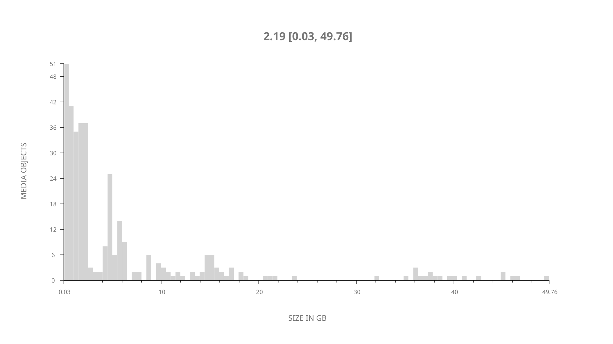
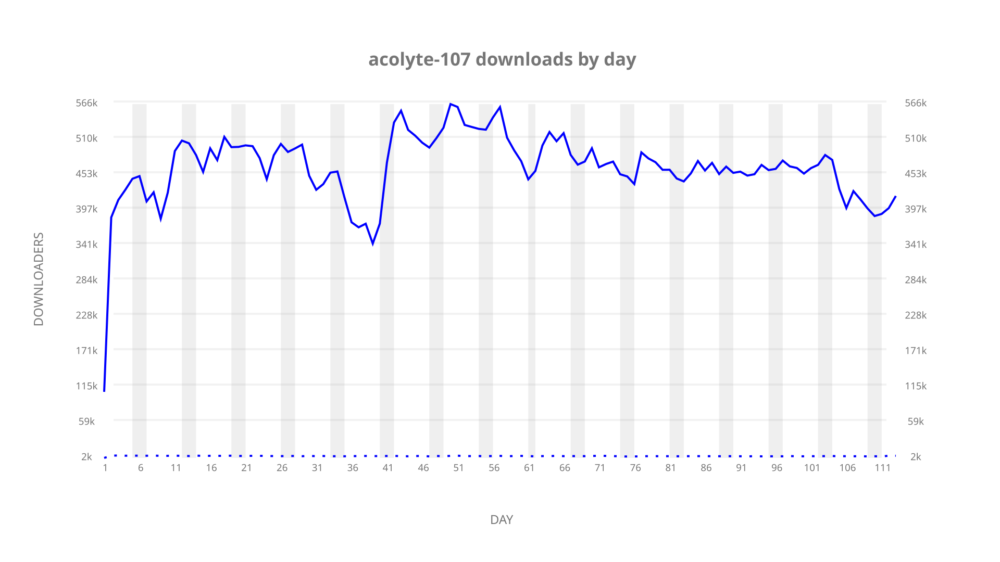
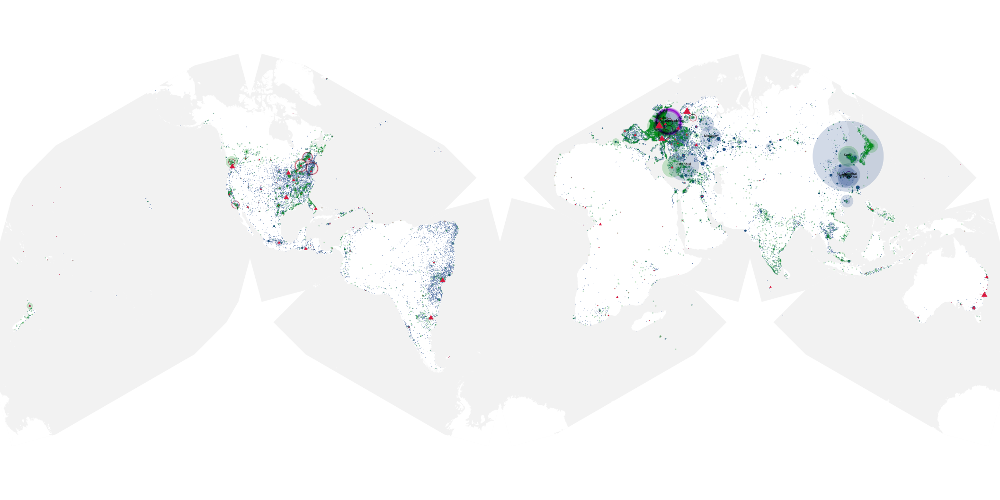
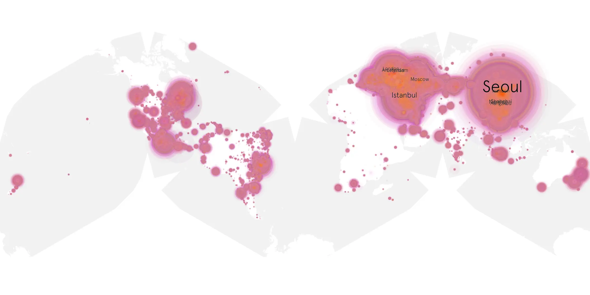
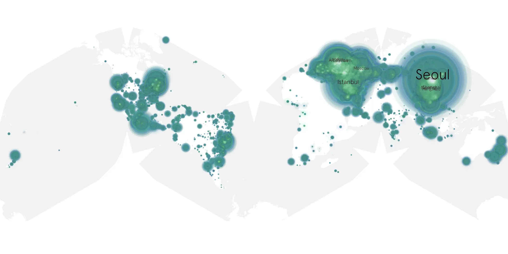

# acolyte-107 sample cache audit

## 1. Media object

| Field | Value |
| --- | --- |
| Media object | The Acolyte |
| Collection key | `acolyte-107` |
| imdb_id | [tt12262202](https://www.imdb.com/title/tt12262202/) |
| wikipedia_url | [Star Wars: The Acolyte](https://en.wikipedia.org/wiki/Star_Wars:_The_Acolyte) |
| Sample dates | 2026-05-04-to-2026-08-25 |
| Sample days | 114 |
| BTIH count | 376 |
| Unique BTIH count | 346 |
| Downloaders total | 41,175,625 |
| Uploaders total | 319,853 |
| Data version | `2026-08-05` |
| IP geolocation version | `6:1777968300` |

## 2. Sample coverage report

- Generated: 2026-09-13T17:13:03Z
- Sample archive directory: `/mnt/gold/src/alpha60-samples-raw.gold/acolyte-107.xz/2026`
- Hour directories: 2692
- Zero-length sample files: 0
- Other unparsable sample files: 0
- Hourly discontinuities: 2 (27 missing hours)
- Missing days: 1

### Sample archive discontinuities

- hourly gap: last `2026-05-27 22:04`, resumed `2026-05-28 00:15` — missing 1 hour(s)
- hourly gap: last `2026-07-03 22:04`, resumed `2026-07-05 01:04` — missing 26 hour(s)
- missing day: `2026-07-04`

## 3. File sizes histogram median[lowest, highest]

## 4. Graphs

### Downloads by week cumulative (normalized start)



### Downloads by day, Saturday and Sunday in gray

## 5. Cumulative Maps

<!-- https://s3-ewh.ist.berkeley.edu/adekosnik-bucket01/alpha60-results/2026/data/ -->
<!-- https://raw.githubusercontent.com/alpha60-devops/alpha60-results-2026/refs/heads/main/data/ -->

### Geographic Regions

| Africa | Americas | Asia | Europe | Oceania | Unknown |
| --- | --- | --- | --- | --- | --- |
| 1.13 | 16.02 | 36.40 | 43.49 | 1.05 | 0.83 |

### Network infrastructure

{:target="_blank" rel="noopener"}

### <a href="https://raw.githubusercontent.com/alpha60-devops/alpha60-results-2026/refs/heads/main/data/geojson.cumulative/acolyte-107-cumulative-aggregate.geojson.gz"
   onclick="leaflet_map_open_window(this.href, 'Acolyte 107'); return false;"
   class="table-link"
   aria-label="Open Acolyte 107 cumulative data map in new window"
   title="Opens interactive map for Acolyte 107 data">Swarm Detail</a>

### Resolution >= 1080p**

{:target="_blank" rel="noopener"}

### Resolution < 1080p**

{:target="_blank" rel="noopener"}
