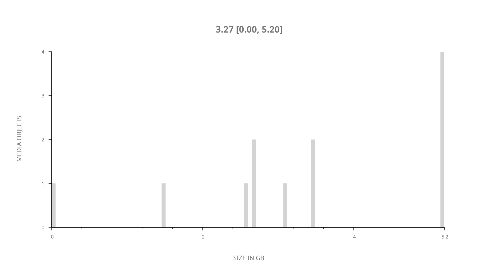
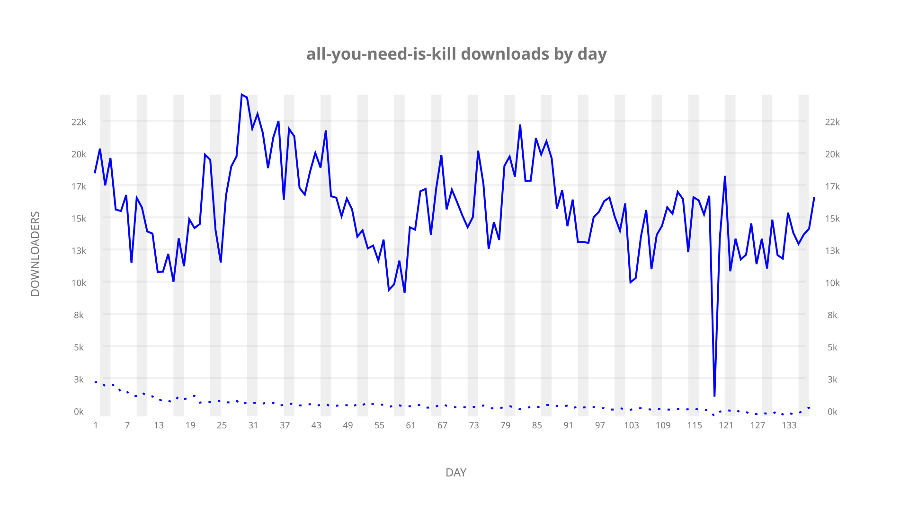
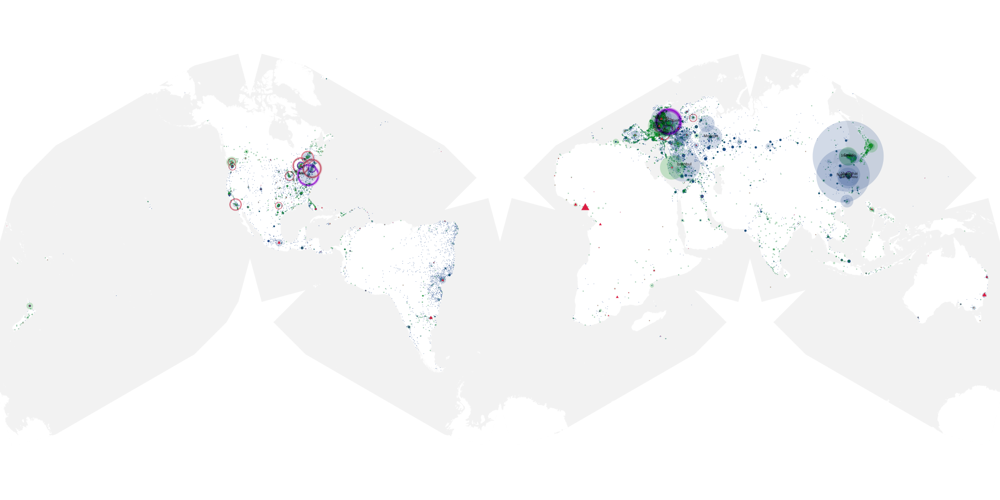
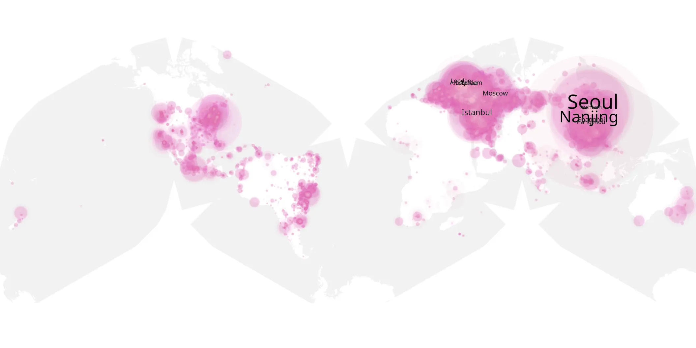
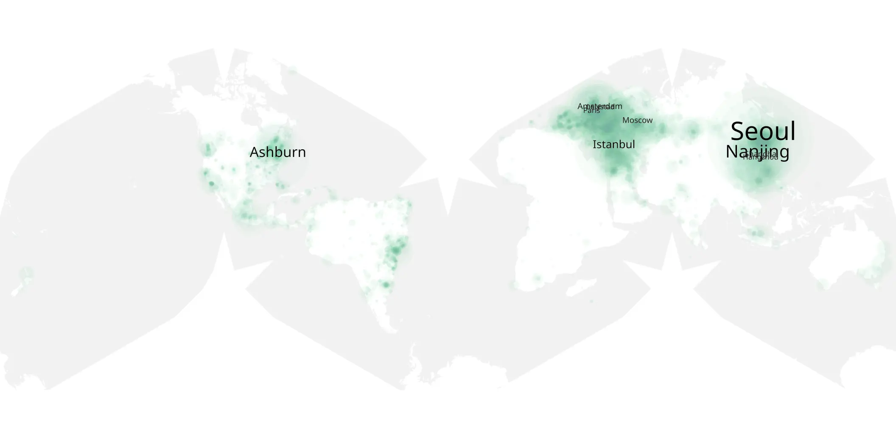

# all-you-need-is-kill sample cache audit

## 1. Media object

| Field | Value |
| --- | --- |
| Media object | All You Need Is Kill |
| Collection key | `all-you-need-is-kill` |
| imdb_id | [tt36148135](https://www.imdb.com/title/tt36148135/) |
| wikipedia_url | [All You Need Is Kill (film)](https://en.wikipedia.org/wiki/All_You_Need_Is_Kill_(film)) |
| Sample dates | 2026-04-16-to-2026-08-31 |
| Sample days | 138 |
| BTIH count | 13 |
| Unique BTIH count | 12 |
| Downloaders total | 1,641,245 |
| Uploaders total | 69,918 |
| Data version | `2026-08-05` |
| IP geolocation version | `6:1777968300` |

## 2. Sample coverage report

- Generated: 2026-09-13T17:13:03Z
- Sample archive directory: `/mnt/gold/src/alpha60-samples-raw.gold/all-you-need-is-kill.xz`
- Hour directories: 3283
- Zero-length sample files: 0
- Other unparsable sample files: 0
- Hourly discontinuities: 1 (26 missing hours)
- Missing days: 0

### Sample archive discontinuities

- hourly gap: last `2026-08-12 03:00`, resumed `2026-08-13 06:00` — missing 26 hour(s)

## 3. Media objects file size histogram

## 4. Visualization pass — graphs

### Downloads by week cumulative (normalized start)



### Downloads by day, Saturday and Sunday in gray

## 5. Visualization pass — maps

### Cumulative geographic slices

| Africa | Americas | Asia | Europe | Oceania | Unknown |
| --- | --- | --- | --- | --- | --- |
| 0.95 | 14.51 | 32.39 | 37.14 | 0.91 | 0.71 |

### Cumulative network infrastructure

{:target="_blank" rel="noopener"}

### Cumulative data maps

**Cumulative >= 1080p**

{:target="_blank" rel="noopener"}

**Cumulative < 1080p**

{:target="_blank" rel="noopener"}
