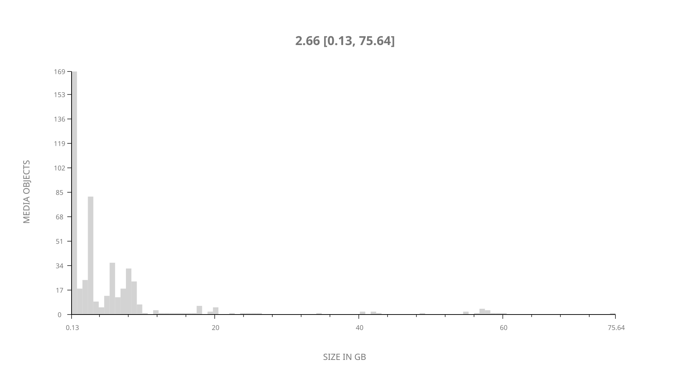
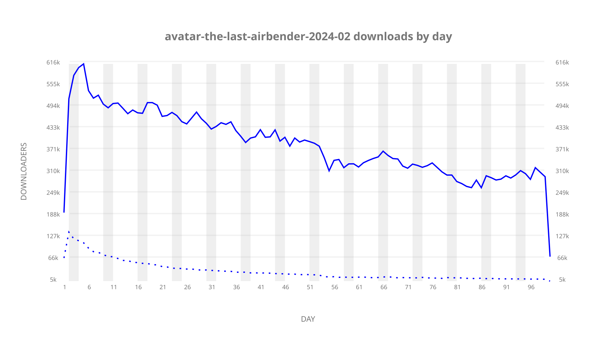
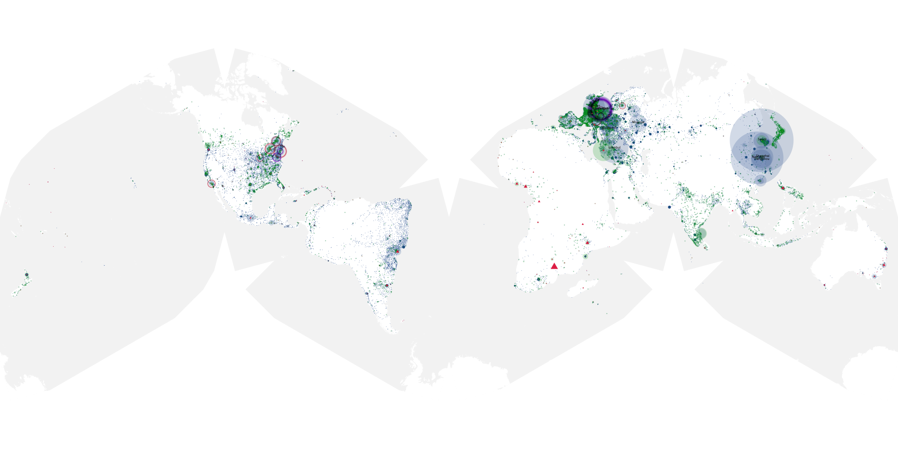
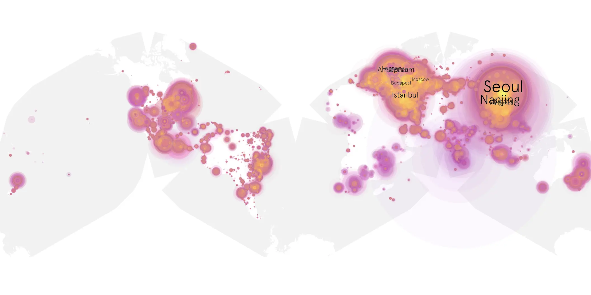
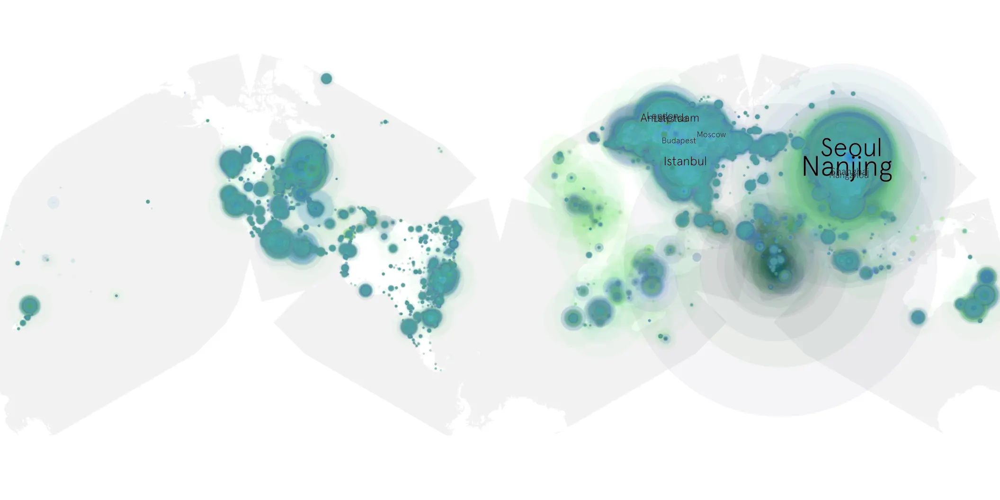

# avatar-the-last-airbender-2024-02 sample cache audit

## 1. Media object

| Field | Value |
| --- | --- |
| Media object | Avatar: The Last Airbender |
| Collection key | `avatar-the-last-airbender-2024-02` |
| imdb_id | [tt9018736](https://www.imdb.com/title/tt9018736/) |
| wikipedia_url | [Avatar: The Last Airbender (2024 TV series)](https://en.wikipedia.org/wiki/Avatar:_The_Last_Airbender_(2024_TV_series)) |
| Sample dates | 2026-06-25-to-2026-10-02 |
| Sample days | 100 |
| BTIH count | 500 |
| Unique BTIH count | 498 |
| Downloaders total | 28,061,681 |
| Uploaders total | 1,459,233 |
| Data version | `2026-08-05` |
| IP geolocation version | `6:1777968300` |

## 2. Sample coverage report

- Generated: 2026-10-07T14:25:15Z
- Frozen sample archive directory: `/mnt/gold/src/alpha60-samples-raw.gold/avatar-the-last-airbender-2024-02.xz`
- Hour directories: 2362
- Zero-length sample files: 0
- Malformed in-scope records accepted: 0 (producer rejects nonempty malformed input)
- Hourly discontinuities: 1 (20 missing hours)
- Missing days: 0

### Sample archive discontinuities

- hourly gap: last `2026-10-01 22:06`, resumed `2026-10-02 19:06` — missing 20 hour(s)

### Frozen validation evidence

- Frozen content SHA-256: `6b65464a3222393bfe9bc72012faa55fb07101653540d3bbc541635eee2b09ca`
- Full-input producer receipt SHA-256: `19f157e48f5c1e28adb9b308c3122a51b9040fe4d99eb6cd80dfc460c9dc9ef2`
- Frozen raw archives: 2362
- Empty sampler observations remain explicit gaps; no observations were imputed.
- Out-of-scope records retain the collection factory's established filtering.
- Excluded raw members: 5
- Excluded observations: 5959

## 3. Media objects file size histogram

## 4. Visualization pass — graphs

### Downloads by week cumulative (normalized start)



### Downloads by day, Saturday and Sunday in gray

## 5. Visualization pass — maps

### Cumulative geographic slices

| Africa | Americas | Asia | Europe | Oceania | Unknown |
| --- | --- | --- | --- | --- | --- |
| 2.32 | 17.82 | 35.91 | 41.82 | 1.31 | 0.82 |

### Cumulative network infrastructure

{:target="_blank" rel="noopener"}

### Cumulative data maps

**Cumulative >= 1080p**

{:target="_blank" rel="noopener"}

**Cumulative < 1080p**

{:target="_blank" rel="noopener"}
