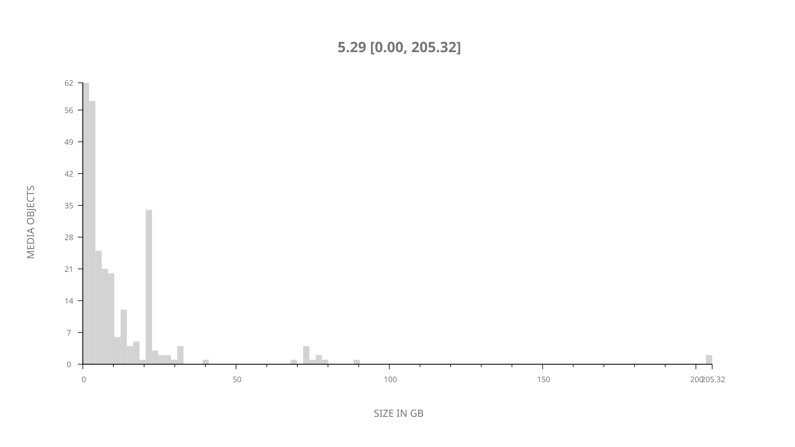
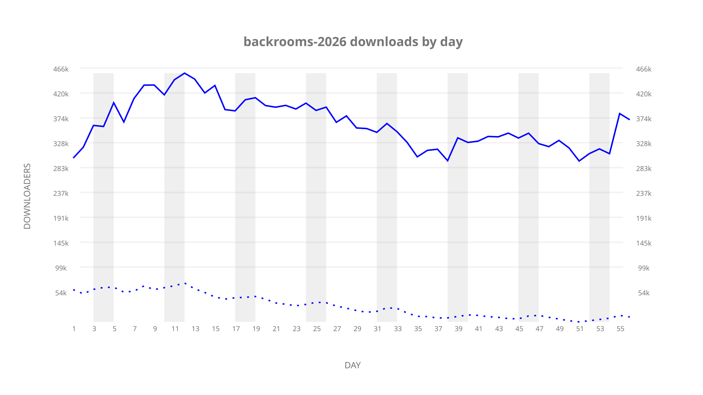
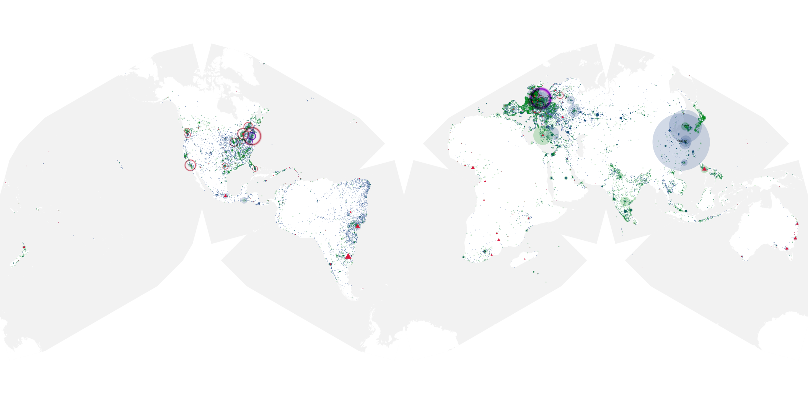
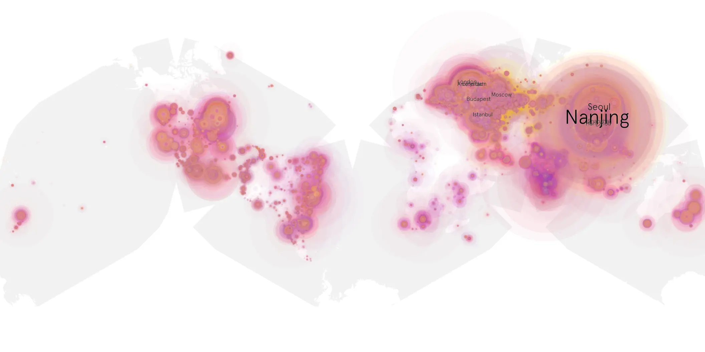
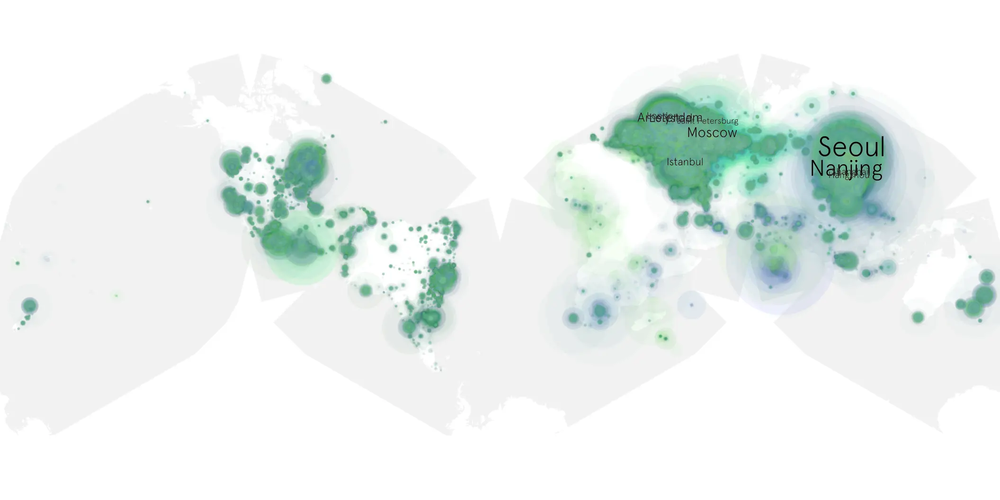

# backrooms-2026 sample cache audit

## 1. Media object

| Field | Value |
| --- | --- |
| Media object | Backrooms |
| Collection key | `backrooms-2026` |
| imdb_id | [tt26657236](https://www.imdb.com/title/tt26657236/) |
| wikipedia_url | [Backrooms (film)](https://en.wikipedia.org/wiki/Backrooms_(film)) |
| Sample dates | 2026-07-15-to-2026-09-08 |
| Sample days | 56 |
| BTIH count | 286 |
| Unique BTIH count | 273 |
| Downloaders total | 16,952,956 |
| Uploaders total | 2,660,564 |
| Data version | `2026-08-05` |
| IP geolocation version | `6:1777968300` |

## 2. Coverage report

- Generated: 2026-09-13T17:13:03Z
- Sample archive directory: `/mnt/gold/src/alpha60-samples-raw.gold/backrooms.xz`
- Hour directories: 1344
- Zero-length sample files: 0
- Other unparsable sample files: 0
- Hourly discontinuities: 0 (0 missing hours)
- Missing days: 0

### Sample archive discontinuities

None detected.

## 3. File sizes histogram *median[lowest, highest]*

## 4. Graphs

### Downloads by week cumulative (normalized start)



### Downloads by day, Saturday and Sunday in gray

## 5. Cumulative Maps

<!-- https://raw.githubusercontent.com/alpha60-devops/alpha60-results-2026/refs/heads/main/data/ -->

### <a href="https://raw.githubusercontent.com/alpha60-devops/alpha60-results-2026/refs/heads/main/data/geojson.cumulative/backrooms-2026-cumulative-aggregate.geojson.gz" data-map-title="Backrooms — backrooms-2026" onclick="leaflet_map_open_window(this.href, this.dataset.mapTitle); return false;" class="table-link" aria-label="Open Backrooms (backrooms-2026) cumulative data map in new window" title="Opens interactive map for Backrooms (backrooms-2026) data">Swarm Detail</a>

### Geographic Regions

| Africa | Americas | Asia | Europe | Oceania | Unknown |
| --- | --- | --- | --- | --- | --- |
| 2.10 | 18.58 | 32.33 | 38.44 | 1.24 | 0.74 |

### Network infrastructure

{:target="_blank" rel="noopener"}

### Resolution >= 1080p

{:target="_blank" rel="noopener"}

### Resolution < 1080p

{:target="_blank" rel="noopener"}
