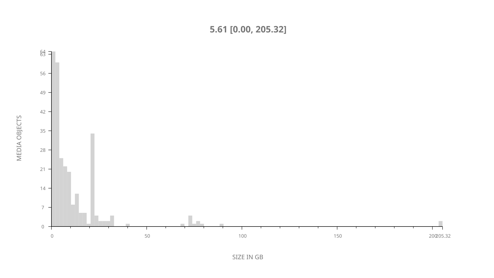
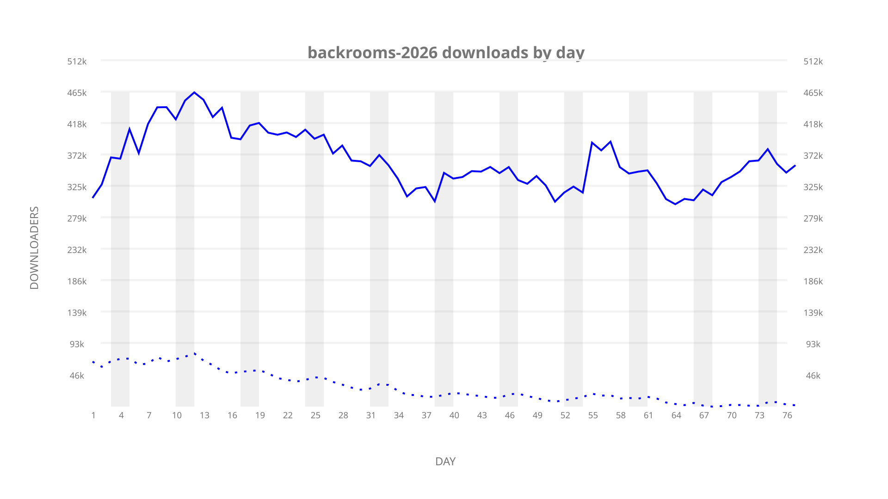
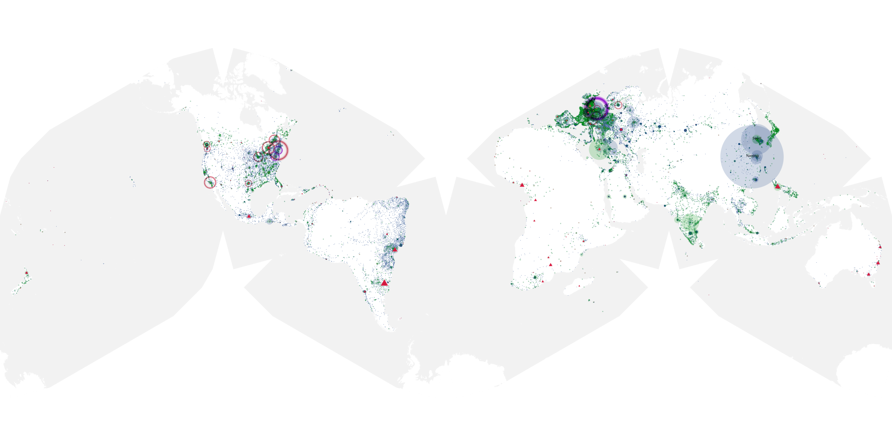
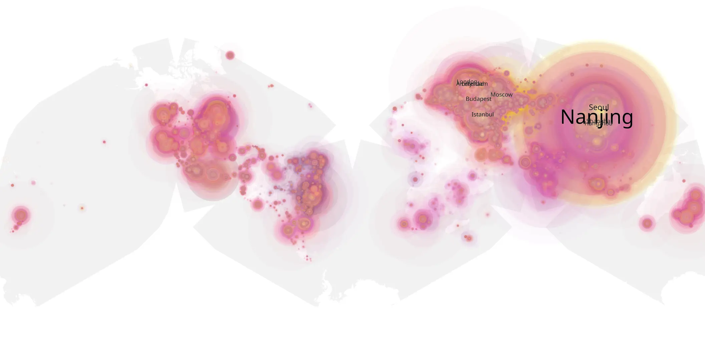
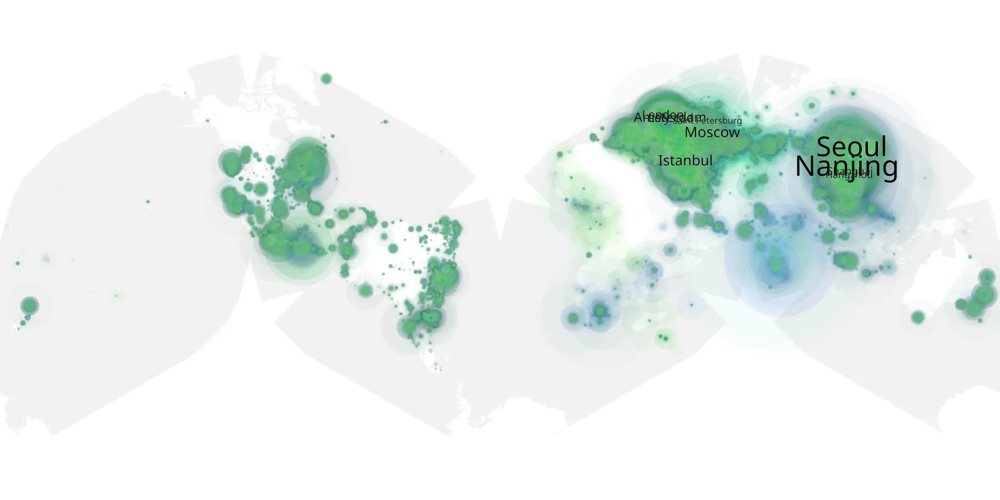

# backrooms-2026 sample cache audit

## 1. Media object

| Field | Value |
| --- | --- |
| Media object | Backrooms |
| Collection key | `backrooms-2026` |
| imdb_id | [tt26657236](https://www.imdb.com/title/tt26657236/) |
| wikipedia_url | [Backrooms (film)](https://en.wikipedia.org/wiki/Backrooms_(film)) |
| Sample dates | 2026-07-15-to-2026-09-29 |
| Sample days | 77 |
| BTIH count | 304 |
| Unique BTIH count | 283 |
| Downloaders total | 22,428,582 |
| Uploaders total | 3,185,534 |
| Data version | `2026-08-05` |
| IP geolocation version | `6:1777968300` |

## 2. Sample coverage report

- Generated: 2026-10-07T14:25:15Z
- Frozen sample archive directory: `/mnt/gold/src/alpha60-samples-raw.gold/backrooms.xz`
- Hour directories: 1848
- Zero-length sample files: 0
- Malformed in-scope records accepted: 0 (producer rejects nonempty malformed input)
- Hourly discontinuities: 0 (0 missing hours)
- Missing days: 0

### Sample archive discontinuities

None detected.

### Frozen validation evidence

- Frozen content SHA-256: `33ab58aa14da9f88367a8c34e22496ecfb8804af7f165f4f301cba59c82dac9f`
- Full-input producer receipt SHA-256: `b27c41a4cd3f5d5ecec571798469b9e69a2c89f835b1533789611c3816187a90`
- Frozen raw archives: 1848
- Empty sampler observations remain explicit gaps; no observations were imputed.
- Out-of-scope records retain the collection factory's established filtering.
- Excluded raw members: 0
- Excluded observations: 0

## 3. Media objects file size histogram

## 4. Visualization pass — graphs

### Downloads by week cumulative (normalized start)



### Downloads by day, Saturday and Sunday in gray

## 5. Visualization pass — maps

### Cumulative geographic slices

| Africa | Americas | Asia | Europe | Oceania | Unknown |
| --- | --- | --- | --- | --- | --- |
| 2.53 | 20.07 | 34.96 | 40.33 | 1.37 | 0.75 |

### Cumulative network infrastructure

{:target="_blank" rel="noopener"}

### Cumulative data maps

**Cumulative >= 1080p**

{:target="_blank" rel="noopener"}

**Cumulative < 1080p**

{:target="_blank" rel="noopener"}
