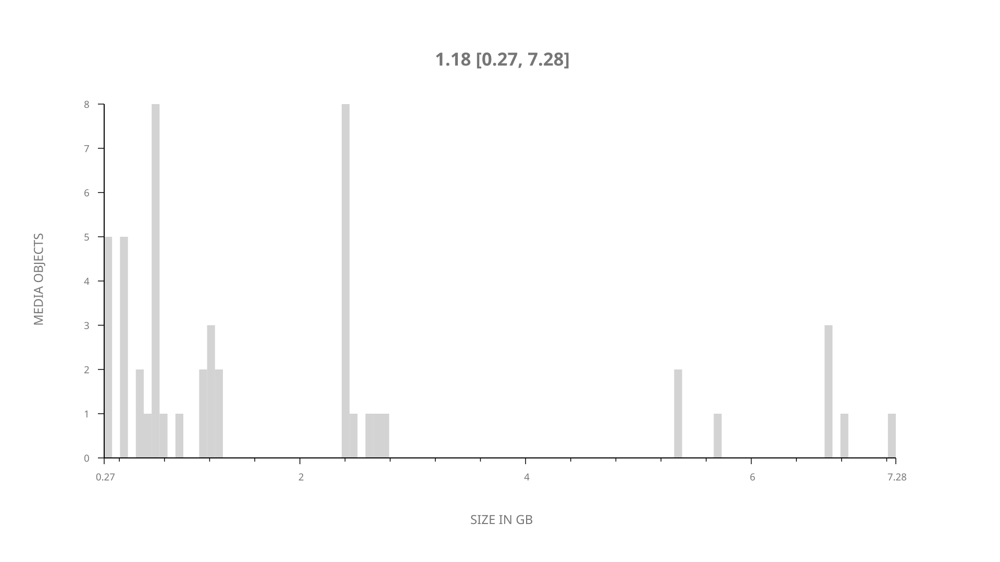
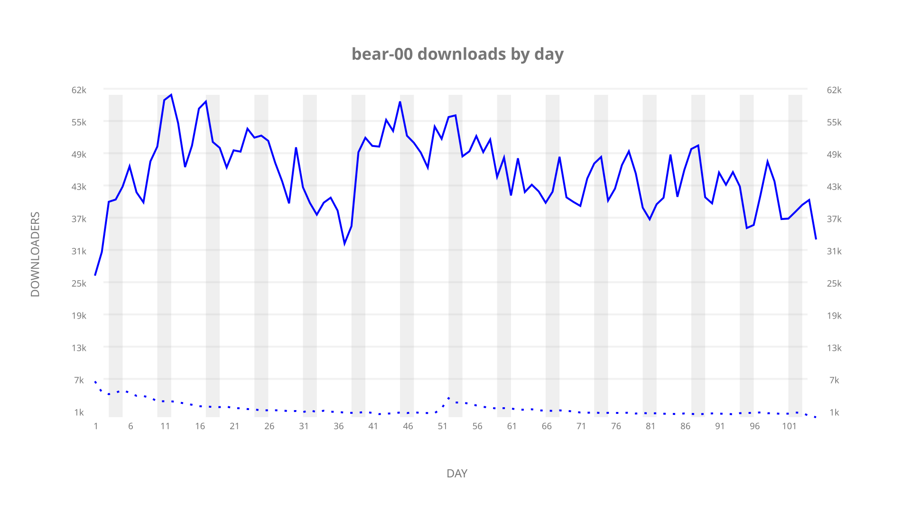
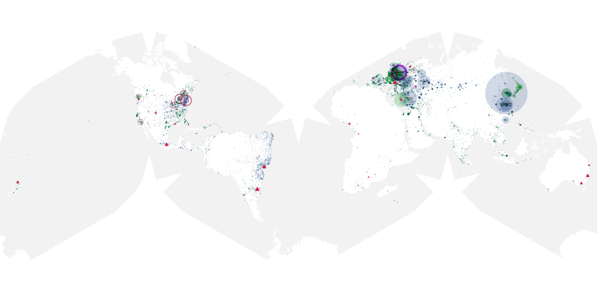
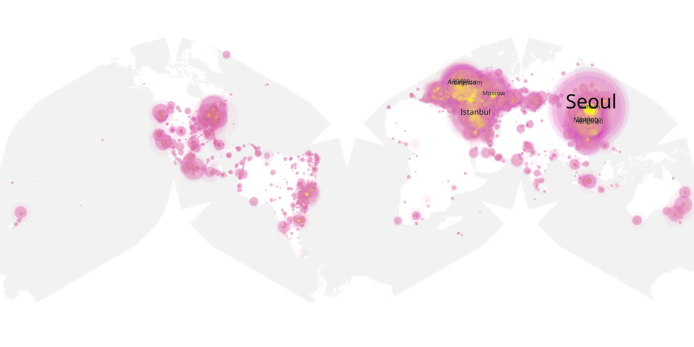
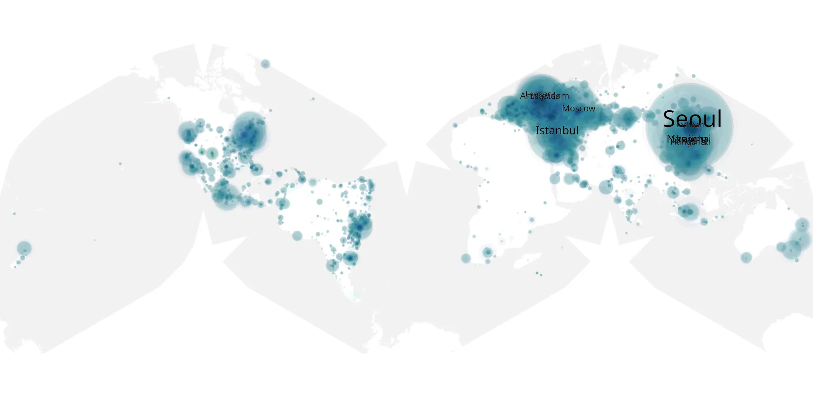

# bear-00 sample cache audit

## 1. Media object

| Field | Value |
| --- | --- |
| Media object | The Bear |
| Collection key | `bear-00` |
| imdb_id | [tt14452776](https://www.imdb.com/title/tt14452776/) |
| wikipedia_url | [The Bear (TV series)](https://en.wikipedia.org/wiki/The_Bear_(TV_series)) |
| Sample dates | 2026-05-06-to-2026-08-18 |
| Sample days | 105 |
| BTIH count | 50 |
| Unique BTIH count | 50 |
| Downloaders total | 3,744,382 |
| Uploaders total | 108,526 |
| Data version | `2026-08-05` |
| IP geolocation version | `6:1777968300` |

## 2. Sample coverage report

- Generated: 2026-09-13T17:13:03Z
- Sample archive directory: `/mnt/gold/src/alpha60-samples-raw.gold/bear-00.xz`
- Hour directories: 2515
- Zero-length sample files: 0
- Other unparsable sample files: 0
- Hourly discontinuities: 2 (4 missing hours)
- Missing days: 0

### Sample archive discontinuities

- hourly gap: last `2026-06-02 22:01`, resumed `2026-06-03 02:01` — missing 3 hour(s)
- hourly gap: last `2026-06-12 22:01`, resumed `2026-06-13 00:01` — missing 1 hour(s)

## 3. Media objects file size histogram

## 4. Visualization pass — graphs

### Downloads by week cumulative (normalized start)



### Downloads by day, Saturday and Sunday in gray

## 5. Visualization pass — maps

### Cumulative geographic slices

| Africa | Americas | Asia | Europe | Oceania | Unknown |
| --- | --- | --- | --- | --- | --- |
| 1.11 | 15.96 | 34.54 | 41.63 | 1.17 | 0.79 |

### Cumulative network infrastructure

{:target="_blank" rel="noopener"}

### Cumulative data maps

**Cumulative >= 1080p**

{:target="_blank" rel="noopener"}

**Cumulative < 1080p**

{:target="_blank" rel="noopener"}
