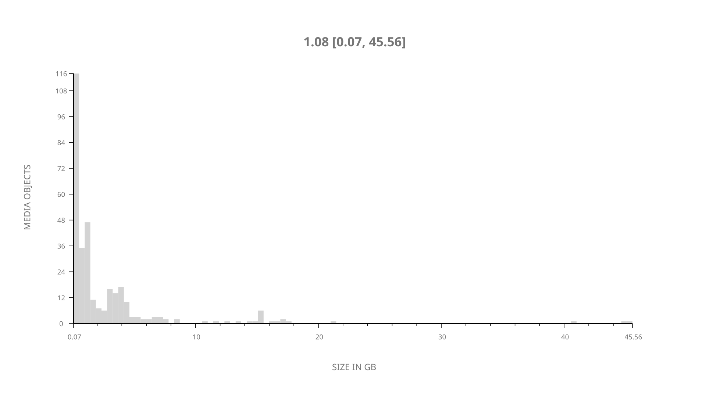
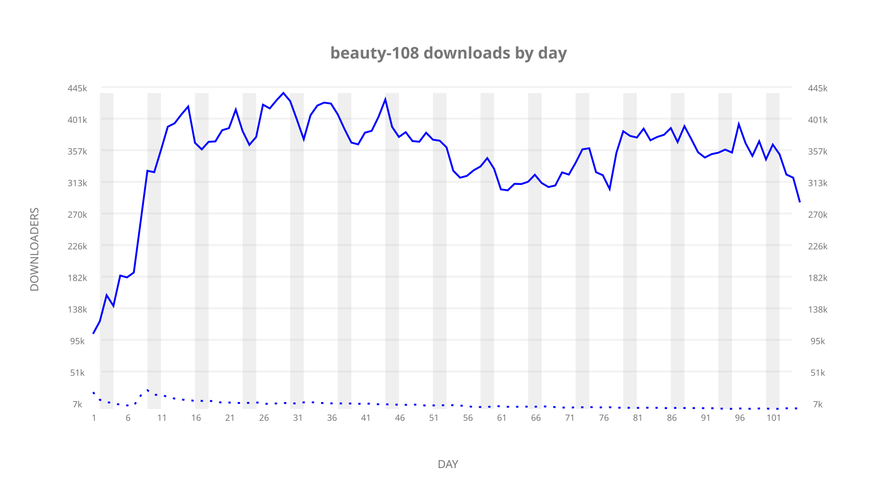
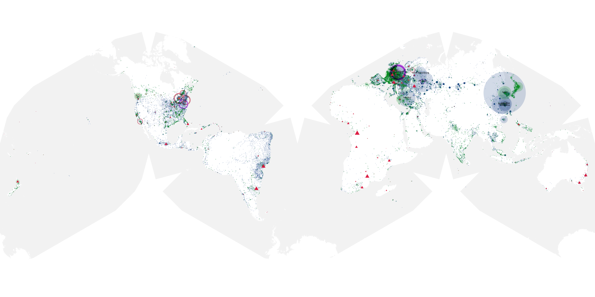
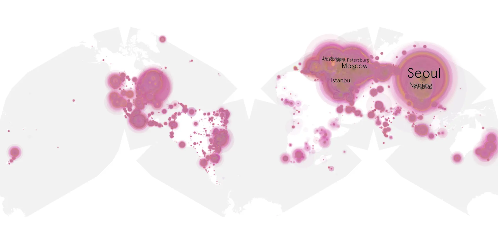
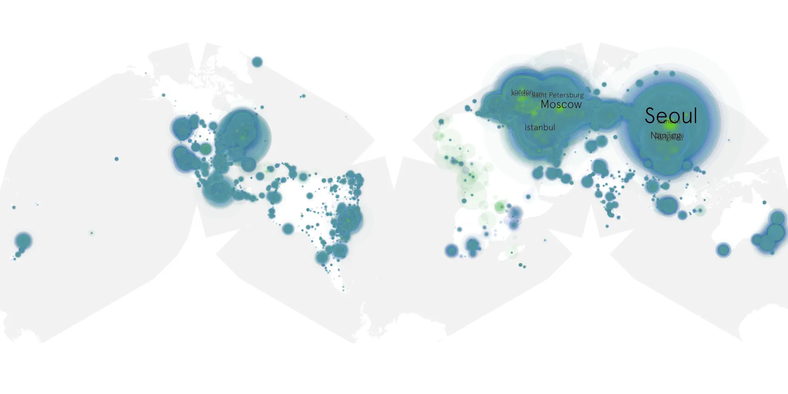

# beauty-108 sample cache audit

## 1. Media object

| Field | Value |
| --- | --- |
| Media object | The Beauty |
| Collection key | `beauty-108` |
| imdb_id | [tt33517752](https://www.imdb.com/title/tt33517752/) |
| wikipedia_url | [The Beauty (TV series)](https://en.wikipedia.org/wiki/The_Beauty_(TV_series)) |
| Sample dates | 2026-02-26-to-2026-06-10 |
| Sample days | 105 |
| BTIH count | 341 |
| Unique BTIH count | 320 |
| Downloaders total | 30,276,619 |
| Uploaders total | 743,955 |
| Data version | `2026-08-05` |
| IP geolocation version | `6:1777968300` |

## 2. Coverage report

- Generated: 2026-09-13T17:13:03Z
- Sample archive directory: `/mnt/gold/src/alpha60-samples-raw.gold/beauty-108.xz`
- Hour directories: 2515
- Zero-length sample files: 0
- Other unparsable sample files: 0
- Hourly discontinuities: 1 (1 missing hours)
- Missing days: 0

### Sample archive discontinuities

- hourly gap: last `2026-03-29 01:00`, resumed `2026-03-29 03:00` — missing 1 hour(s)

## 3. File sizes histogram *median[lowest, highest]*

## 4. Graphs

### Downloads by week cumulative (normalized start)



### Downloads by day, Saturday and Sunday in gray

## 5. Cumulative Maps

<!-- https://raw.githubusercontent.com/alpha60-devops/alpha60-results-2026/refs/heads/main/data/ -->

### <a href="https://raw.githubusercontent.com/alpha60-devops/alpha60-results-2026/refs/heads/main/data/geojson.cumulative/beauty-108-cumulative-aggregate.geojson.gz" data-map-title="The Beauty — beauty-108" onclick="leaflet_map_open_window(this.href, this.dataset.mapTitle); return false;" class="table-link" aria-label="Open The Beauty (beauty-108) cumulative data map in new window" title="Opens interactive map for The Beauty (beauty-108) data">Swarm Detail</a>

### Geographic Regions

| Africa | Americas | Asia | Europe | Oceania | Unknown |
| --- | --- | --- | --- | --- | --- |
| 1.20 | 14.63 | 34.92 | 45.53 | 1.11 | 0.70 |

### Network infrastructure

{:target="_blank" rel="noopener"}

### Resolution >= 1080p

{:target="_blank" rel="noopener"}

### Resolution < 1080p

{:target="_blank" rel="noopener"}
