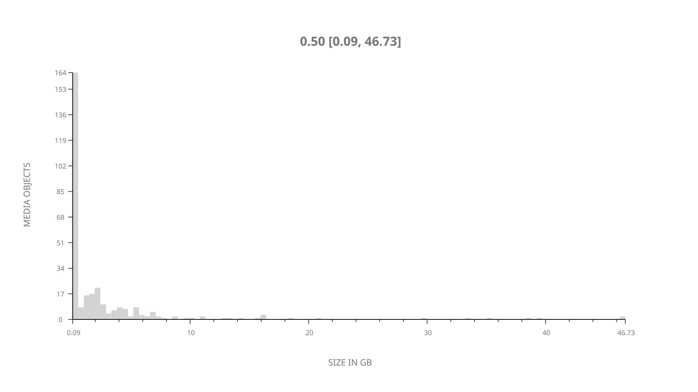
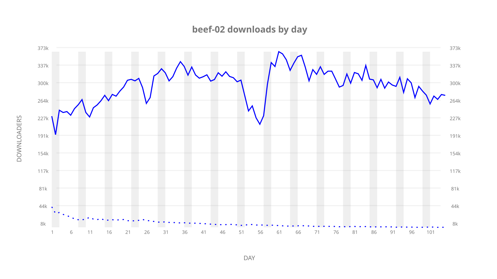
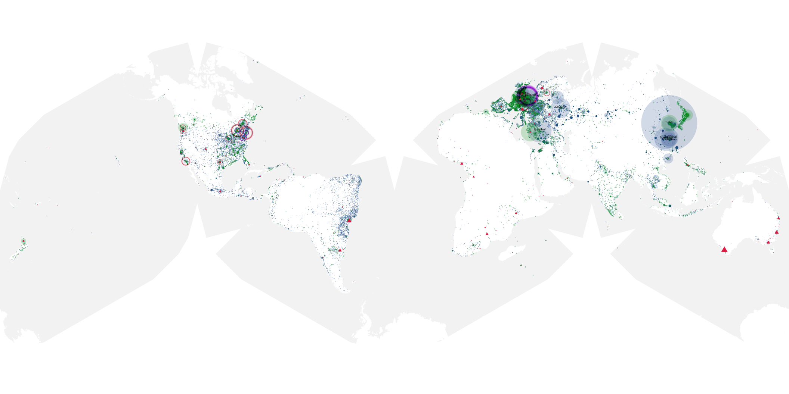
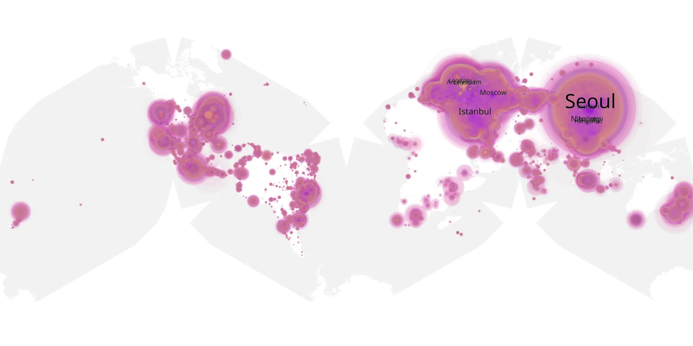
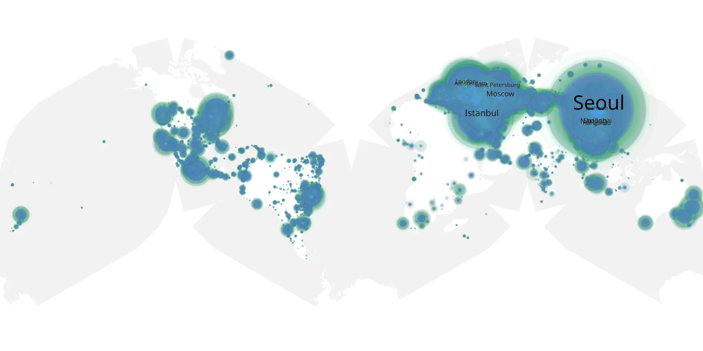

# beef-02 sample cache audit

## 1. Media object

| Field | Value |
| --- | --- |
| Media object | Beef |
| Collection key | `beef-02` |
| imdb_id | [tt14403178](https://www.imdb.com/title/tt14403178/) |
| wikipedia_url | [Beef (TV series)](https://en.wikipedia.org/wiki/Beef_(TV_series)) |
| Sample dates | 2026-04-17-to-2026-07-30 |
| Sample days | 105 |
| BTIH count | 346 |
| Unique BTIH count | 306 |
| Downloaders total | 25,555,385 |
| Uploaders total | 825,082 |
| Data version | `2026-08-05` |
| IP geolocation version | `6:1777968300` |

## 2. Sample coverage report

- Generated: 2026-09-13T17:13:04Z
- Sample archive directory: `/mnt/gold/src/alpha60-samples-raw.gold/beef-02.xz`
- Hour directories: 2520
- Zero-length sample files: 0
- Other unparsable sample files: 0
- Hourly discontinuities: 0 (0 missing hours)
- Missing days: 0

### Sample archive discontinuities

None detected.

## 3. Media objects file size histogram

## 4. Visualization pass — graphs

### Downloads by week cumulative (normalized start)



### Downloads by day, Saturday and Sunday in gray

## 5. Visualization pass — maps

### Cumulative geographic slices

| Africa | Americas | Asia | Europe | Oceania | Unknown |
| --- | --- | --- | --- | --- | --- |
| 1.37 | 15.79 | 36.16 | 43.01 | 1.29 | 0.81 |

### Cumulative network infrastructure

{:target="_blank" rel="noopener"}

### Cumulative data maps

**Cumulative >= 1080p**

{:target="_blank" rel="noopener"}

**Cumulative < 1080p**

{:target="_blank" rel="noopener"}
