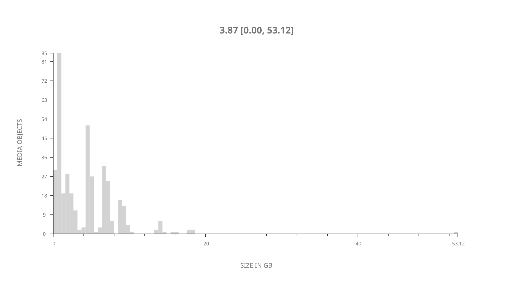
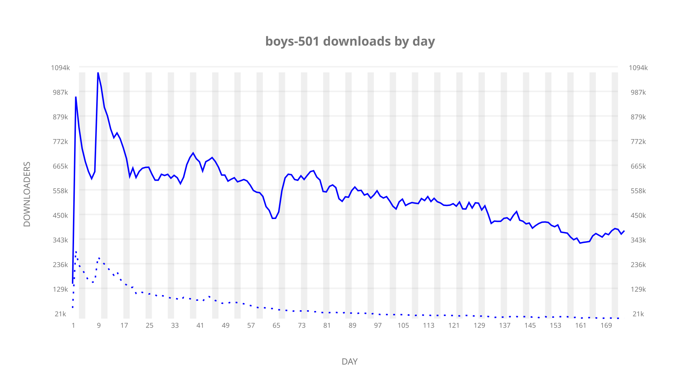
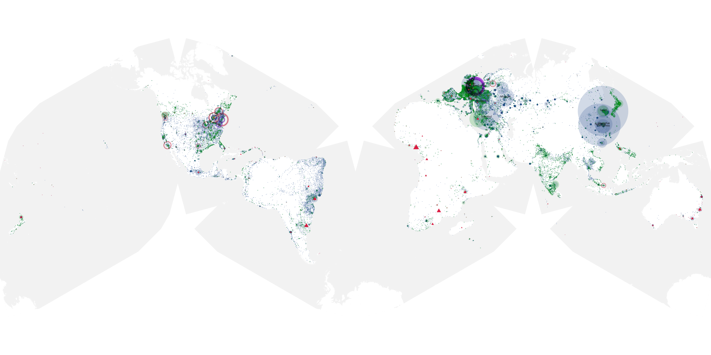
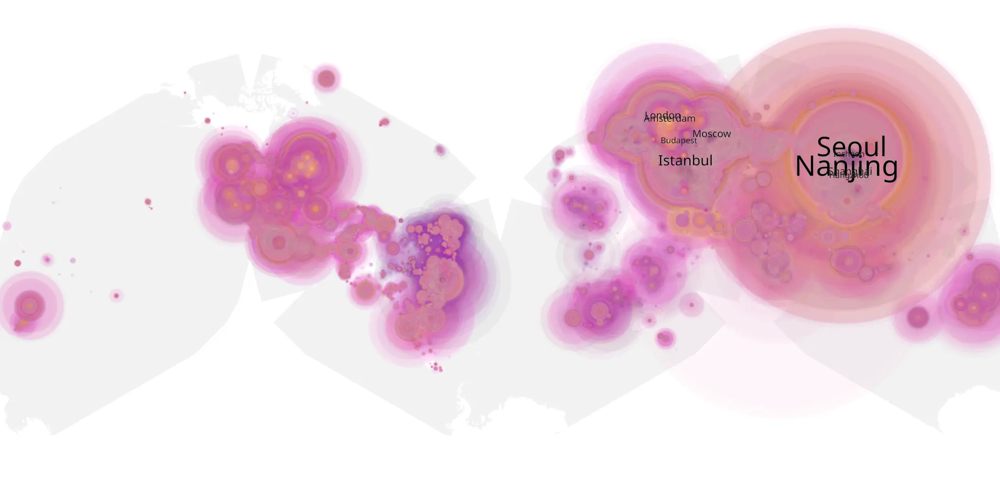
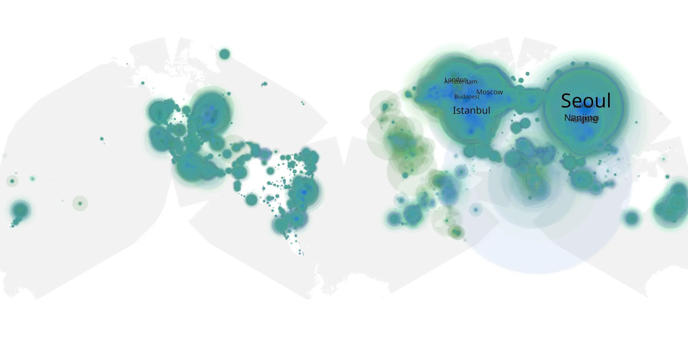

# boys-501 sample cache audit

## 1. Media object

| Field | Value |
| --- | --- |
| Media object | The Boys |
| Collection key | `boys-501` |
| imdb_id | [tt1190634](https://www.imdb.com/title/tt1190634/) |
| wikipedia_url | [The Boys (TV series)](https://en.wikipedia.org/wiki/The_Boys_(TV_series)) |
| Sample dates | 2026-04-08-to-2026-09-29 |
| Sample days | 175 |
| BTIH count | 409 |
| Unique BTIH count | 392 |
| Downloaders total | 68,625,238 |
| Uploaders total | 6,107,125 |
| Data version | `2026-08-05` |
| IP geolocation version | `6:1777968300` |

## 2. Sample coverage report

- Generated: 2026-10-07T11:57:08Z
- Frozen sample archive directory: `/mnt/gold/src/alpha60-samples-raw.gold/boys-501.xz`
- Hour directories: 4179
- Zero-length sample files: 0
- Malformed in-scope records accepted: 0 (producer rejects nonempty malformed input)
- Hourly discontinuities: 1 (4 missing hours)
- Missing days: 0

### Sample archive discontinuities

- hourly gap: last `2026-04-25 22:00`, resumed `2026-04-26 03:00` — missing 4 hour(s)

### Frozen validation evidence

- Frozen content SHA-256: `1d9bcbd27f56f9533844e567bc8d0cb247a99fed10ea24e4e31d8bdcfce1bf66`
- Full-input producer receipt SHA-256: `1cb5869eba1fac433577fa4f4900db8adbf744c26a99acfe6c6cd90c7b3010fe`
- Frozen raw archives: 4179
- Empty sampler observations remain explicit gaps; no observations were imputed.
- Out-of-scope records retain the collection factory's established filtering.
- Excluded raw members: 4
- Excluded observations: 47674

## 3. Media objects file size histogram

## 4. Visualization pass — graphs

### Downloads by week cumulative (normalized start)



### Downloads by day, Saturday and Sunday in gray

## 5. Visualization pass — maps

### Cumulative geographic slices

| Africa | Americas | Asia | Europe | Oceania | Unknown |
| --- | --- | --- | --- | --- | --- |
| 2.22 | 17.30 | 36.61 | 41.75 | 1.36 | 0.76 |

### Cumulative network infrastructure

{:target="_blank" rel="noopener"}

### Cumulative data maps

**Cumulative >= 1080p**

{:target="_blank" rel="noopener"}

**Cumulative < 1080p**

{:target="_blank" rel="noopener"}
