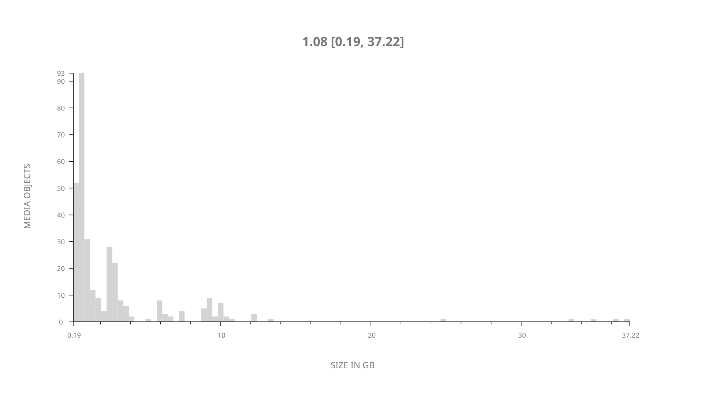
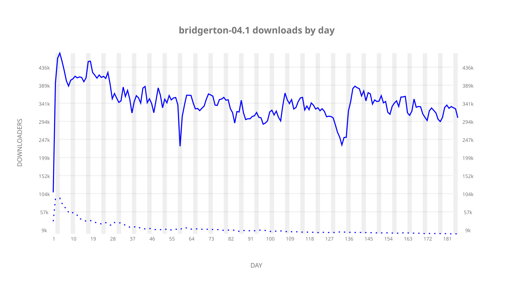
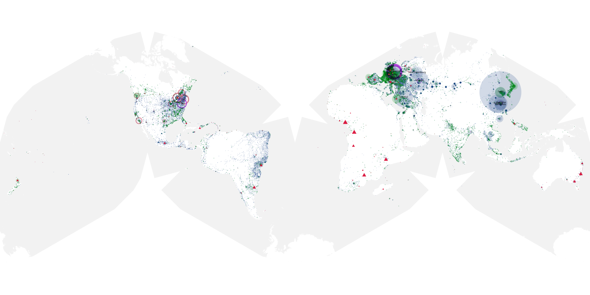
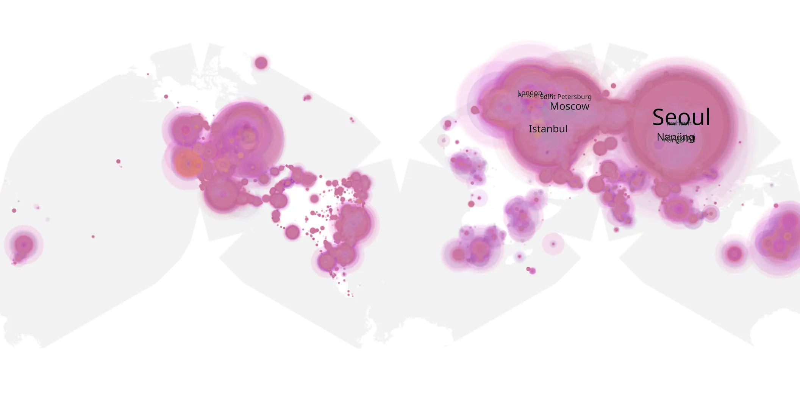
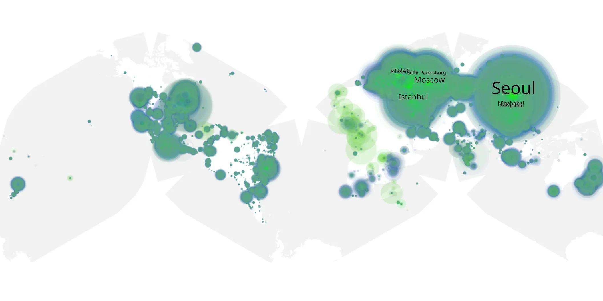

# bridgerton-04.1 sample cache audit

## 1. Media object

| Field | Value |
| --- | --- |
| Media object | Bridgerton |
| Collection key | `bridgerton-04.1` |
| imdb_id | [tt8740790](https://www.imdb.com/title/tt8740790/) |
| wikipedia_url | [Bridgerton](https://en.wikipedia.org/wiki/Bridgerton) |
| Sample dates | 2026-01-29-to-2026-08-02 |
| Sample days | 186 |
| BTIH count | 325 |
| Unique BTIH count | 320 |
| Downloaders total | 48,128,893 |
| Uploaders total | 1,743,355 |
| Data version | `2026-08-05` |
| IP geolocation version | `6:1777968300` |

## 2. Sample coverage report

- Generated: 2026-09-13T17:13:04Z
- Sample archive directory: `/mnt/gold/src/alpha60-samples-raw.gold/bridgerton-04.1.xz`
- Hour directories: 4437
- Zero-length sample files: 0
- Other unparsable sample files: 0
- Hourly discontinuities: 2 (10 missing hours)
- Missing days: 0

### Sample archive discontinuities

- hourly gap: last `2026-03-27 22:01`, resumed `2026-03-28 08:01` — missing 9 hour(s)
- hourly gap: last `2026-03-29 01:01`, resumed `2026-03-29 03:01` — missing 1 hour(s)

## 3. Media objects file size histogram

## 4. Visualization pass — graphs

### Downloads by week cumulative (normalized start)



### Downloads by day, Saturday and Sunday in gray

## 5. Visualization pass — maps

### Cumulative geographic slices

| Africa | Americas | Asia | Europe | Oceania | Unknown |
| --- | --- | --- | --- | --- | --- |
| 1.59 | 15.63 | 34.58 | 45.13 | 1.28 | 0.73 |

### Cumulative network infrastructure

{:target="_blank" rel="noopener"}

### Cumulative data maps

**Cumulative >= 1080p**

{:target="_blank" rel="noopener"}

**Cumulative < 1080p**

{:target="_blank" rel="noopener"}
