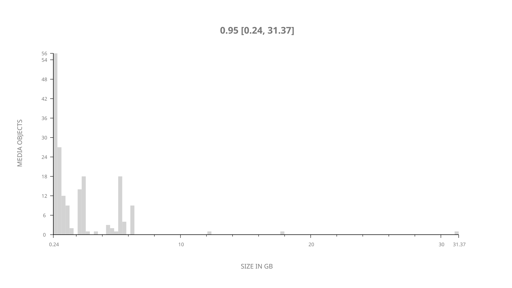
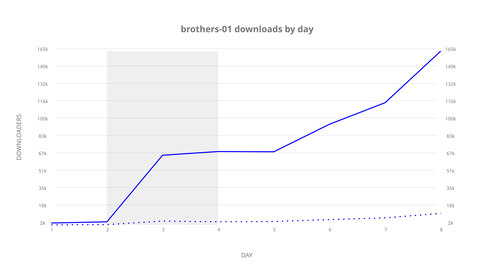
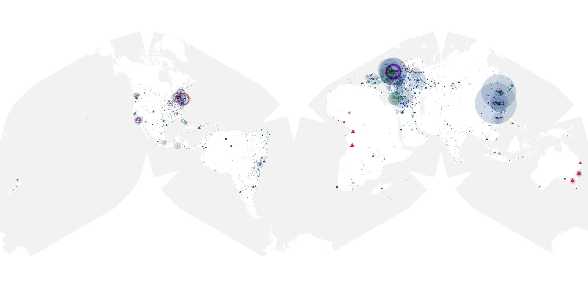
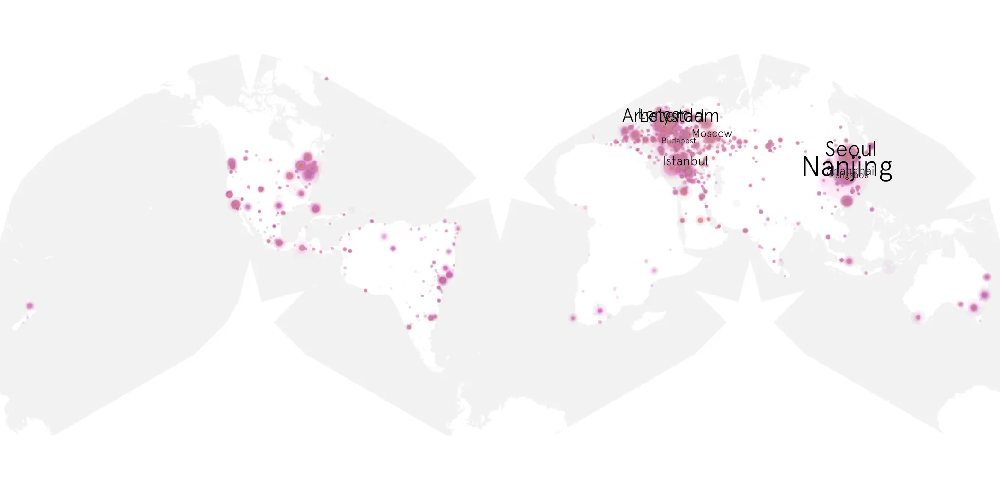
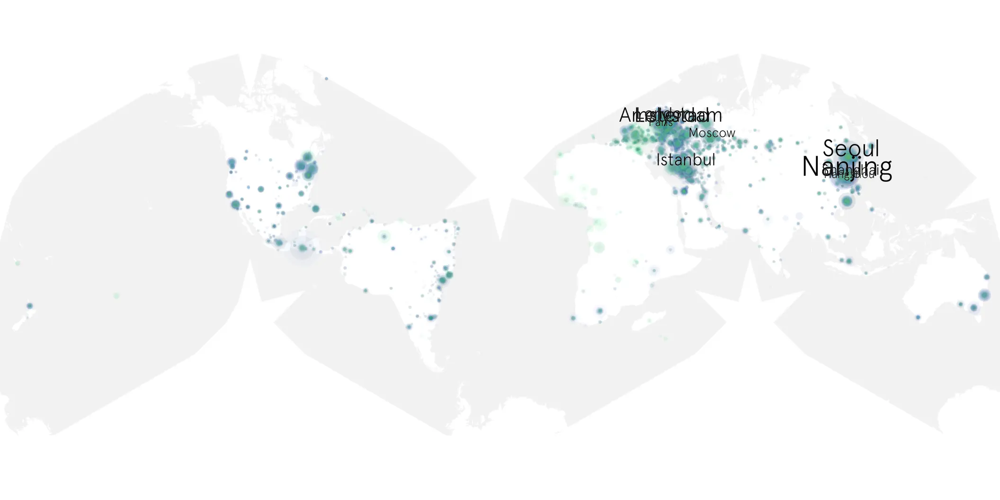

# brothers-01 sample cache audit

## 1. Media object

| Field | Value |
| --- | --- |
| Media object | Brothers |
| Collection key | `brothers-01` |
| imdb_id | [tt6773088](https://www.imdb.com/title/tt6773088/) |
| wikipedia_url | [Brothers (2026 TV series)](https://en.wikipedia.org/wiki/Brothers_(2026_TV_series)) |
| Sample dates | 2026-09-24-to-2026-10-01 |
| Sample days | 8 |
| BTIH count | 180 |
| Unique BTIH count | 180 |
| Downloaders total | 508,983 |
| Uploaders total | 29,058 |
| Data version | `2026-08-05` |
| IP geolocation version | `6:1777968300` |

## 2. Sample coverage report

- Generated: 2026-10-03T19:10:22Z
- Frozen sample archive directory: `/mnt/gold/src/alpha60-samples-raw.gold/brothers-01.xz`
- Hour directories: 174
- Zero-length sample files: 0
- Malformed in-scope records accepted: 0 (producer rejects nonempty malformed input)
- Hourly discontinuities: 0 (0 missing hours)
- Missing days: 0

### Sample archive discontinuities

None detected.

### Frozen validation evidence

- Frozen content SHA-256: `0e595e14217a40f66eb90884a7b5dc6fed200d892065fe9a1069ad50bfff68f1`
- Full-input producer receipt SHA-256: `6eb691582b52e09abbcbbbfc8f569a2ae118a5536b98f722e5570475fec33f24`
- Frozen raw archives: 174
- Empty sampler observations remain explicit gaps; no observations were imputed.
- Out-of-scope records retain the collection factory's established filtering.
- Excluded raw members: 0
- Excluded observations: 0

## 3. Media objects file size histogram

## 4. Visualization pass — graphs

### Downloads by week cumulative (normalized start)



### Downloads by day, Saturday and Sunday in gray

## 5. Visualization pass — maps

### Cumulative geographic slices

| Africa | Americas | Asia | Europe | Oceania | Unknown |
| --- | --- | --- | --- | --- | --- |
| 2.35 | 21.58 | 28.08 | 45.42 | 1.92 | 0.66 |

### Cumulative network infrastructure

{:target="_blank" rel="noopener"}

### Cumulative data maps

**Cumulative >= 1080p**

{:target="_blank" rel="noopener"}

**Cumulative < 1080p**

{:target="_blank" rel="noopener"}
