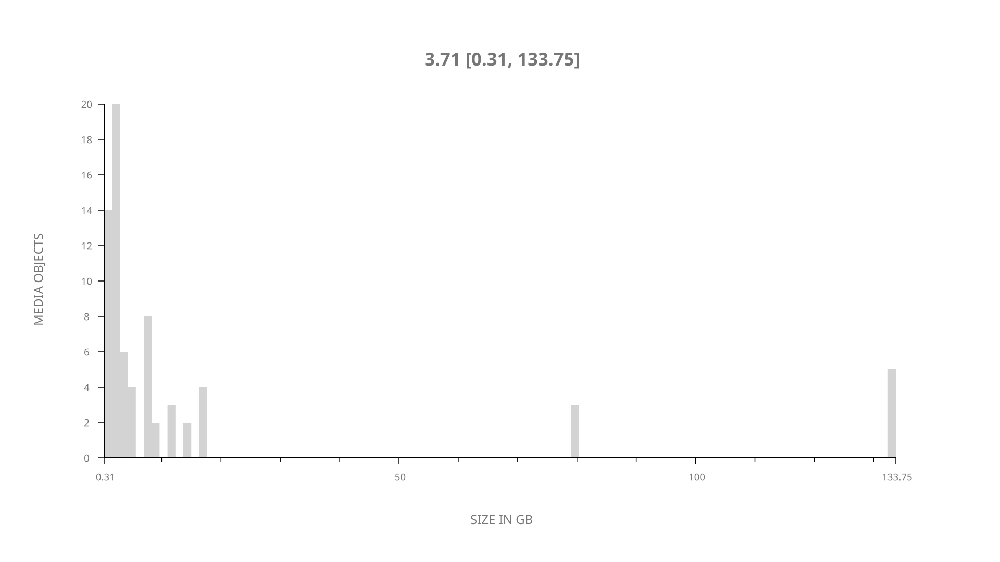
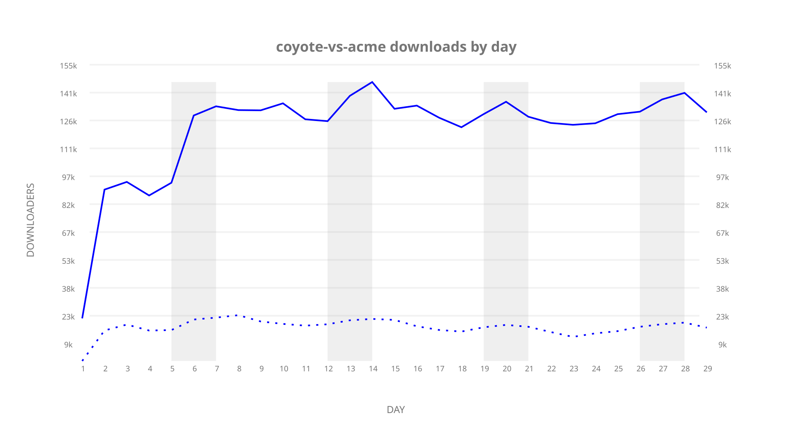
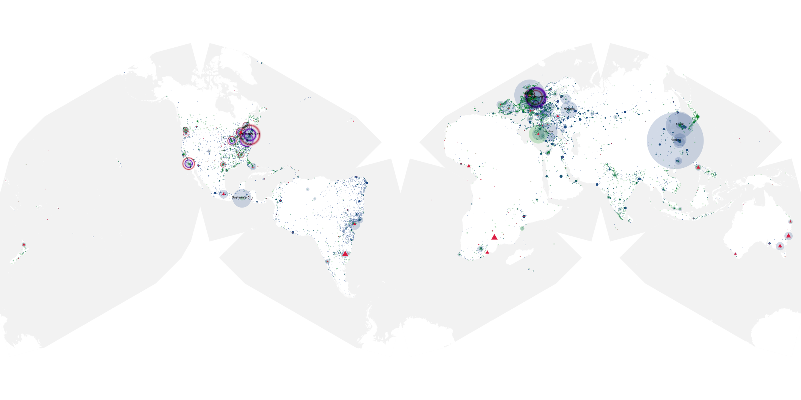
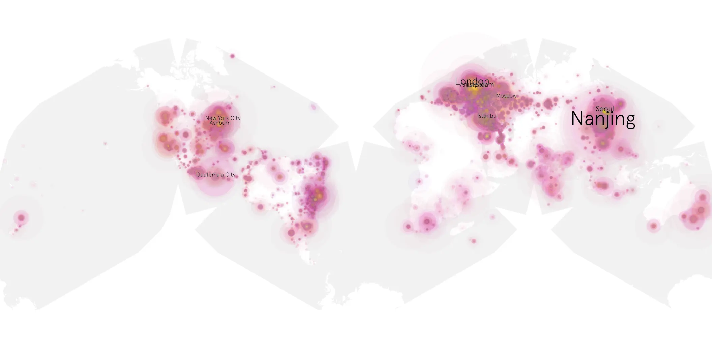
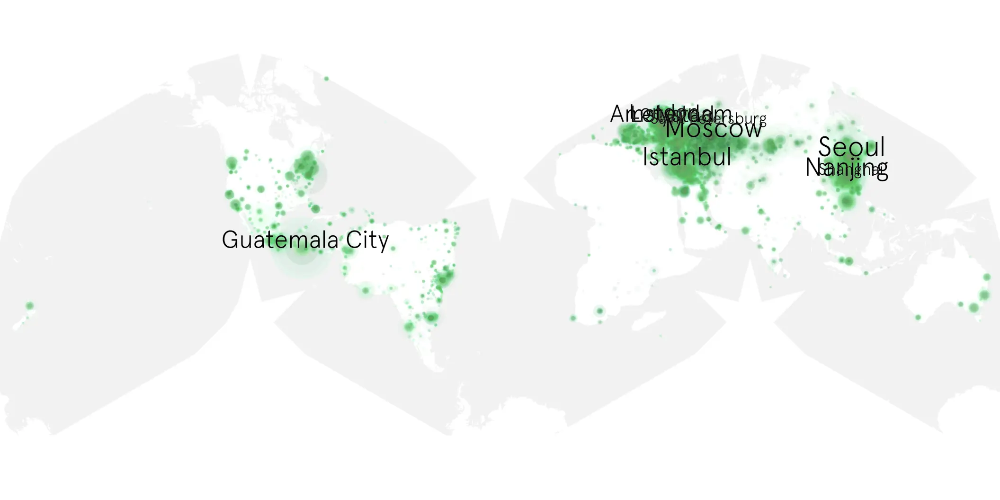

# coyote-vs-acme sample cache audit

## 1. Media object

| Field | Value |
| --- | --- |
| Media object | Coyote vs. Acme |
| Collection key | `coyote-vs-acme` |
| imdb_id | [tt1756855](https://www.imdb.com/title/tt1756855/) |
| wikipedia_url | [Coyote vs. Acme](https://en.wikipedia.org/wiki/Coyote_vs._Acme) |
| Sample dates | 2026-08-31-to-2026-09-28 |
| Sample days | 29 |
| BTIH count | 72 |
| Unique BTIH count | 71 |
| Downloaders total | 2,457,960 |
| Uploaders total | 381,879 |
| Data version | `2026-08-05` |
| IP geolocation version | `6:1777968300` |

## 2. Sample coverage report

- Generated: 2026-10-03T19:10:22Z
- Frozen sample archive directory: `/mnt/gold/src/alpha60-samples-raw.gold/coyote-vs-acme.xz`
- Hour directories: 688
- Zero-length sample files: 0
- Malformed in-scope records accepted: 0 (producer rejects nonempty malformed input)
- Hourly discontinuities: 0 (0 missing hours)
- Missing days: 0

### Sample archive discontinuities

None detected.

### Frozen validation evidence

- Frozen content SHA-256: `4106794c71492c7155aac40431ff73ac4cbd2864a6d6d146d1dc9f12b2126775`
- Full-input producer receipt SHA-256: `aa03477365c48e275bdcbe57d0b8fdcead503b49d62d13cd07316abc24fb34b9`
- Frozen raw archives: 688
- Empty sampler observations remain explicit gaps; no observations were imputed.
- Out-of-scope records retain the collection factory's established filtering.
- Excluded raw members: 0
- Excluded observations: 0

## 3. Media objects file size histogram

## 4. Visualization pass — graphs

### Downloads by week cumulative (normalized start)



### Downloads by day, Saturday and Sunday in gray

## 5. Visualization pass — maps

### Cumulative geographic slices

| Africa | Americas | Asia | Europe | Oceania | Unknown |
| --- | --- | --- | --- | --- | --- |
| 3.42 | 26.38 | 26.53 | 40.86 | 2.26 | 0.54 |

### Cumulative network infrastructure

{:target="_blank" rel="noopener"}

### Cumulative data maps

**Cumulative >= 1080p**

{:target="_blank" rel="noopener"}

**Cumulative < 1080p**

{:target="_blank" rel="noopener"}
