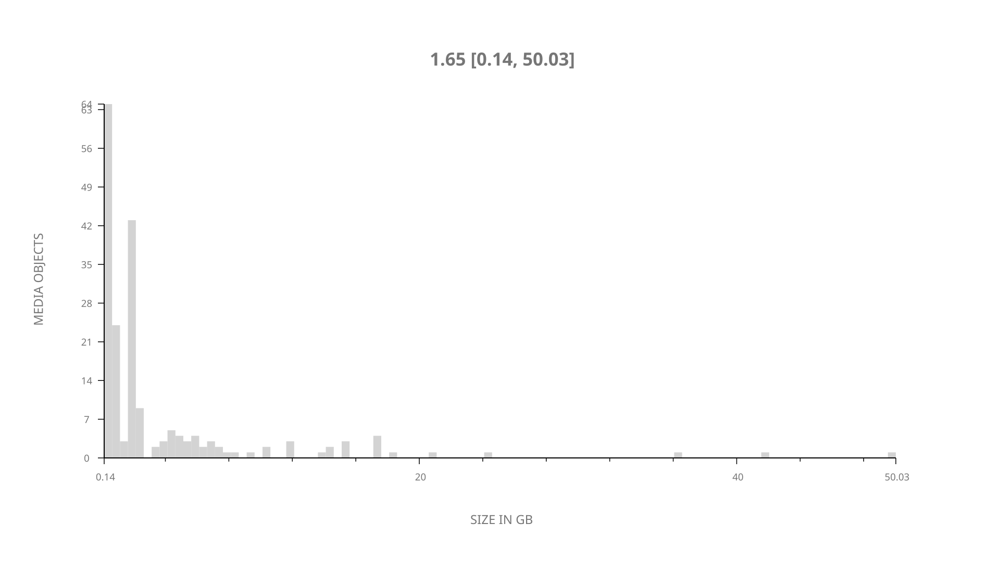
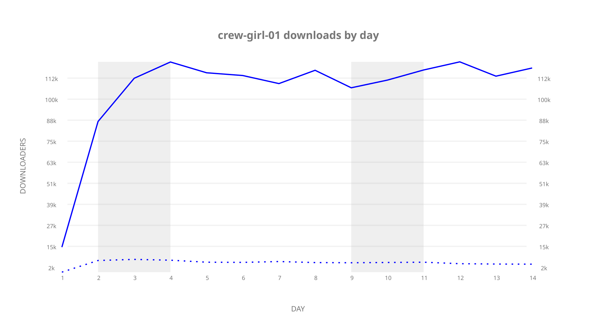
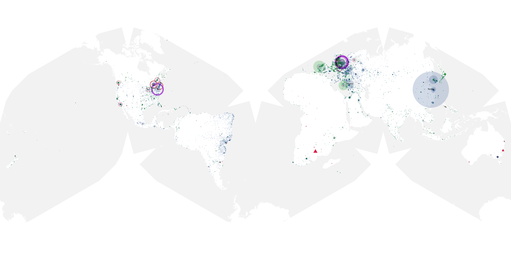
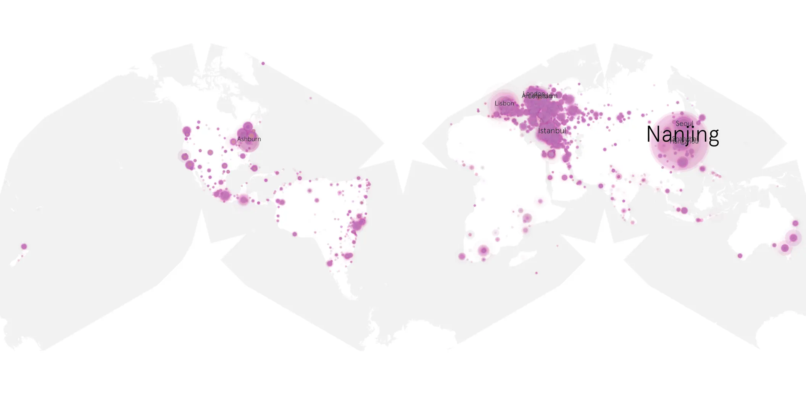
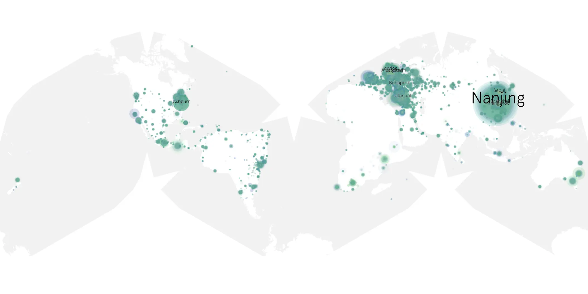

# crew-girl-01 sample cache audit

## 1. Media object

| Field | Value |
| --- | --- |
| Media object | Crew Girl |
| Collection key | `crew-girl-01` |
| imdb_id | [tt38218082](https://www.imdb.com/title/tt38218082/) |
| wikipedia_url | [Crew Girl](https://en.wikipedia.org/wiki/Crew_Girl) |
| Sample dates | 2026-09-10-to-2026-09-23 |
| Sample days | 14 |
| BTIH count | 196 |
| Unique BTIH count | 195 |
| Downloaders total | 1,254,086 |
| Uploaders total | 75,730 |
| Data version | `2026-08-05` |
| IP geolocation version | `6:1777968300` |

## 2. Sample coverage report

- Generated: 2026-10-03T19:10:22Z
- Frozen sample archive directory: `/mnt/gold/src/alpha60-samples-raw.gold/crew-girl-01.xz`
- Hour directories: 315
- Zero-length sample files: 0
- Malformed in-scope records accepted: 0 (producer rejects nonempty malformed input)
- Hourly discontinuities: 0 (0 missing hours)
- Missing days: 0

### Sample archive discontinuities

None detected.

### Frozen validation evidence

- Frozen content SHA-256: `8a2f37ce3267e4be2806cc529aa0116497fbe7cf1bf19460bd270929ebaaa9f8`
- Full-input producer receipt SHA-256: `035071dff47200bb166115eba75ea325a16217e0d600ed3b3674e5376bbbf108`
- Frozen raw archives: 315
- Empty sampler observations remain explicit gaps; no observations were imputed.
- Out-of-scope records retain the collection factory's established filtering.
- Excluded raw members: 1
- Excluded observations: 6

## 3. Media objects file size histogram

## 4. Visualization pass — graphs

### Downloads by week cumulative (normalized start)



### Downloads by day, Saturday and Sunday in gray

## 5. Visualization pass — maps

### Cumulative geographic slices

| Africa | Americas | Asia | Europe | Oceania | Unknown |
| --- | --- | --- | --- | --- | --- |
| 2.86 | 19.32 | 31.48 | 44.26 | 1.56 | 0.52 |

### Cumulative network infrastructure

{:target="_blank" rel="noopener"}

### Cumulative data maps

**Cumulative >= 1080p**

{:target="_blank" rel="noopener"}

**Cumulative < 1080p**

{:target="_blank" rel="noopener"}
