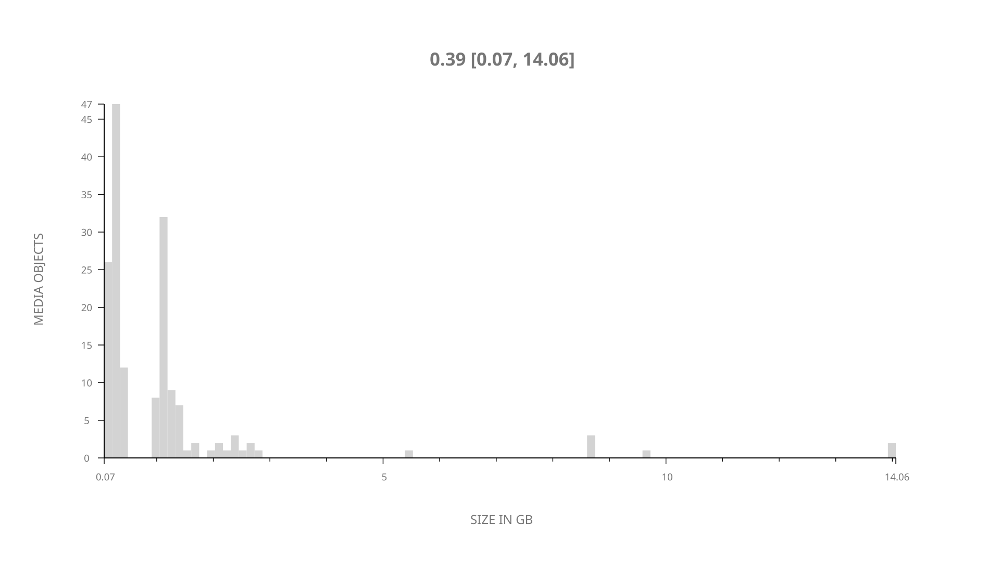
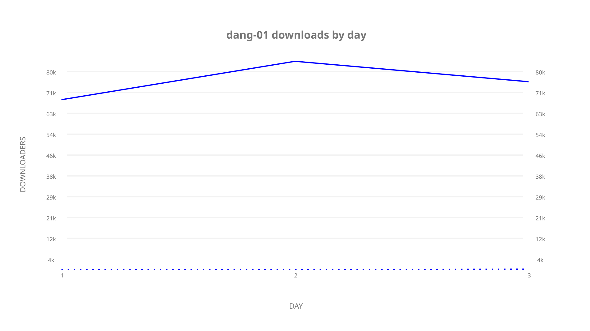
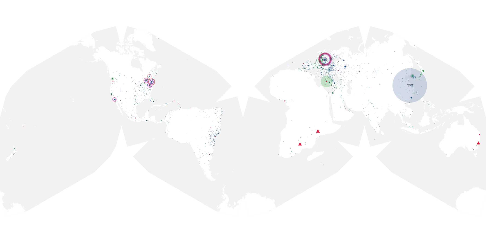
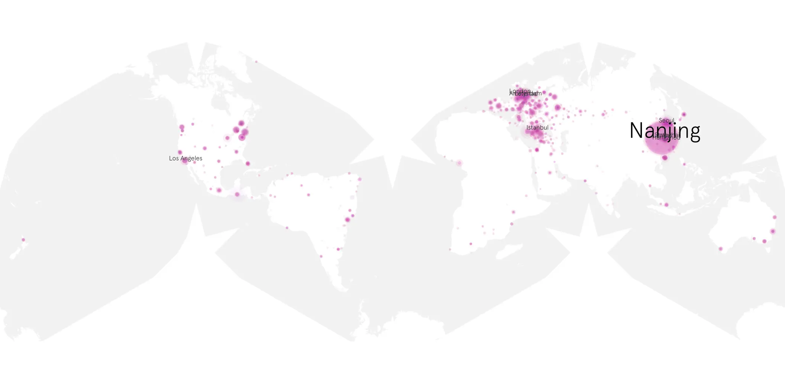
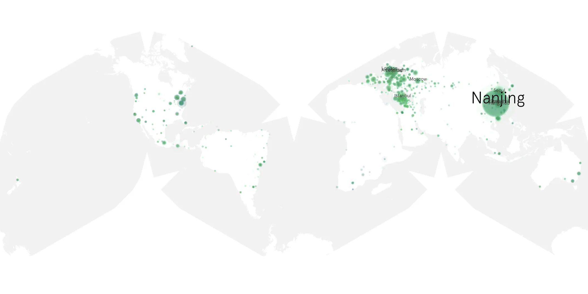

# dang-01 sample cache audit

## 1. Media object

| Field | Value |
| --- | --- |
| Media object | DANG! |
| Collection key | `dang-01` |
| imdb_id | [tt40003445](https://www.imdb.com/title/tt40003445/) |
| wikipedia_url | UNAVAILABLE — no English Wikipedia page exists |
| Sample dates | 2026-09-09-to-2026-09-11 |
| Sample days | 3 |
| BTIH count | 163 |
| Unique BTIH count | 162 |
| Downloaders total | 224,069 |
| Uploaders total | 9,503 |
| Data version | `2026-08-05` |
| IP geolocation version | `6:1777968300` |

## 2. Coverage report

- Generated: 2026-09-13T17:13:04Z
- Sample archive directory: `/mnt/gold/src/alpha60-samples-raw.gold/dang-01.xz`
- Hour directories: 71
- Zero-length sample files: 0
- Other unparsable sample files: 0
- Hourly discontinuities: 0 (0 missing hours)
- Missing days: 0

### Sample archive discontinuities

None detected.

## 3. File sizes histogram *median[lowest, highest]*

## 4. Graphs

### Downloads by week cumulative (normalized start)



### Downloads by day, Saturday and Sunday in gray

## 5. Cumulative Maps

<!-- https://raw.githubusercontent.com/alpha60-devops/alpha60-results-2026/refs/heads/main/data/ -->

### <a href="https://raw.githubusercontent.com/alpha60-devops/alpha60-results-2026/refs/heads/main/data/geojson.cumulative/dang-01-cumulative-aggregate.geojson.gz" data-map-title="DANG! — dang-01" onclick="leaflet_map_open_window(this.href, this.dataset.mapTitle); return false;" class="table-link" aria-label="Open DANG! (dang-01) cumulative data map in new window" title="Opens interactive map for DANG! (dang-01) data">Swarm Detail</a>

### Geographic Regions

| Africa | Americas | Asia | Europe | Oceania | Unknown |
| --- | --- | --- | --- | --- | --- |
| 1.62 | 16.92 | 38.77 | 36.43 | 1.28 | 0.50 |

### Network infrastructure

{:target="_blank" rel="noopener"}

### Resolution >= 1080p

{:target="_blank" rel="noopener"}

### Resolution < 1080p

{:target="_blank" rel="noopener"}
