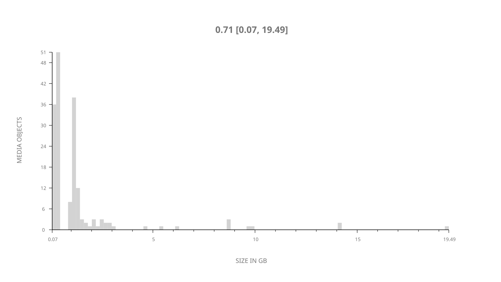
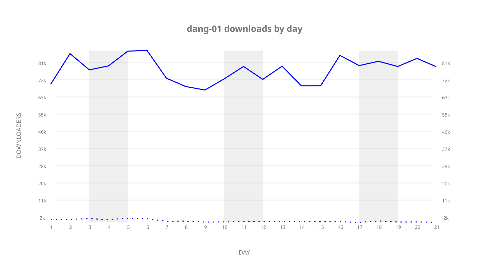
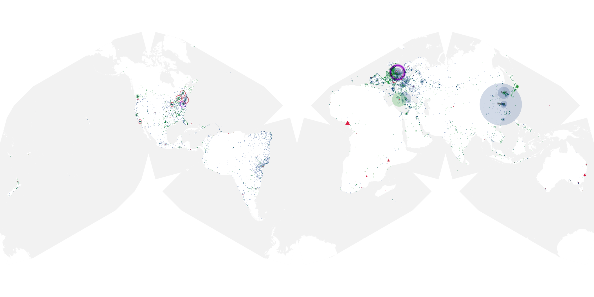
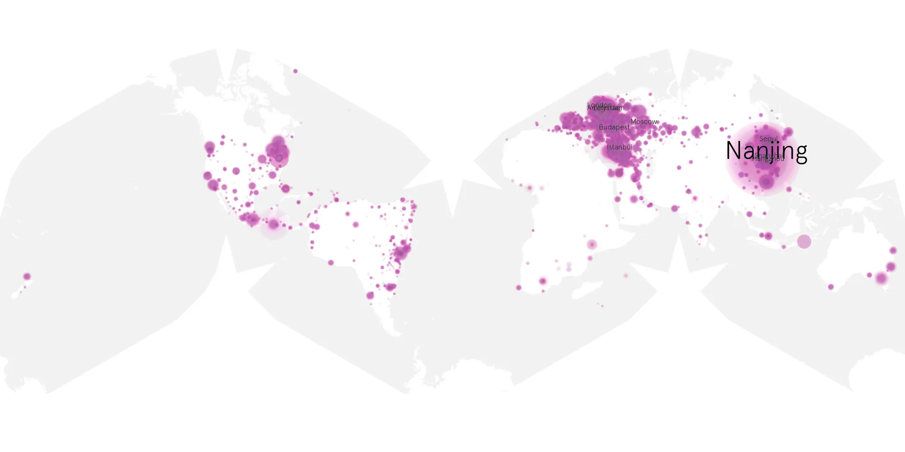
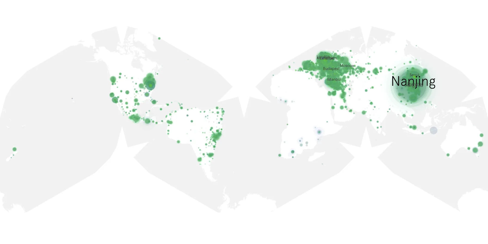

# dang-01 sample cache audit

## 1. Media object

| Field | Value |
| --- | --- |
| Media object | DANG! |
| Collection key | `dang-01` |
| imdb_id | [tt40003445](https://www.imdb.com/title/tt40003445/) |
| wikipedia_url | UNAVAILABLE — no English Wikipedia page exists |
| Sample dates | 2026-09-09-to-2026-09-29 |
| Sample days | 21 |
| BTIH count | 175 |
| Unique BTIH count | 174 |
| Downloaders total | 1,405,793 |
| Uploaders total | 37,982 |
| Data version | `2026-08-05` |
| IP geolocation version | `6:1777968300` |

## 2. Sample coverage report

- Generated: 2026-10-03T19:10:22Z
- Frozen sample archive directory: `/mnt/gold/src/alpha60-samples-raw.gold/dang-01.xz`
- Hour directories: 503
- Zero-length sample files: 0
- Malformed in-scope records accepted: 0 (producer rejects nonempty malformed input)
- Hourly discontinuities: 0 (0 missing hours)
- Missing days: 0

### Sample archive discontinuities

None detected.

### Frozen validation evidence

- Frozen content SHA-256: `3301adf70fb824f9aca6455b993a9e2f9350ba02f592b05d0612e151db24d0f7`
- Full-input producer receipt SHA-256: `47f7268fd0709dad61d2f007e52c0398fe493bf8f0a285cd3d5d2368ab07ebcd`
- Frozen raw archives: 503
- Empty sampler observations remain explicit gaps; no observations were imputed.
- Out-of-scope records retain the collection factory's established filtering.
- Excluded raw members: 0
- Excluded observations: 0

## 3. Media objects file size histogram

## 4. Visualization pass — graphs

### Downloads by week cumulative (normalized start)



### Downloads by day, Saturday and Sunday in gray

## 5. Visualization pass — maps

### Cumulative geographic slices

| Africa | Americas | Asia | Europe | Oceania | Unknown |
| --- | --- | --- | --- | --- | --- |
| 1.75 | 18.92 | 34.70 | 42.86 | 1.15 | 0.62 |

### Cumulative network infrastructure

{:target="_blank" rel="noopener"}

### Cumulative data maps

**Cumulative >= 1080p**

{:target="_blank" rel="noopener"}

**Cumulative < 1080p**

{:target="_blank" rel="noopener"}
