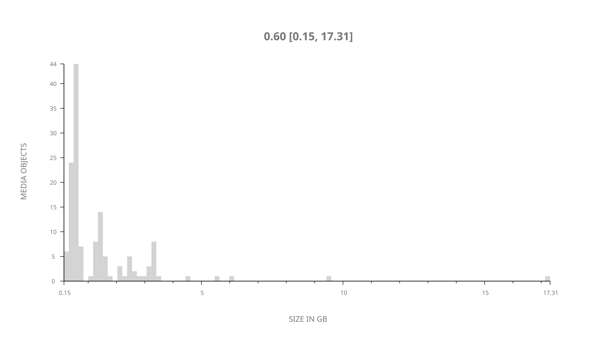
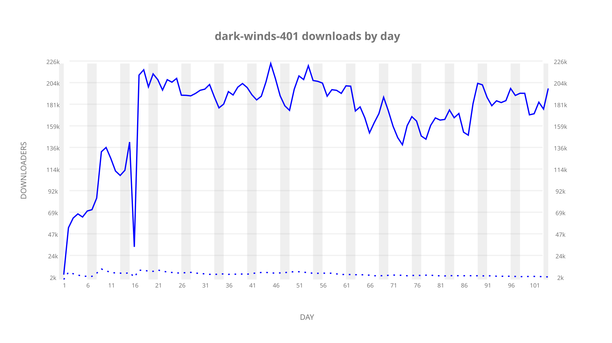
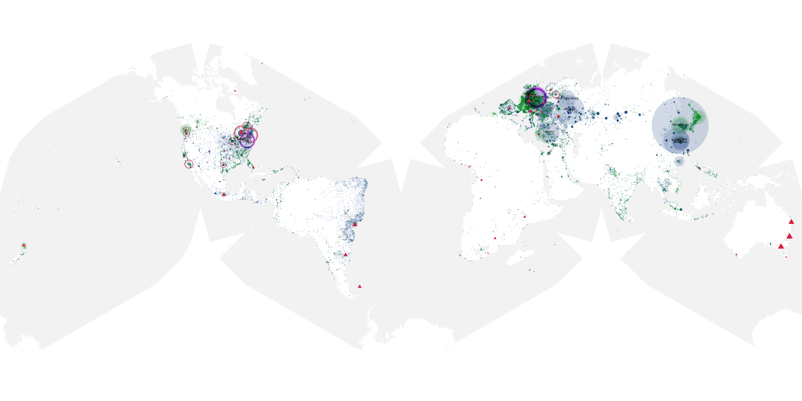
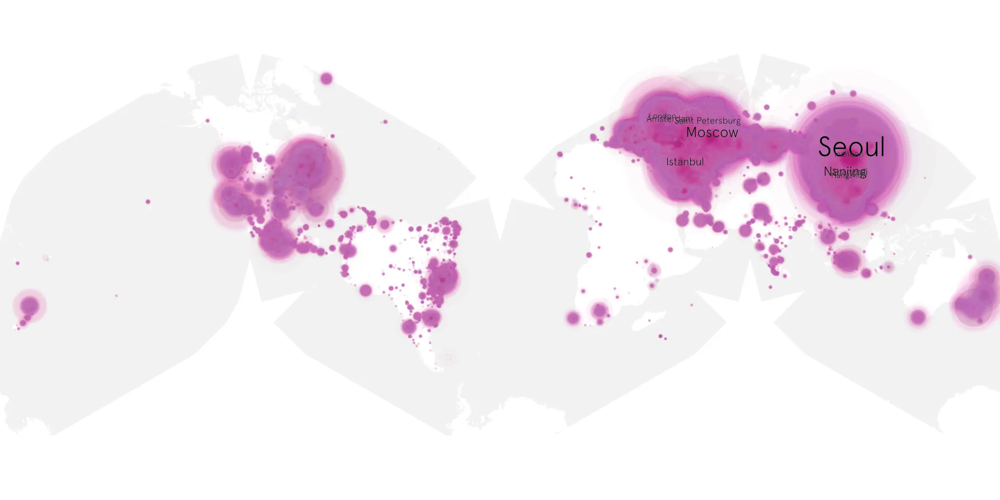
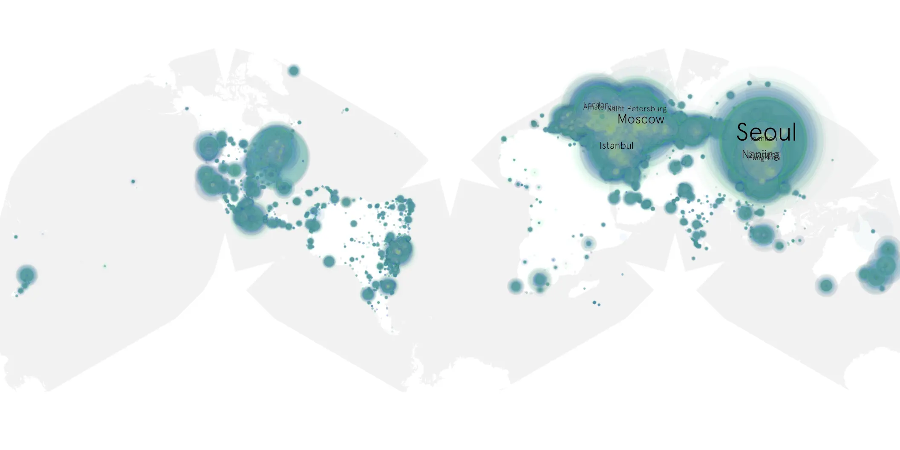

# dark-winds-401 sample cache audit

## 1. Media object

| Field | Value |
| --- | --- |
| Media object | Dark Winds |
| Collection key | `dark-winds-401` |
| imdb_id | [tt15017118](https://www.imdb.com/title/tt15017118/) |
| wikipedia_url | [Dark Winds](https://en.wikipedia.org/wiki/Dark_Winds) |
| Sample dates | 2026-02-15-to-2026-05-30 |
| Sample days | 105 |
| BTIH count | 158 |
| Unique BTIH count | 140 |
| Downloaders total | 14,527,731 |
| Uploaders total | 411,163 |
| Data version | `2026-08-05` |
| IP geolocation version | `6:1777968300` |

## 2. Sample coverage report

- Generated: 2026-09-13T17:13:04Z
- Sample archive directory: `/mnt/gold/src/alpha60-samples-raw.gold/dark-winds-401.xz`
- Hour directories: 2451
- Zero-length sample files: 0
- Other unparsable sample files: 0
- Hourly discontinuities: 2 (46 missing hours)
- Missing days: 1

### Sample archive discontinuities

- hourly gap: last `2026-03-02 02:00`, resumed `2026-03-04 00:00` — missing 45 hour(s)
- hourly gap: last `2026-03-29 01:00`, resumed `2026-03-29 03:00` — missing 1 hour(s)
- missing day: `2026-03-03`

## 3. Media objects file size histogram

## 4. Visualization pass — graphs

### Downloads by week cumulative (normalized start)



### Downloads by day, Saturday and Sunday in gray

## 5. Visualization pass — maps

### Cumulative geographic slices

| Africa | Americas | Asia | Europe | Oceania | Unknown |
| --- | --- | --- | --- | --- | --- |
| 0.98 | 14.88 | 33.96 | 44.84 | 1.31 | 0.69 |

### Cumulative network infrastructure

{:target="_blank" rel="noopener"}

### Cumulative data maps

**Cumulative >= 1080p**

{:target="_blank" rel="noopener"}

**Cumulative < 1080p**

{:target="_blank" rel="noopener"}
