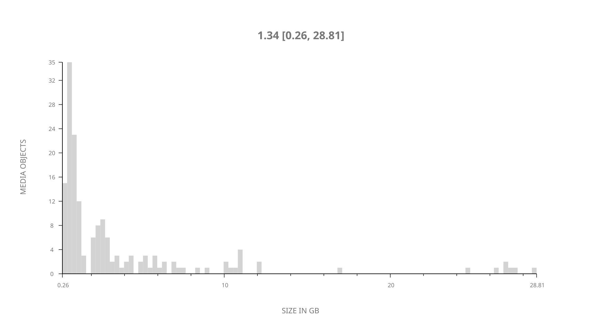
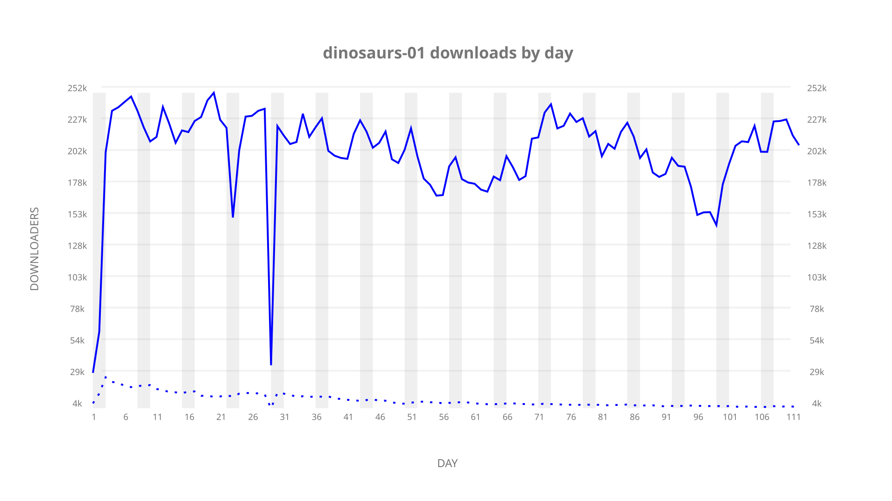
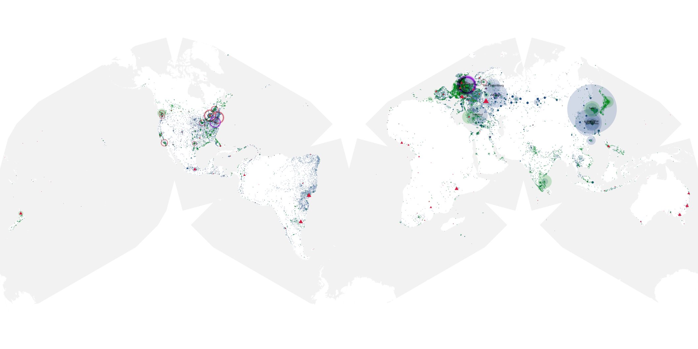
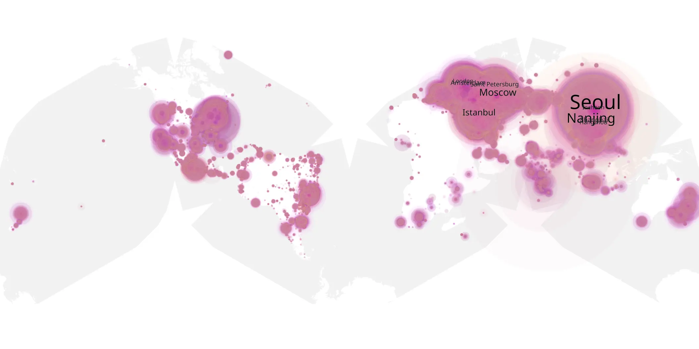
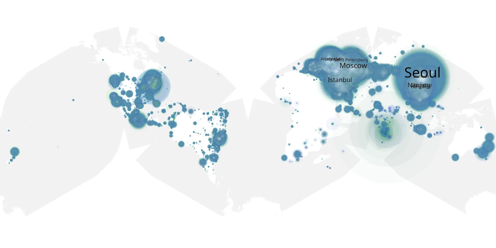

# dinosaurs-01 sample cache audit

## 1. Media object

| Field | Value |
| --- | --- |
| Media object | The Dinosaurs |
| Collection key | `dinosaurs-01` |
| imdb_id | [tt32493765](https://www.imdb.com/title/tt32493765/) |
| wikipedia_url | [The Dinosaurs (miniseries)](https://en.wikipedia.org/wiki/The_Dinosaurs_(miniseries)) |
| Sample dates | 2026-03-06-to-2026-06-25 |
| Sample days | 112 |
| BTIH count | 166 |
| Unique BTIH count | 164 |
| Downloaders total | 17,795,117 |
| Uploaders total | 578,385 |
| Data version | `2026-08-05` |
| IP geolocation version | `6:1777968300` |

## 2. Sample coverage report

- Generated: 2026-09-13T17:13:04Z
- Sample archive directory: `/mnt/gold/src/alpha60-samples-raw.gold/dinosaurs-01.xz`
- Hour directories: 2640
- Zero-length sample files: 0
- Other unparsable sample files: 0
- Hourly discontinuities: 3 (31 missing hours)
- Missing days: 0

### Sample archive discontinuities

- hourly gap: last `2026-03-27 22:00`, resumed `2026-03-28 08:00` — missing 9 hour(s)
- hourly gap: last `2026-03-29 01:00`, resumed `2026-03-29 03:00` — missing 1 hour(s)
- hourly gap: last `2026-04-03 02:00`, resumed `2026-04-04 00:00` — missing 21 hour(s)

## 3. Media objects file size histogram

## 4. Visualization pass — graphs

### Downloads by week cumulative (normalized start)



### Downloads by day, Saturday and Sunday in gray

## 5. Visualization pass — maps

### Cumulative geographic slices

| Africa | Americas | Asia | Europe | Oceania | Unknown |
| --- | --- | --- | --- | --- | --- |
| 1.16 | 14.75 | 36.08 | 44.40 | 1.19 | 0.71 |

### Cumulative network infrastructure

{:target="_blank" rel="noopener"}

### Cumulative data maps

**Cumulative >= 1080p**

{:target="_blank" rel="noopener"}

**Cumulative < 1080p**

{:target="_blank" rel="noopener"}
