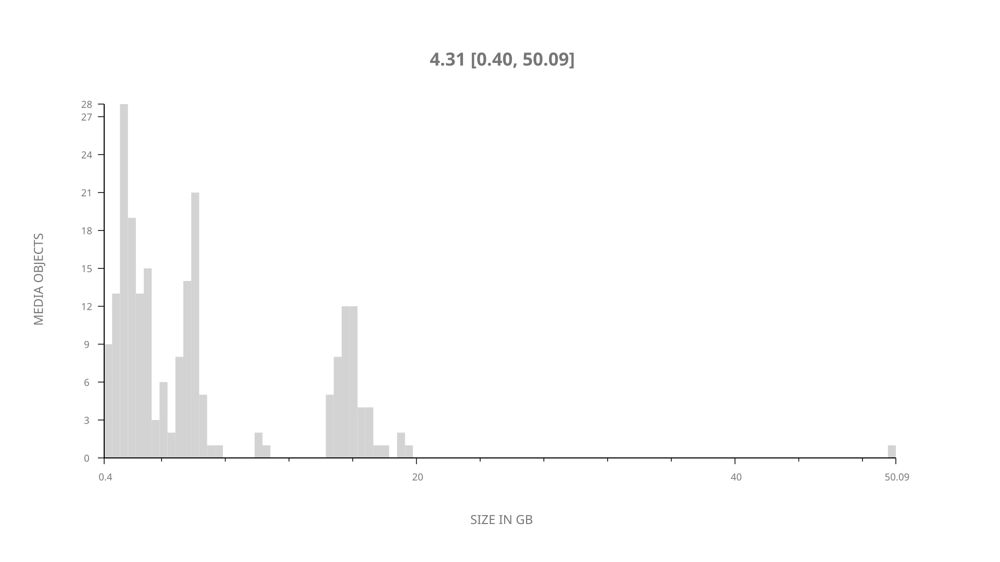
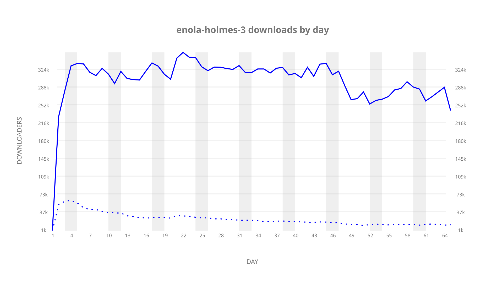
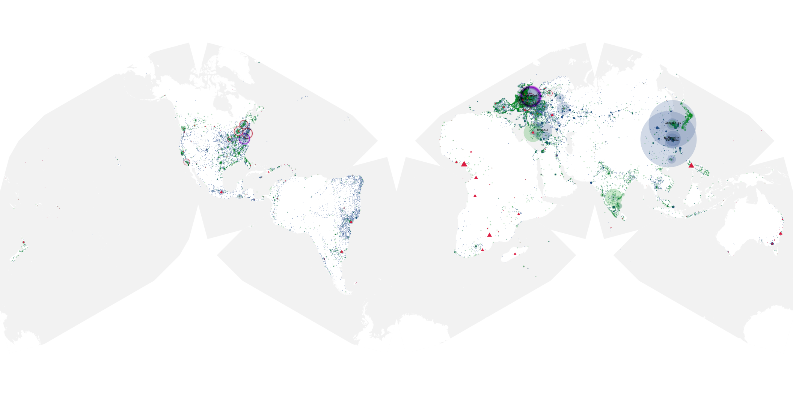
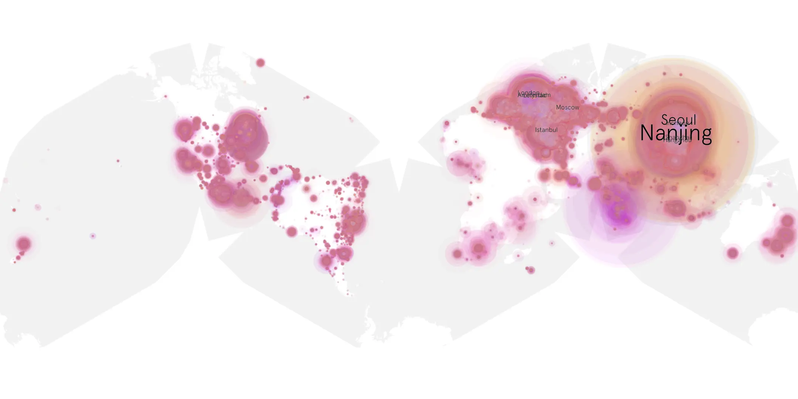
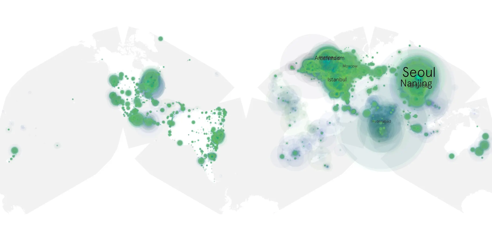

# enola-holmes-3 sample cache audit

## 1. Media object

| Field | Value |
| --- | --- |
| Media object | Enola Holmes 3 |
| Collection key | `enola-holmes-3` |
| imdb_id | [tt32278481](https://www.imdb.com/title/tt32278481/) |
| wikipedia_url | [Enola Holmes 3](https://en.wikipedia.org/wiki/Enola_Holmes_3) |
| Sample dates | 2026-07-01-to-2026-09-03 |
| Sample days | 65 |
| BTIH count | 227 |
| Unique BTIH count | 212 |
| Downloaders total | 15,175,601 |
| Uploaders total | 890,921 |
| Data version | `2026-08-05` |
| IP geolocation version | `6:1777968300` |

## 2. Sample coverage report

- Generated: 2026-09-13T17:13:05Z
- Sample archive directory: `/mnt/gold/src/alpha60-samples-raw.gold/enola-holmes-3.xz`
- Hour directories: 1538
- Zero-length sample files: 0
- Other unparsable sample files: 0
- Hourly discontinuities: 1 (1 missing hours)
- Missing days: 0

### Sample archive discontinuities

- hourly gap: last `2026-08-30 22:02`, resumed `2026-08-31 00:02` — missing 1 hour(s)

## 3. Media objects file size histogram

## 4. Visualization pass — graphs

### Downloads by week cumulative (normalized start)



### Downloads by day, Saturday and Sunday in gray

## 5. Visualization pass — maps

### Cumulative geographic slices

| Africa | Americas | Asia | Europe | Oceania | Unknown |
| --- | --- | --- | --- | --- | --- |
| 1.80 | 16.22 | 37.55 | 40.89 | 1.09 | 0.81 |

### Cumulative network infrastructure

{:target="_blank" rel="noopener"}

### Cumulative data maps

**Cumulative >= 1080p**

{:target="_blank" rel="noopener"}

**Cumulative < 1080p**

{:target="_blank" rel="noopener"}
