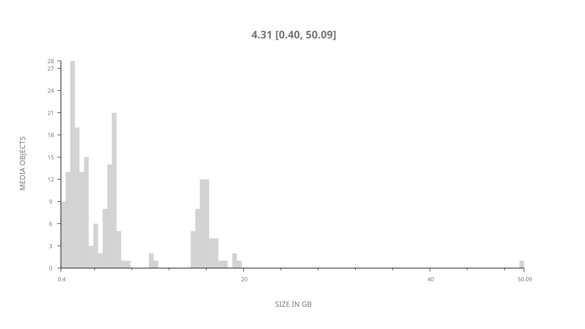
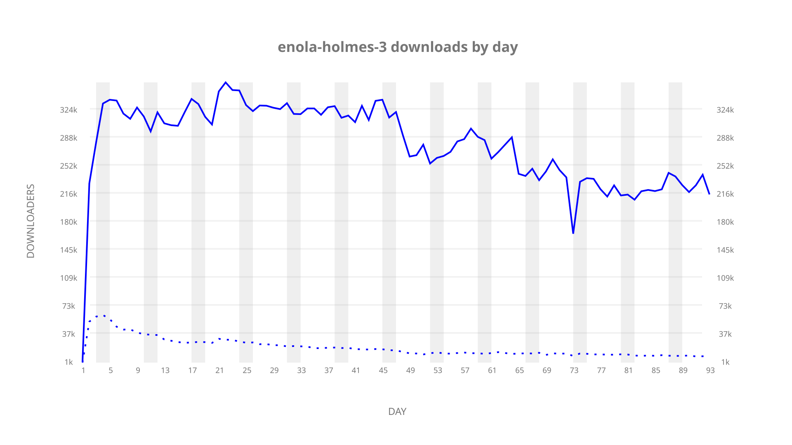
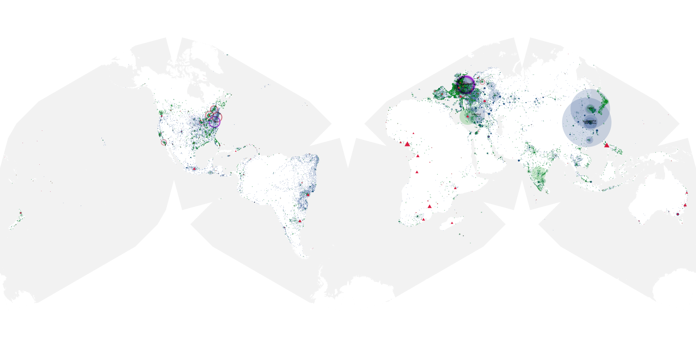
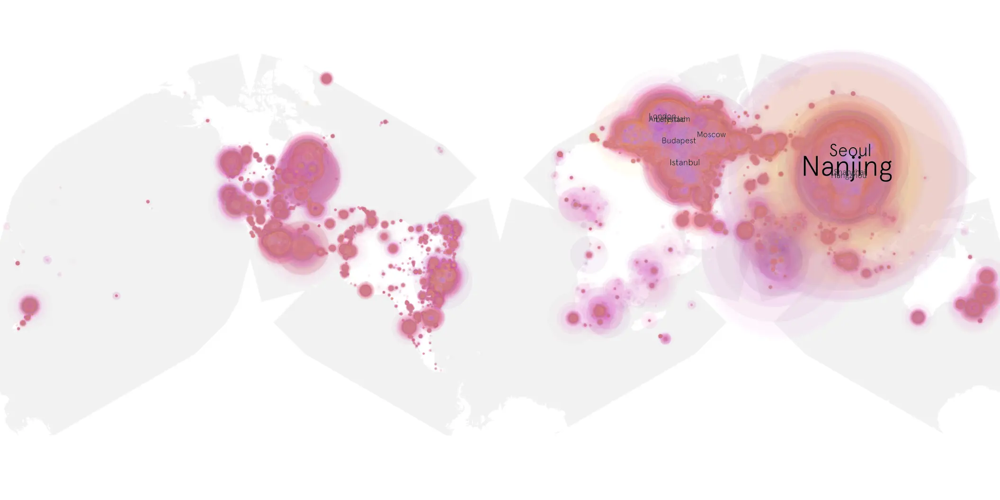
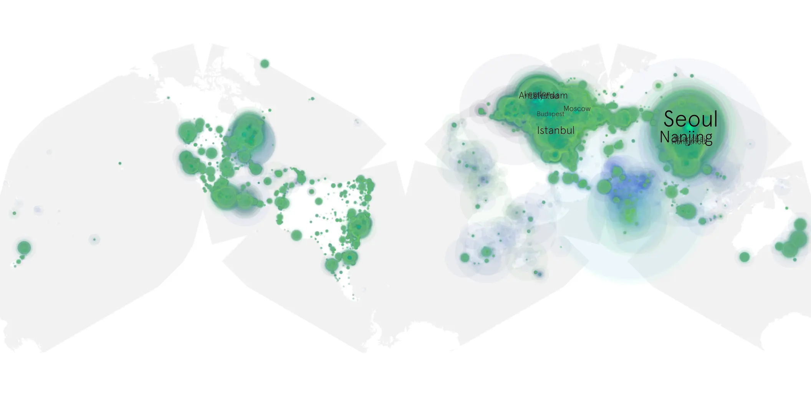

# enola-holmes-3 sample cache audit

## 1. Media object

| Field | Value |
| --- | --- |
| Media object | Enola Holmes 3 |
| Collection key | `enola-holmes-3` |
| imdb_id | [tt32278481](https://www.imdb.com/title/tt32278481/) |
| wikipedia_url | [Enola Holmes 3](https://en.wikipedia.org/wiki/Enola_Holmes_3) |
| Sample dates | 2026-07-01-to-2026-10-01 |
| Sample days | 93 |
| BTIH count | 227 |
| Unique BTIH count | 212 |
| Downloaders total | 19,725,085 |
| Uploaders total | 1,037,155 |
| Data version | `2026-08-05` |
| IP geolocation version | `6:1777968300` |

## 2. Sample coverage report

- Generated: 2026-10-07T10:10:20Z
- Frozen sample archive directory: `/mnt/gold/src/alpha60-samples-raw.gold/enola-holmes-3.xz`
- Hour directories: 2201
- Zero-length sample files: 0
- Malformed in-scope records accepted: 0 (producer rejects nonempty malformed input)
- Hourly discontinuities: 2 (10 missing hours)
- Missing days: 0

### Sample archive discontinuities

- hourly gap: last `2026-08-30 22:02`, resumed `2026-08-31 00:02` — missing 1 hour(s)
- hourly gap: last `2026-09-10 22:02`, resumed `2026-09-11 08:02` — missing 9 hour(s)

### Frozen validation evidence

- Frozen content SHA-256: `7e18763d7ce50f24ef98086d7534f6f8a890eea1abb0adfcdaafbad946164ab6`
- Full-input producer receipt SHA-256: `65b3ef3f718bba8372dc17c0cef3289b7658457a30e02eddda31eed79e29e463`
- Frozen raw archives: 2201
- Empty sampler observations remain explicit gaps; no observations were imputed.
- Out-of-scope records retain the collection factory's established filtering.
- Excluded raw members: 1
- Excluded observations: 3292

## 3. Media objects file size histogram

## 4. Visualization pass — graphs

### Downloads by week cumulative (normalized start)



### Downloads by day, Saturday and Sunday in gray

## 5. Visualization pass — maps

### Cumulative geographic slices

| Africa | Americas | Asia | Europe | Oceania | Unknown |
| --- | --- | --- | --- | --- | --- |
| 1.93 | 17.31 | 37.07 | 41.74 | 1.11 | 0.83 |

### Cumulative network infrastructure

{:target="_blank" rel="noopener"}

### Cumulative data maps

**Cumulative >= 1080p**

{:target="_blank" rel="noopener"}

**Cumulative < 1080p**

{:target="_blank" rel="noopener"}
