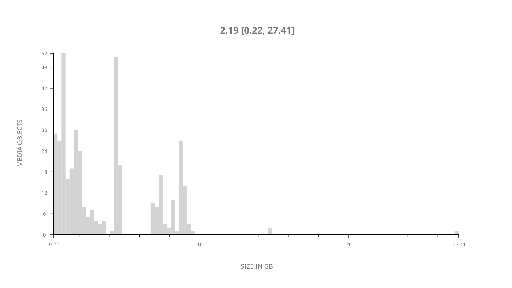
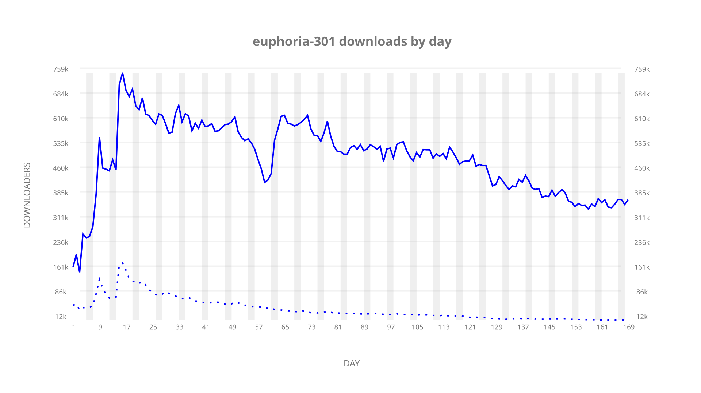
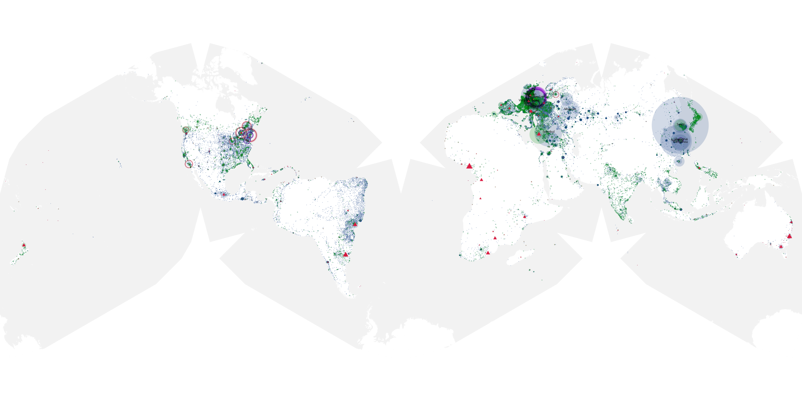
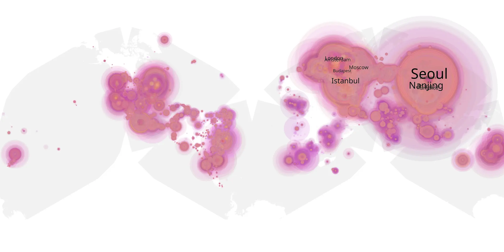
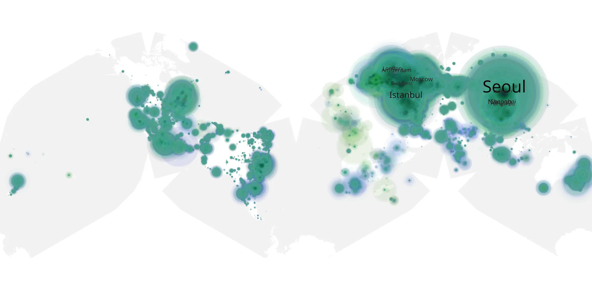

# euphoria-301 sample cache audit

## 1. Media object

| Field | Value |
| --- | --- |
| Media object | Euphoria |
| Collection key | `euphoria-301` |
| imdb_id | [tt8772296](https://www.imdb.com/title/tt8772296/) |
| wikipedia_url | [Euphoria (American TV series)](https://en.wikipedia.org/wiki/Euphoria_(American_TV_series)) |
| Sample dates | 2026-04-13-to-2026-09-28 |
| Sample days | 169 |
| BTIH count | 410 |
| Unique BTIH count | 398 |
| Downloaders total | 61,172,208 |
| Uploaders total | 3,525,109 |
| Data version | `2026-08-05` |
| IP geolocation version | `6:1777968300` |

## 2. Sample coverage report

- Generated: 2026-10-07T14:25:16Z
- Frozen sample archive directory: `/mnt/gold/src/alpha60-samples-raw.gold/euphoria-301.xz`
- Hour directories: 4049
- Zero-length sample files: 0
- Malformed in-scope records accepted: 0 (producer rejects nonempty malformed input)
- Hourly discontinuities: 0 (0 missing hours)
- Missing days: 0

### Sample archive discontinuities

None detected.

### Frozen validation evidence

- Frozen content SHA-256: `29e872ee7bf8b1dfcfffce2a9e81f1952cb6df930b11df6a862c3214785f13e5`
- Full-input producer receipt SHA-256: `8490c77745e558c2bd3414be6eae80b7a8ca7ad6b5c8eb736fd883501f9ddc3d`
- Frozen raw archives: 4049
- Empty sampler observations remain explicit gaps; no observations were imputed.
- Out-of-scope records retain the collection factory's established filtering.
- Excluded raw members: 12
- Excluded observations: 60415

## 3. Media objects file size histogram

## 4. Visualization pass — graphs

### Downloads by week cumulative (normalized start)



### Downloads by day, Saturday and Sunday in gray

## 5. Visualization pass — maps

### Cumulative geographic slices

| Africa | Americas | Asia | Europe | Oceania | Unknown |
| --- | --- | --- | --- | --- | --- |
| 1.84 | 17.14 | 34.83 | 44.05 | 1.34 | 0.80 |

### Cumulative network infrastructure

{:target="_blank" rel="noopener"}

### Cumulative data maps

**Cumulative >= 1080p**

{:target="_blank" rel="noopener"}

**Cumulative < 1080p**

{:target="_blank" rel="noopener"}
