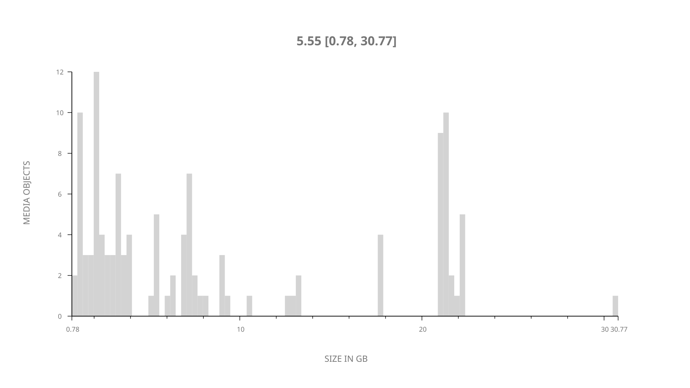
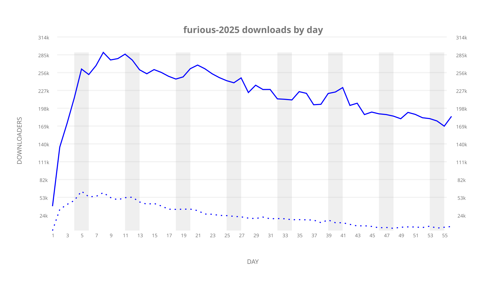
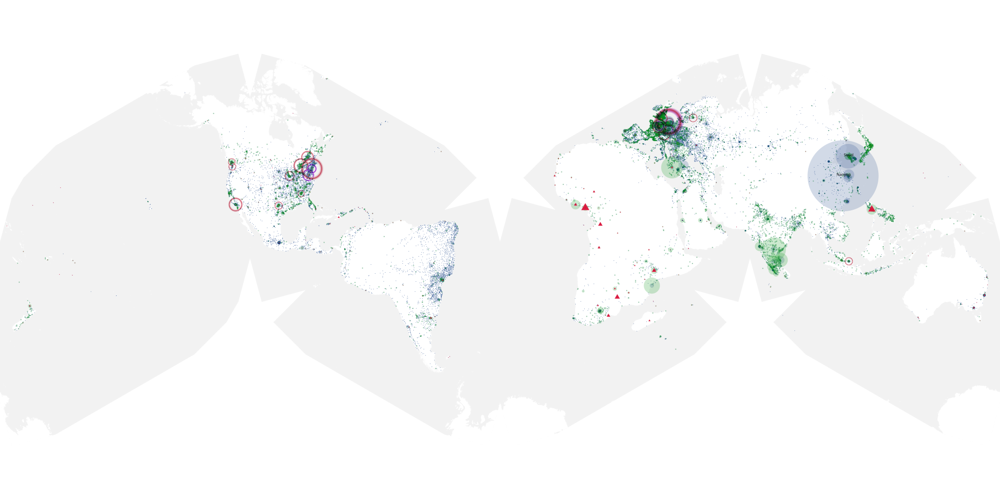
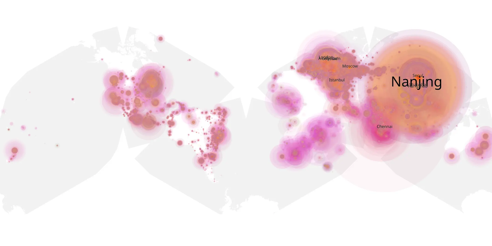
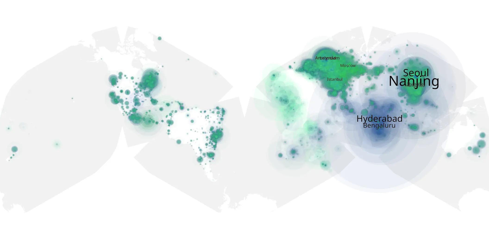

# furious-2025 sample cache audit

## 1. Media object

| Field | Value |
| --- | --- |
| Media object | The Furious |
| Collection key | `furious-2025` |
| imdb_id | [tt33311069](https://www.imdb.com/title/tt33311069/) |
| wikipedia_url | [The Furious](https://en.wikipedia.org/wiki/The_Furious) |
| Sample dates | 2026-07-07-to-2026-08-31 |
| Sample days | 56 |
| BTIH count | 128 |
| Unique BTIH count | 119 |
| Downloaders total | 10,432,240 |
| Uploaders total | 1,934,557 |
| Data version | `2026-08-05` |
| IP geolocation version | `6:1777968300` |

## 2. Coverage report

- Generated: 2026-09-13T17:13:05Z
- Sample archive directory: `/mnt/gold/src/alpha60-samples-raw.gold/furious-2025.xz`
- Hour directories: 1325
- Zero-length sample files: 0
- Other unparsable sample files: 0
- Hourly discontinuities: 2 (2 missing hours)
- Missing days: 0

### Sample archive discontinuities

- hourly gap: last `2026-08-24 22:06`, resumed `2026-08-25 00:06` — missing 1 hour(s)
- hourly gap: last `2026-08-30 22:06`, resumed `2026-08-31 00:06` — missing 1 hour(s)

## 3. File sizes histogram *median[lowest, highest]*

## 4. Graphs

### Downloads by week cumulative (normalized start)



### Downloads by day, Saturday and Sunday in gray

## 5. Cumulative Maps

<!-- https://raw.githubusercontent.com/alpha60-devops/alpha60-results-2026/refs/heads/main/data/ -->

### <a href="https://raw.githubusercontent.com/alpha60-devops/alpha60-results-2026/refs/heads/main/data/geojson.cumulative/furious-2025-cumulative-aggregate.geojson.gz" data-map-title="The Furious — furious-2025" onclick="leaflet_map_open_window(this.href, this.dataset.mapTitle); return false;" class="table-link" aria-label="Open The Furious (furious-2025) cumulative data map in new window" title="Opens interactive map for The Furious (furious-2025) data">Swarm Detail</a>

### Geographic Regions

| Africa | Americas | Asia | Europe | Oceania | Unknown |
| --- | --- | --- | --- | --- | --- |
| 4.16 | 14.83 | 41.70 | 32.73 | 1.21 | 0.69 |

### Network infrastructure

{:target="_blank" rel="noopener"}

### Resolution >= 1080p

{:target="_blank" rel="noopener"}

### Resolution < 1080p

{:target="_blank" rel="noopener"}
