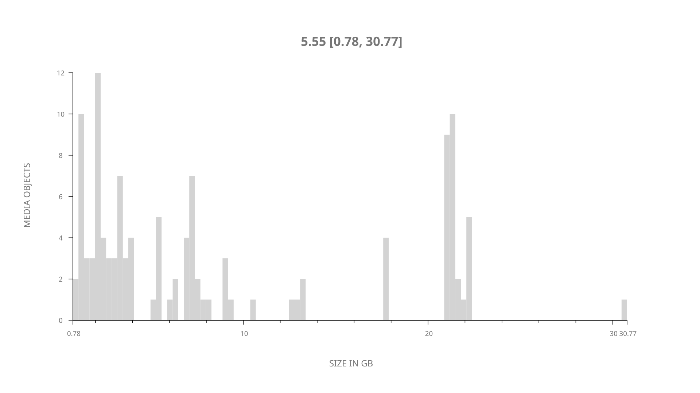
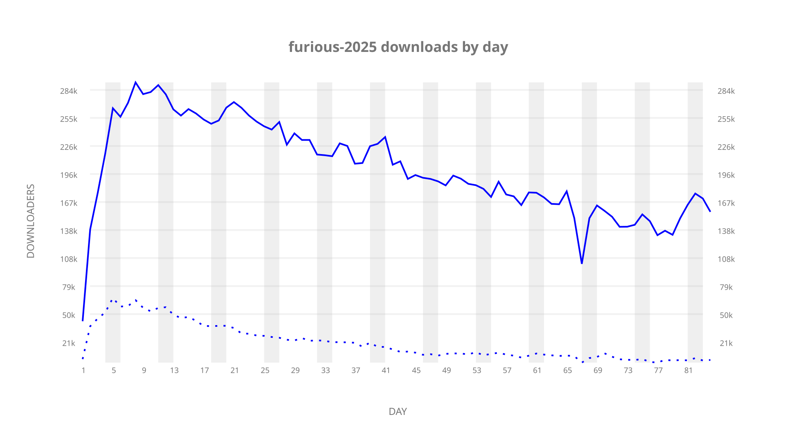
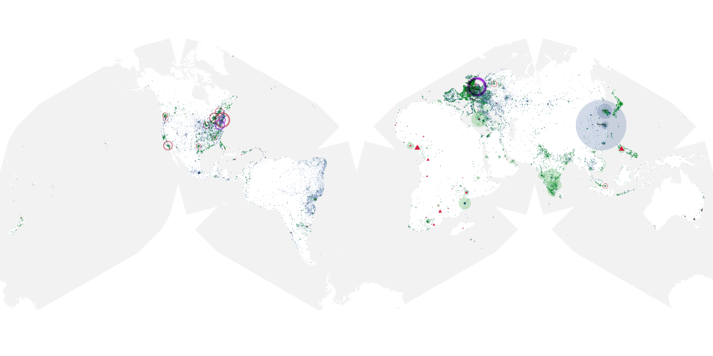
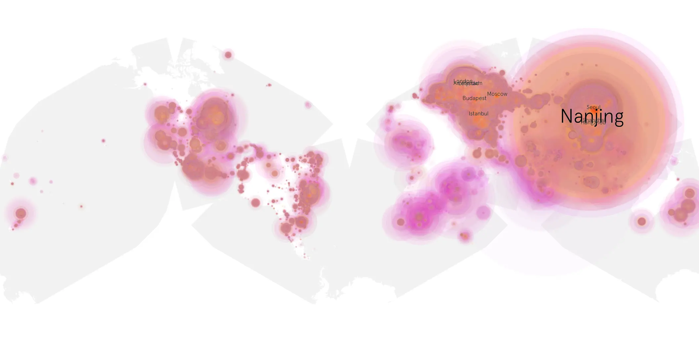
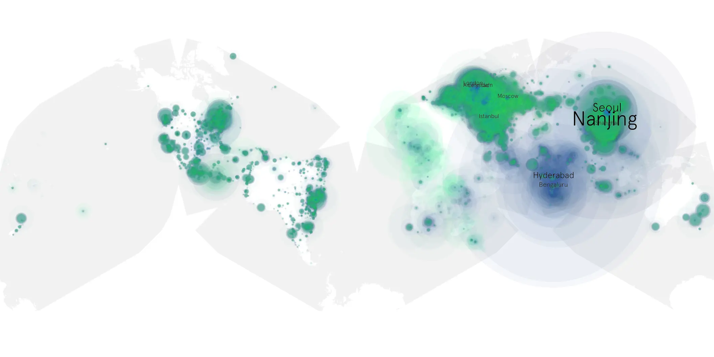

# furious-2025 sample cache audit

## 1. Media object

| Field | Value |
| --- | --- |
| Media object | The Furious |
| Collection key | `furious-2025` |
| imdb_id | [tt33311069](https://www.imdb.com/title/tt33311069/) |
| wikipedia_url | [The Furious](https://en.wikipedia.org/wiki/The_Furious) |
| Sample dates | 2026-07-07-to-2026-09-28 |
| Sample days | 84 |
| BTIH count | 128 |
| Unique BTIH count | 119 |
| Downloaders total | 13,764,852 |
| Uploaders total | 2,327,190 |
| Data version | `2026-08-05` |
| IP geolocation version | `6:1777968300` |

## 2. Sample coverage report

- Generated: 2026-10-07T10:10:20Z
- Frozen sample archive directory: `/mnt/gold/src/alpha60-samples-raw.gold/furious-2025.xz`
- Hour directories: 1988
- Zero-length sample files: 0
- Malformed in-scope records accepted: 0 (producer rejects nonempty malformed input)
- Hourly discontinuities: 3 (11 missing hours)
- Missing days: 0

### Sample archive discontinuities

- hourly gap: last `2026-08-24 22:06`, resumed `2026-08-25 00:06` — missing 1 hour(s)
- hourly gap: last `2026-08-30 22:06`, resumed `2026-08-31 00:06` — missing 1 hour(s)
- hourly gap: last `2026-09-10 22:06`, resumed `2026-09-11 08:06` — missing 9 hour(s)

### Frozen validation evidence

- Frozen content SHA-256: `9d5a548d85bf19373c353df031d422d85417057a3871ea19532765c13ced9b32`
- Full-input producer receipt SHA-256: `4df79db4d7ee6331493cd0d7bb4f9b2fcb518ed8a3f708383a091349d36af573`
- Frozen raw archives: 1988
- Empty sampler observations remain explicit gaps; no observations were imputed.
- Out-of-scope records retain the collection factory's established filtering.
- Excluded raw members: 0
- Excluded observations: 0

## 3. Media objects file size histogram

## 4. Visualization pass — graphs

### Downloads by week cumulative (normalized start)



### Downloads by day, Saturday and Sunday in gray

## 5. Visualization pass — maps

### Cumulative geographic slices

| Africa | Americas | Asia | Europe | Oceania | Unknown |
| --- | --- | --- | --- | --- | --- |
| 4.49 | 16.01 | 42.96 | 34.59 | 1.21 | 0.73 |

### Cumulative network infrastructure

{:target="_blank" rel="noopener"}

### Cumulative data maps

**Cumulative >= 1080p**

{:target="_blank" rel="noopener"}

**Cumulative < 1080p**

{:target="_blank" rel="noopener"}
