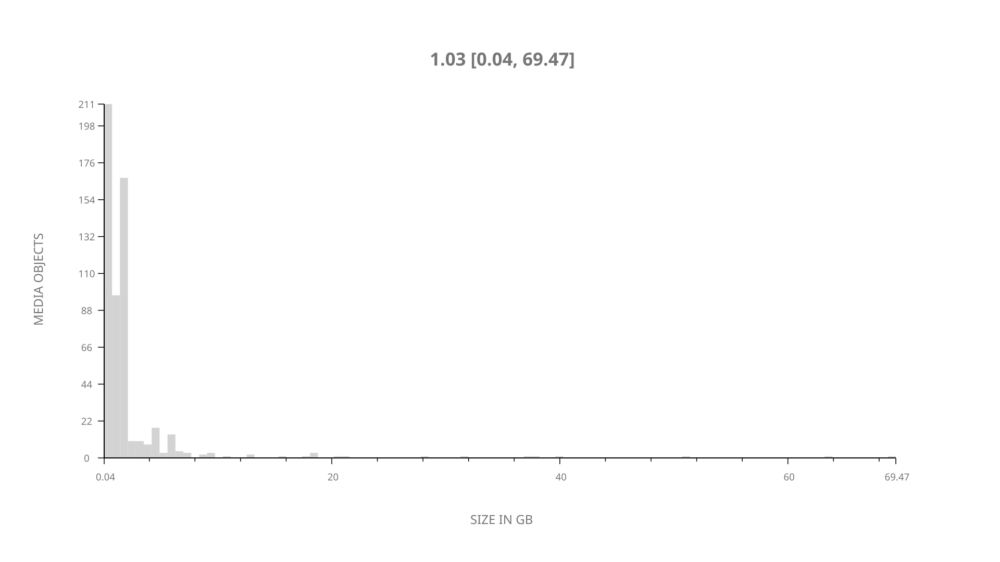
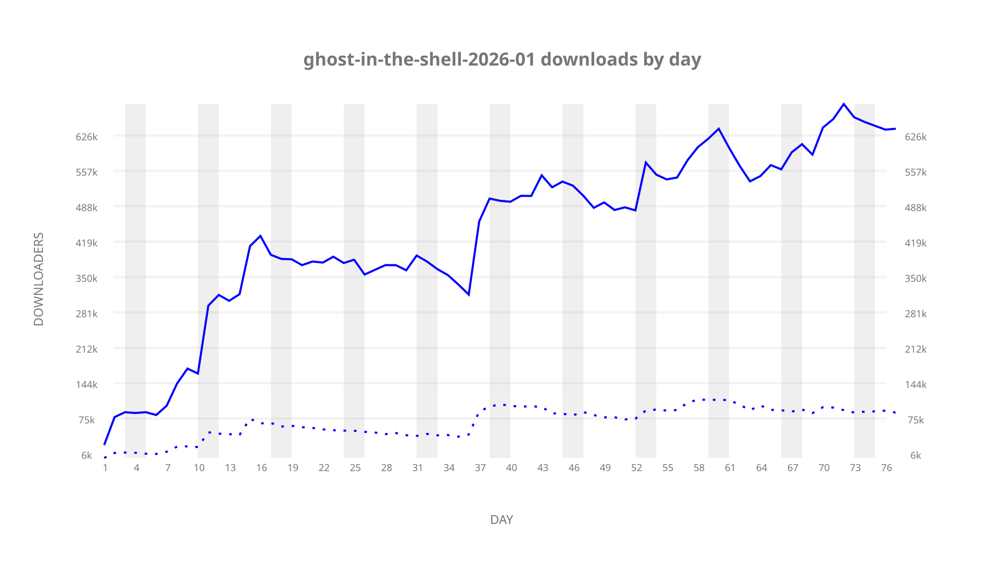
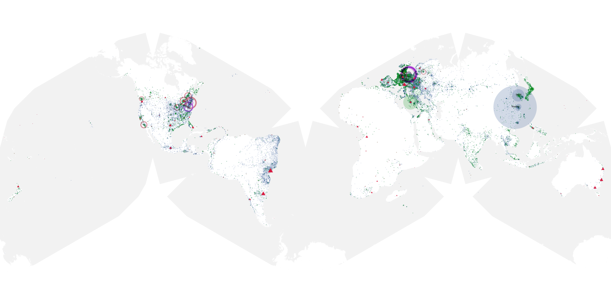
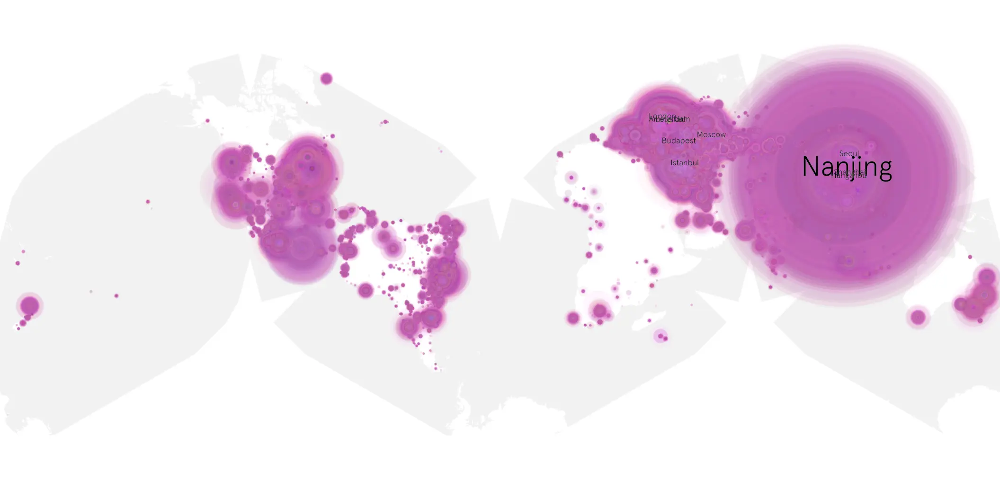
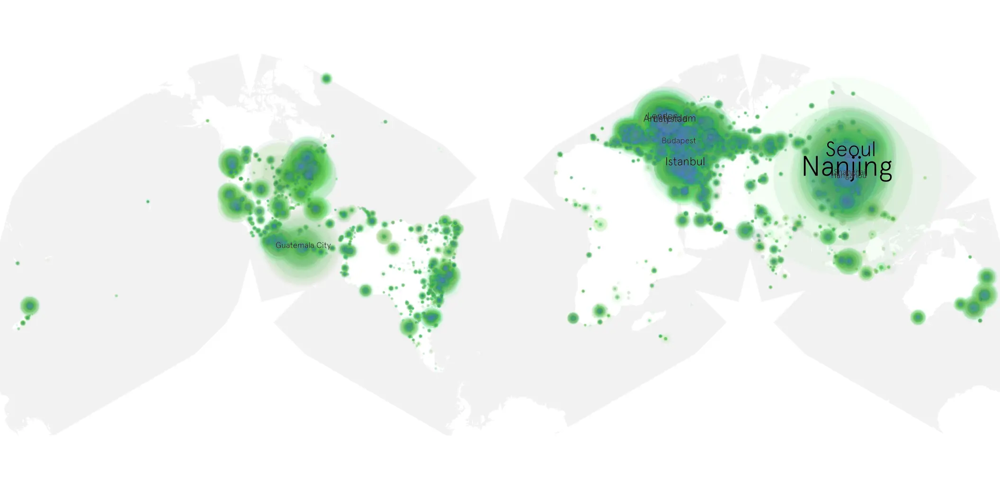

# ghost-in-the-shell-2026-01 sample cache audit

## 1. Media object

| Field | Value |
| --- | --- |
| Media object | The Ghost in the Shell |
| Collection key | `ghost-in-the-shell-2026-01` |
| imdb_id | [tt36517689](https://www.imdb.com/title/tt36517689/) |
| wikipedia_url | [The Ghost in the Shell (2026 TV series)](https://en.wikipedia.org/wiki/The_Ghost_in_the_Shell_(2026_TV_series)) |
| Sample dates | 2026-07-15-to-2026-09-29 |
| Sample days | 77 |
| BTIH count | 616 |
| Unique BTIH count | 568 |
| Downloaders total | 25,558,676 |
| Uploaders total | 3,159,601 |
| Data version | `2026-08-05` |
| IP geolocation version | `6:1777968300` |

## 2. Sample coverage report

- Generated: 2026-10-03T19:10:22Z
- Frozen sample archive directory: `/mnt/gold/src/alpha60-samples-raw.gold/ghost-in-the-shell-2026-01.xz`
- Hour directories: 1844
- Zero-length sample files: 0
- Malformed in-scope records accepted: 0 (producer rejects nonempty malformed input)
- Hourly discontinuities: 0 (0 missing hours)
- Missing days: 0

### Sample archive discontinuities

None detected.

### Frozen validation evidence

- Frozen content SHA-256: `ee0ee9113207da7834cfd320e954cca9e33faa82b0eab9c2585594cb4217b6d3`
- Full-input producer receipt SHA-256: `1f9d9ccbed1302185c2f3f8da0871bcddaa91e98972c6886e107820e9c04066b`
- Frozen raw archives: 1844
- Empty sampler observations remain explicit gaps; no observations were imputed.
- Out-of-scope records retain the collection factory's established filtering.
- Excluded raw members: 4
- Excluded observations: 3918

## 3. Media objects file size histogram

## 4. Visualization pass — graphs

### Downloads by week cumulative (normalized start)



### Downloads by day, Saturday and Sunday in gray

## 5. Visualization pass — maps

### Cumulative geographic slices

| Africa | Americas | Asia | Europe | Oceania | Unknown |
| --- | --- | --- | --- | --- | --- |
| 1.20 | 18.82 | 39.10 | 38.98 | 1.04 | 0.87 |

### Cumulative network infrastructure

{:target="_blank" rel="noopener"}

### Cumulative data maps

**Cumulative >= 1080p**

{:target="_blank" rel="noopener"}

**Cumulative < 1080p**

{:target="_blank" rel="noopener"}
