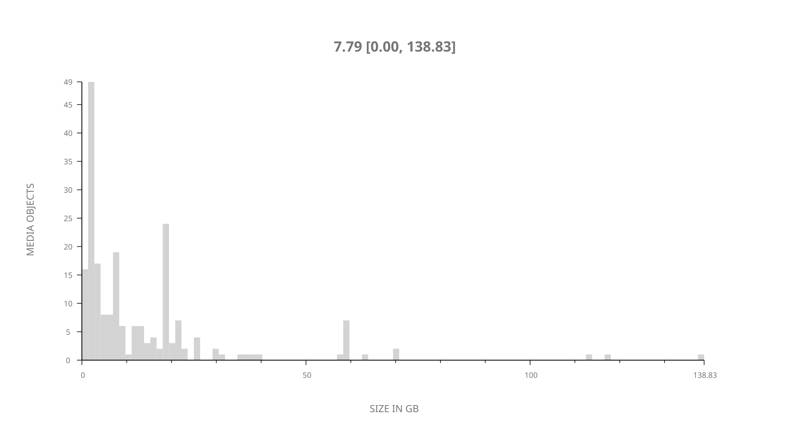
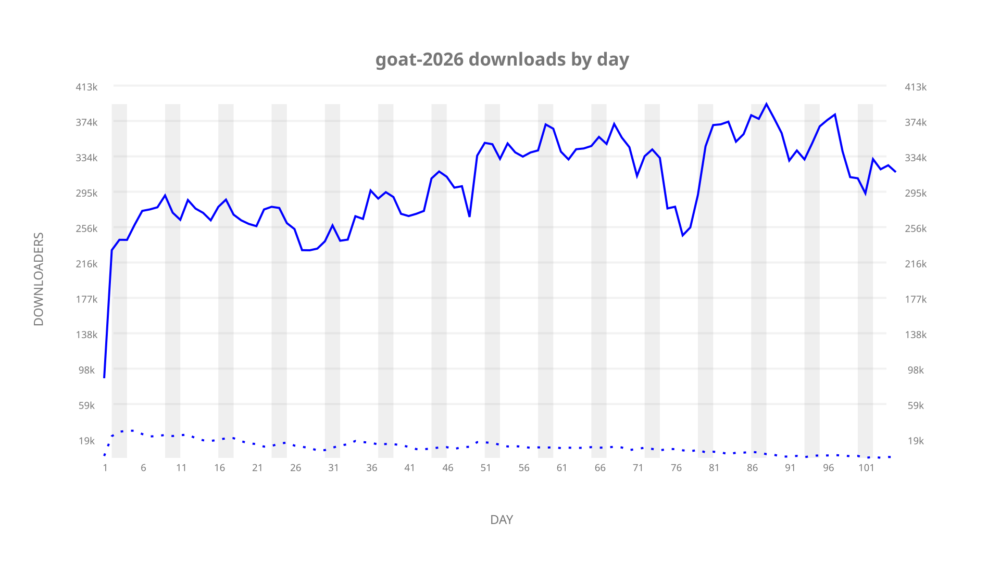
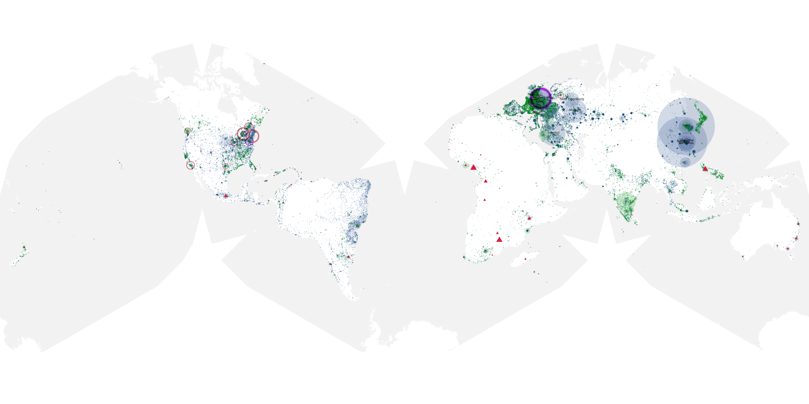
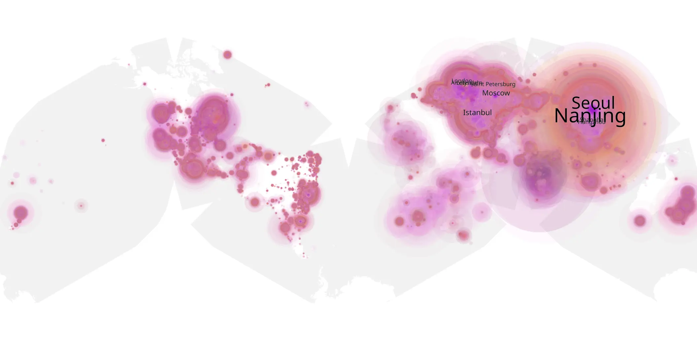
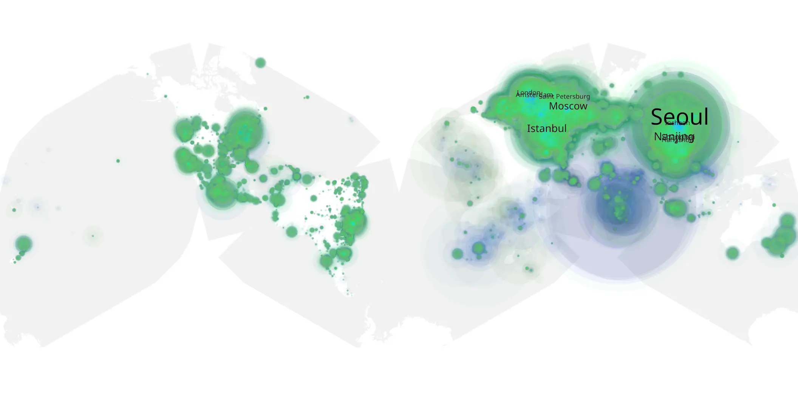

# goat-2026 sample cache audit

## 1. Media object

| Field | Value |
| --- | --- |
| Media object | GOAT |
| Collection key | `goat-2026` |
| imdb_id | [tt27613895](https://www.imdb.com/title/tt27613895/) |
| wikipedia_url | [Goat (2026 film)](https://en.wikipedia.org/wiki/Goat_(2026_film)) |
| Sample dates | 2026-03-26-to-2026-07-08 |
| Sample days | 105 |
| BTIH count | 225 |
| Unique BTIH count | 206 |
| Downloaders total | 25,986,657 |
| Uploaders total | 1,739,432 |
| Data version | `2026-08-05` |
| IP geolocation version | `6:1777968300` |

## 2. Sample coverage report

- Generated: 2026-09-13T17:13:05Z
- Sample archive directory: `/mnt/gold/src/alpha60-samples-raw.gold/goat-2026.xz`
- Hour directories: 2503
- Zero-length sample files: 0
- Other unparsable sample files: 0
- Hourly discontinuities: 1 (1 missing hours)
- Missing days: 0

### Sample archive discontinuities

- hourly gap: last `2026-03-29 01:03`, resumed `2026-03-29 03:03` — missing 1 hour(s)

## 3. Media objects file size histogram

## 4. Visualization pass — graphs

### Downloads by week cumulative (normalized start)



### Downloads by day, Saturday and Sunday in gray

## 5. Visualization pass — maps

### Cumulative geographic slices

| Africa | Americas | Asia | Europe | Oceania | Unknown |
| --- | --- | --- | --- | --- | --- |
| 2.63 | 14.53 | 37.79 | 41.10 | 1.24 | 0.74 |

### Cumulative network infrastructure

{:target="_blank" rel="noopener"}

### Cumulative data maps

**Cumulative >= 1080p**

{:target="_blank" rel="noopener"}

**Cumulative < 1080p**

{:target="_blank" rel="noopener"}
