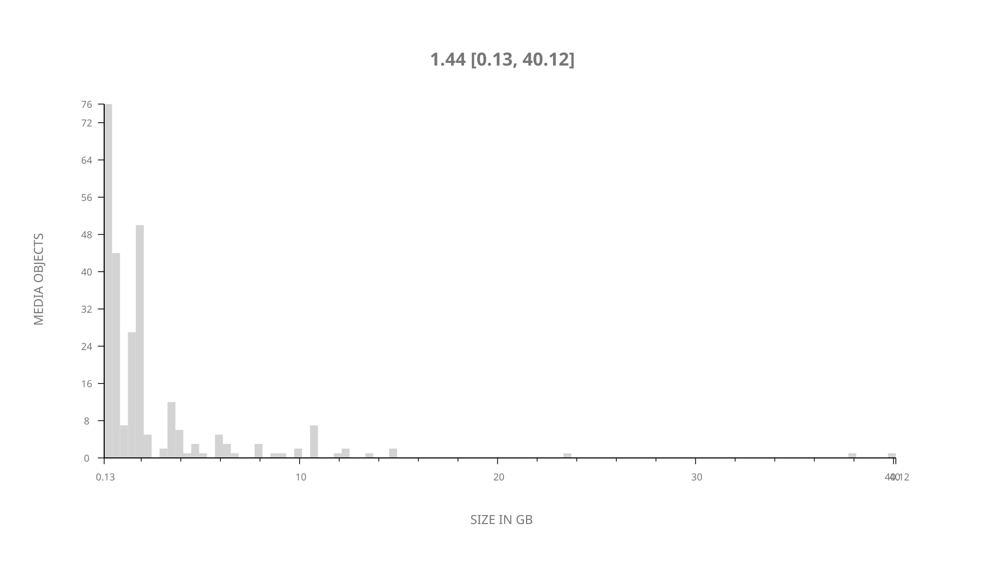
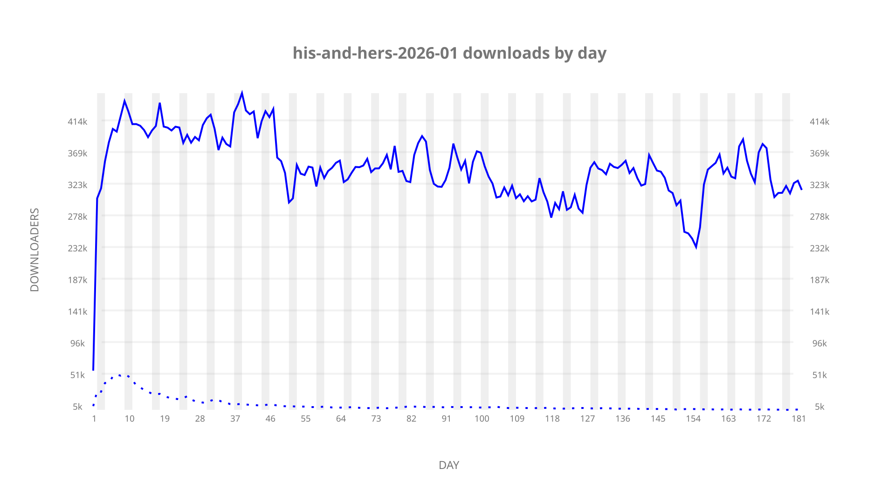
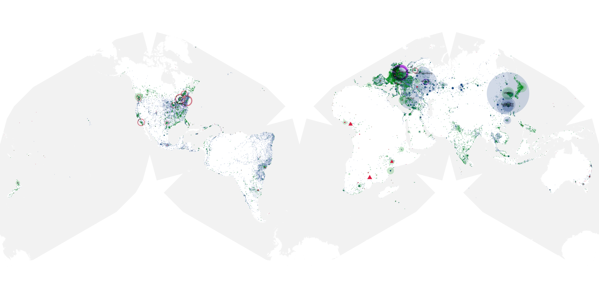
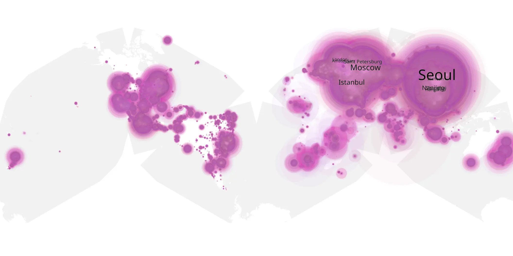
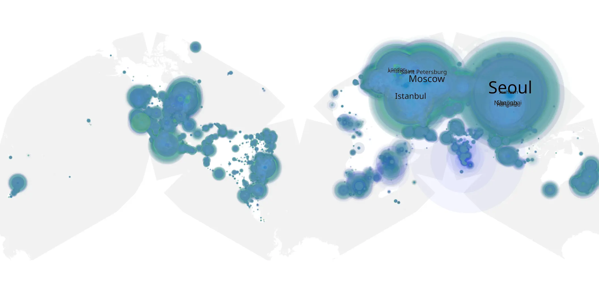

# his-and-hers-2026-01 sample cache audit

## 1. Media object

| Field | Value |
| --- | --- |
| Media object | His And Hers |
| Collection key | `his-and-hers-2026-01` |
| imdb_id | [tt33035373](https://www.imdb.com/title/tt33035373/) |
| wikipedia_url | [His & Hers (2026 TV series)](https://en.wikipedia.org/wiki/His_%26_Hers_(2026_TV_series)) |
| Sample dates | 2026-01-08-to-2026-07-08 |
| Sample days | 182 |
| BTIH count | 302 |
| Unique BTIH count | 266 |
| Downloaders total | 50,840,083 |
| Uploaders total | 1,447,338 |
| Data version | `2026-08-05` |
| IP geolocation version | `6:1777968300` |

## 2. Sample coverage report

- Generated: 2026-09-13T17:13:06Z
- Sample archive directory: `/mnt/gold/src/alpha60-samples-raw.gold/his-and-hers-2026-01.xz`
- Hour directories: 4347
- Zero-length sample files: 0
- Other unparsable sample files: 0
- Hourly discontinuities: 1 (1 missing hours)
- Missing days: 0

### Sample archive discontinuities

- hourly gap: last `2026-03-29 01:00`, resumed `2026-03-29 03:00` — missing 1 hour(s)

## 3. Media objects file size histogram

## 4. Visualization pass — graphs

### Downloads by week cumulative (normalized start)



### Downloads by day, Saturday and Sunday in gray

## 5. Visualization pass — maps

### Cumulative geographic slices

| Africa | Americas | Asia | Europe | Oceania | Unknown |
| --- | --- | --- | --- | --- | --- |
| 2.05 | 14.38 | 34.44 | 45.84 | 1.12 | 0.73 |

### Cumulative network infrastructure

{:target="_blank" rel="noopener"}

### Cumulative data maps

**Cumulative >= 1080p**

{:target="_blank" rel="noopener"}

**Cumulative < 1080p**

{:target="_blank" rel="noopener"}
