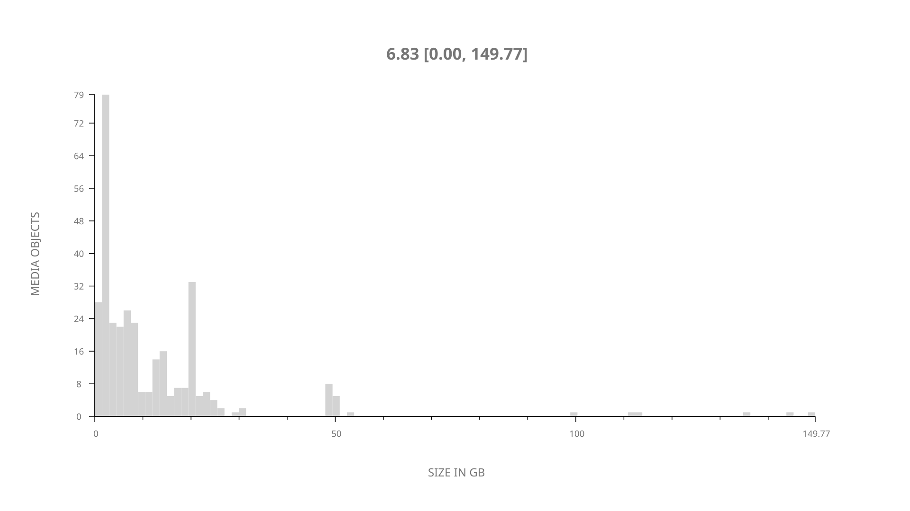
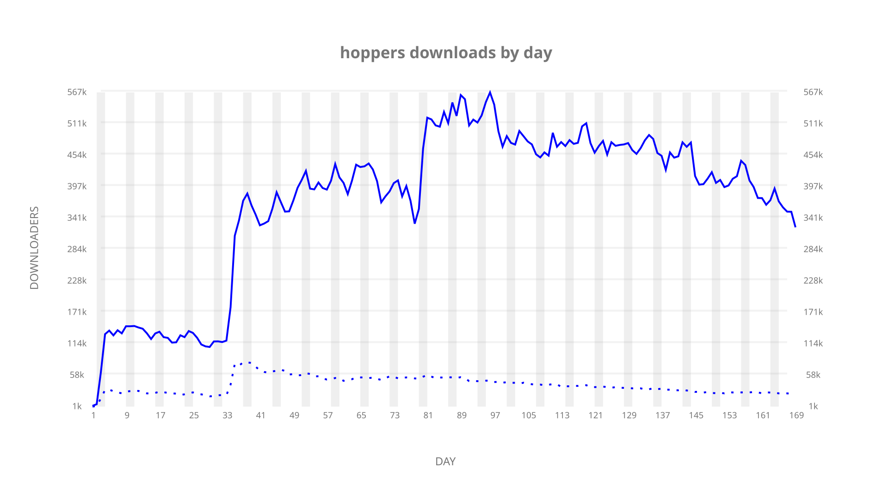
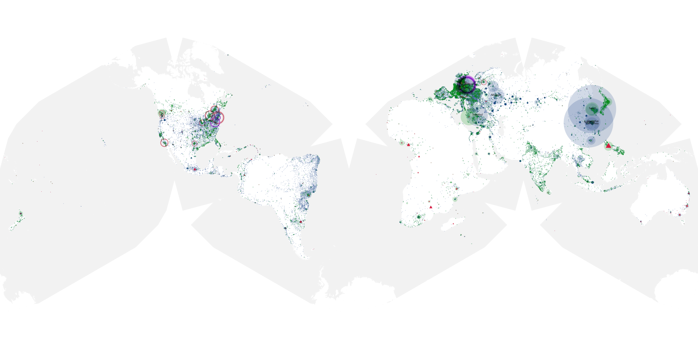
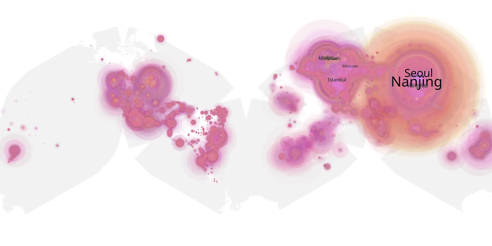
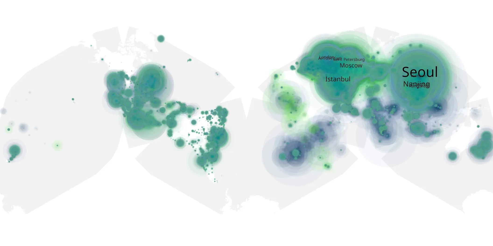

# hoppers sample cache audit

## 1. Media object

| Field | Value |
| --- | --- |
| Media object | Hoppers |
| Collection key | `hoppers` |
| imdb_id | [tt26443616](https://www.imdb.com/title/tt26443616/) |
| wikipedia_url | [Hoppers (film)](https://en.wikipedia.org/wiki/Hoppers_(film)) |
| Sample dates | 2026-03-26-to-2026-09-10 |
| Sample days | 169 |
| BTIH count | 352 |
| Unique BTIH count | 335 |
| Downloaders total | 45,186,008 |
| Uploaders total | 3,267,288 |
| Data version | `2026-08-05` |
| IP geolocation version | `6:1777968300` |

## 2. Coverage report

- Generated: 2026-09-13T17:13:06Z
- Sample archive directory: `/mnt/gold/src/alpha60-samples-raw.gold/hoppers.xz`
- Hour directories: 4026
- Zero-length sample files: 0
- Other unparsable sample files: 0
- Hourly discontinuities: 5 (9 missing hours)
- Missing days: 0

### Sample archive discontinuities

- hourly gap: last `2026-03-29 01:03`, resumed `2026-03-29 03:03` — missing 1 hour(s)
- hourly gap: last `2026-04-25 22:03`, resumed `2026-04-26 02:03` — missing 3 hour(s)
- hourly gap: last `2026-06-02 22:03`, resumed `2026-06-03 02:03` — missing 3 hour(s)
- hourly gap: last `2026-06-12 22:03`, resumed `2026-06-13 00:03` — missing 1 hour(s)
- hourly gap: last `2026-08-30 22:03`, resumed `2026-08-31 00:03` — missing 1 hour(s)

## 3. File sizes histogram *median[lowest, highest]*

## 4. Graphs

### Downloads by week cumulative (normalized start)



### Downloads by day, Saturday and Sunday in gray

## 5. Cumulative Maps

<!-- https://raw.githubusercontent.com/alpha60-devops/alpha60-results-2026/refs/heads/main/data/ -->

### <a href="https://raw.githubusercontent.com/alpha60-devops/alpha60-results-2026/refs/heads/main/data/geojson.cumulative/hoppers-cumulative-aggregate.geojson.gz" data-map-title="Hoppers — hoppers" onclick="leaflet_map_open_window(this.href, this.dataset.mapTitle); return false;" class="table-link" aria-label="Open Hoppers (hoppers) cumulative data map in new window" title="Opens interactive map for Hoppers (hoppers) data">Swarm Detail</a>

### Geographic Regions

| Africa | Americas | Asia | Europe | Oceania | Unknown |
| --- | --- | --- | --- | --- | --- |
| 2.08 | 16.72 | 36.49 | 40.75 | 1.24 | 0.82 |

### Network infrastructure

{:target="_blank" rel="noopener"}

### Resolution >= 1080p

{:target="_blank" rel="noopener"}

### Resolution < 1080p

{:target="_blank" rel="noopener"}
