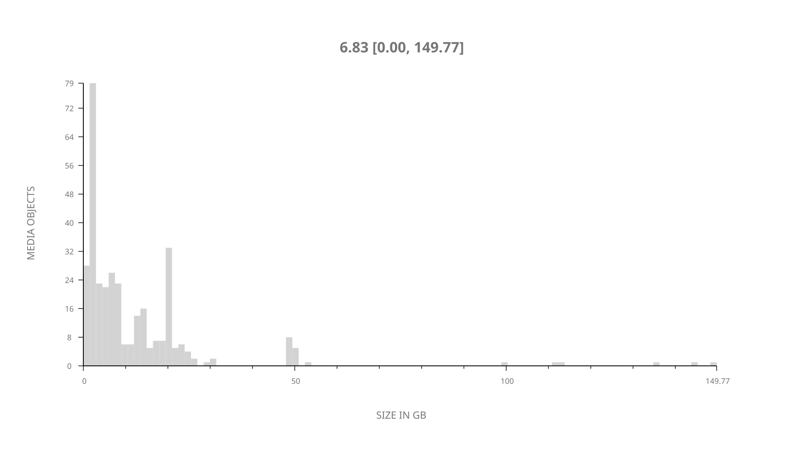
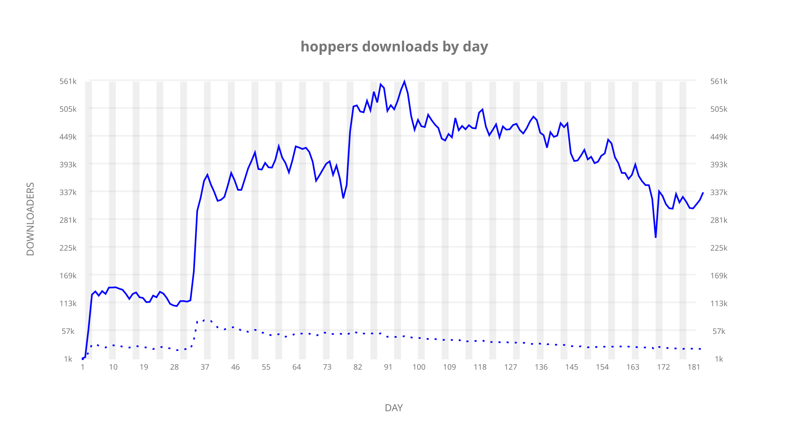
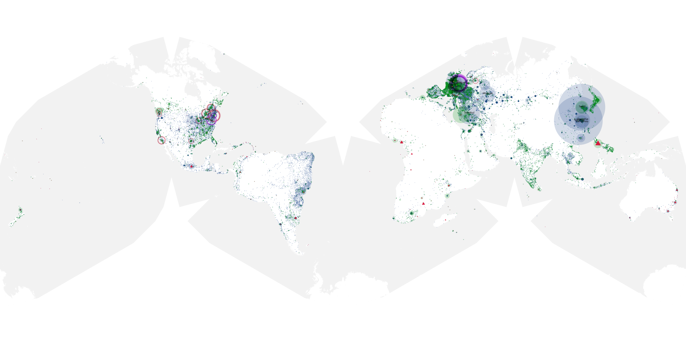
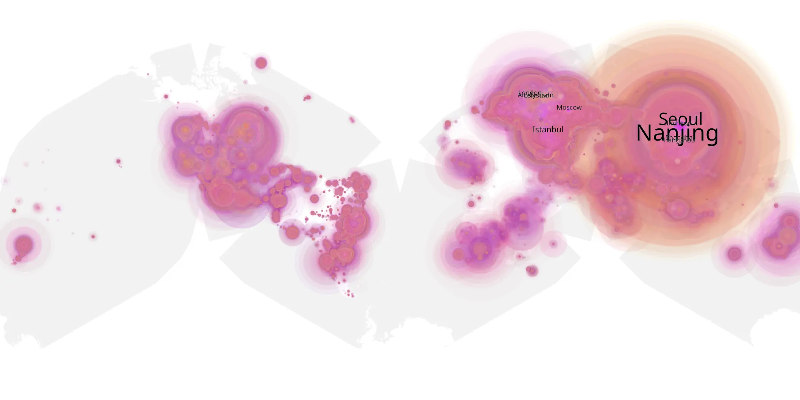
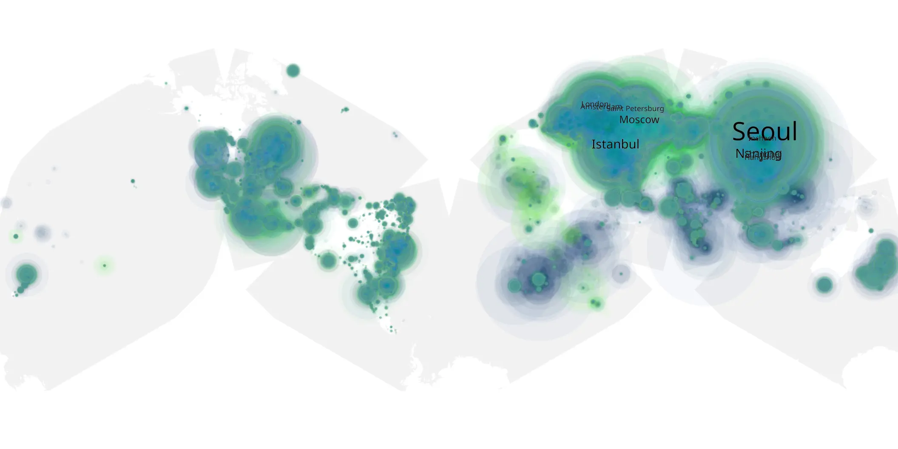

# hoppers sample cache audit

## 1. Media object

| Field | Value |
| --- | --- |
| Media object | Hoppers |
| Collection key | `hoppers` |
| imdb_id | [tt26443616](https://www.imdb.com/title/tt26443616/) |
| wikipedia_url | [Hoppers (film)](https://en.wikipedia.org/wiki/Hoppers_(film)) |
| Sample dates | 2026-03-26-to-2026-09-25 |
| Sample days | 184 |
| BTIH count | 352 |
| Unique BTIH count | 335 |
| Downloaders total | 47,327,944 |
| Uploaders total | 3,351,924 |
| Data version | `2026-08-05` |
| IP geolocation version | `6:1777968300` |

## 2. Sample coverage report

- Generated: 2026-10-07T14:25:16Z
- Frozen sample archive directory: `/mnt/gold/src/alpha60-samples-raw.gold/hoppers.xz`
- Hour directories: 4378
- Zero-length sample files: 0
- Malformed in-scope records accepted: 0 (producer rejects nonempty malformed input)
- Hourly discontinuities: 6 (18 missing hours)
- Missing days: 0

### Sample archive discontinuities

- hourly gap: last `2026-03-29 01:03`, resumed `2026-03-29 03:03` — missing 1 hour(s)
- hourly gap: last `2026-04-25 22:03`, resumed `2026-04-26 02:03` — missing 3 hour(s)
- hourly gap: last `2026-06-02 22:03`, resumed `2026-06-03 02:03` — missing 3 hour(s)
- hourly gap: last `2026-06-12 22:03`, resumed `2026-06-13 00:03` — missing 1 hour(s)
- hourly gap: last `2026-08-30 22:03`, resumed `2026-08-31 00:03` — missing 1 hour(s)
- hourly gap: last `2026-09-10 22:03`, resumed `2026-09-11 08:03` — missing 9 hour(s)

### Frozen validation evidence

- Frozen content SHA-256: `3b35ceee6d19cc901d2d7ad3aa7e12d514cb55cffbceaf0842cf424cf41445c9`
- Full-input producer receipt SHA-256: `6b6c599c5167f566263d525ca56eb042ed6cbca3535b239776e2015c2c24c972`
- Frozen raw archives: 4378
- Empty sampler observations remain explicit gaps; no observations were imputed.
- Out-of-scope records retain the collection factory's established filtering.
- Excluded raw members: 0
- Excluded observations: 0

## 3. Media objects file size histogram

## 4. Visualization pass — graphs

### Downloads by week cumulative (normalized start)



### Downloads by day, Saturday and Sunday in gray

## 5. Visualization pass — maps

### Cumulative geographic slices

| Africa | Americas | Asia | Europe | Oceania | Unknown |
| --- | --- | --- | --- | --- | --- |
| 2.29 | 17.32 | 36.87 | 41.43 | 1.28 | 0.82 |

### Cumulative network infrastructure

{:target="_blank" rel="noopener"}

### Cumulative data maps

**Cumulative >= 1080p**

{:target="_blank" rel="noopener"}

**Cumulative < 1080p**

{:target="_blank" rel="noopener"}
