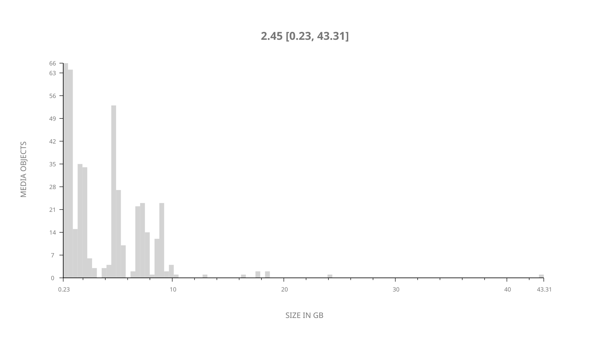
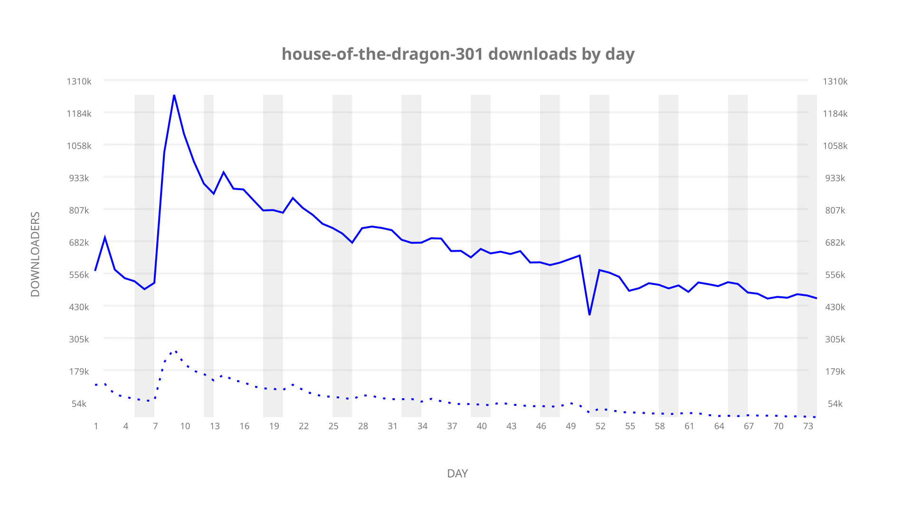
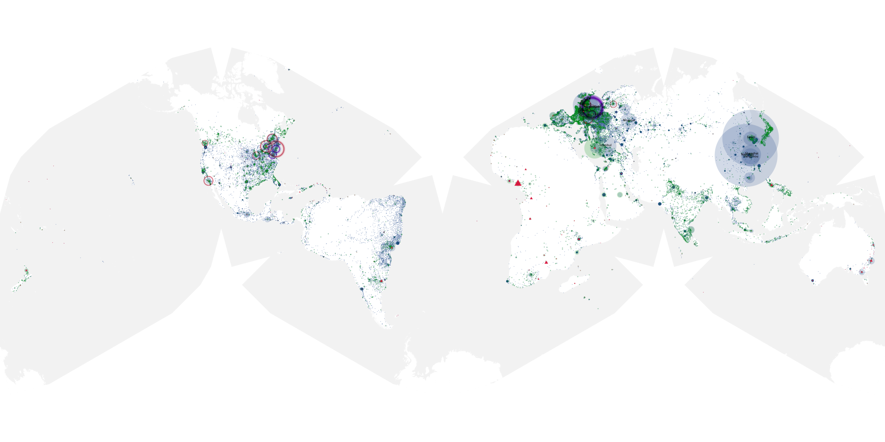
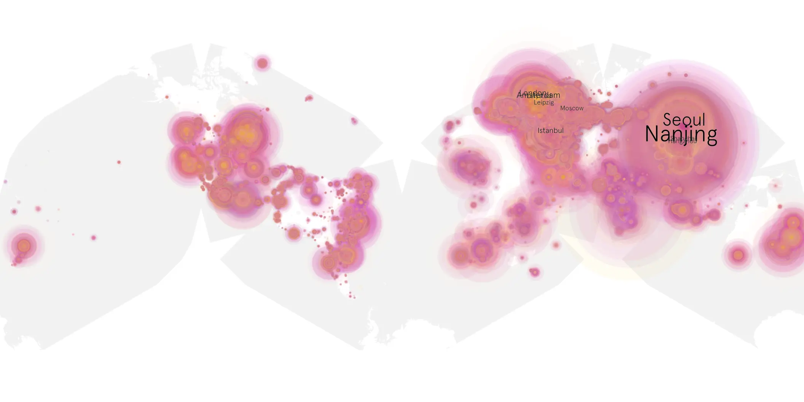
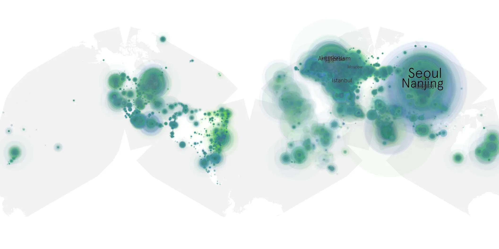

# house-of-the-dragon-301 sample cache audit

## 1. Media object

| Field | Value |
| --- | --- |
| Media object | House of the Dragon |
| Collection key | `house-of-the-dragon-301` |
| imdb_id | [tt11198330](https://www.imdb.com/title/tt11198330/) |
| wikipedia_url | [House of the Dragon](https://en.wikipedia.org/wiki/House_of_the_Dragon) |
| Sample dates | 2026-06-22-to-2026-09-06 |
| Sample days | 77 |
| BTIH count | 448 |
| Unique BTIH count | 432 |
| Downloaders total | 35,919,849 |
| Uploaders total | 4,295,345 |
| Data version | `2026-08-05` |
| IP geolocation version | `6:1777968300` |

## 2. Sample coverage report

- Generated: 2026-09-13T17:13:06Z
- Sample archive directory: `/mnt/gold/src/alpha60-samples-raw.gold/house-of-the-dragon-301.xz`
- Hour directories: 1762
- Zero-length sample files: 0
- Other unparsable sample files: 0
- Hourly discontinuities: 3 (83 missing hours)
- Missing days: 3

### Sample archive discontinuities

- hourly gap: last `2026-07-03 22:05`, resumed `2026-07-05 01:05` — missing 26 hour(s)
- hourly gap: last `2026-07-06 02:05`, resumed `2026-07-06 04:05` — missing 1 hour(s)
- hourly gap: last `2026-08-12 15:05`, resumed `2026-08-15 00:05` — missing 56 hour(s)
- missing day: `2026-07-04`
- missing day: `2026-08-13`
- missing day: `2026-08-14`

## 3. Media objects file size histogram

## 4. Visualization pass — graphs

### Downloads by week cumulative (normalized start)



### Downloads by day, Saturday and Sunday in gray

## 5. Visualization pass — maps

### Cumulative geographic slices

| Africa | Americas | Asia | Europe | Oceania | Unknown |
| --- | --- | --- | --- | --- | --- |
| 3.51 | 17.33 | 34.63 | 40.40 | 1.70 | 0.73 |

### Cumulative network infrastructure

{:target="_blank" rel="noopener"}

### Cumulative data maps

**Cumulative >= 1080p**

{:target="_blank" rel="noopener"}

**Cumulative < 1080p**

{:target="_blank" rel="noopener"}
