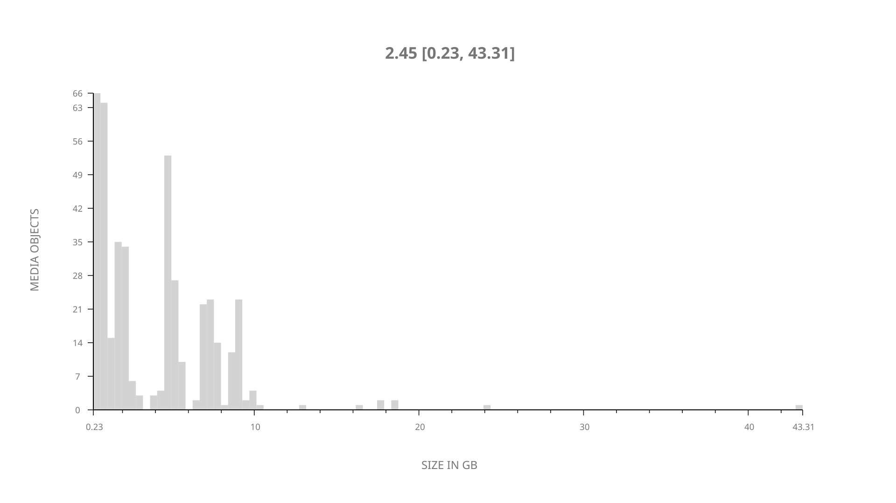
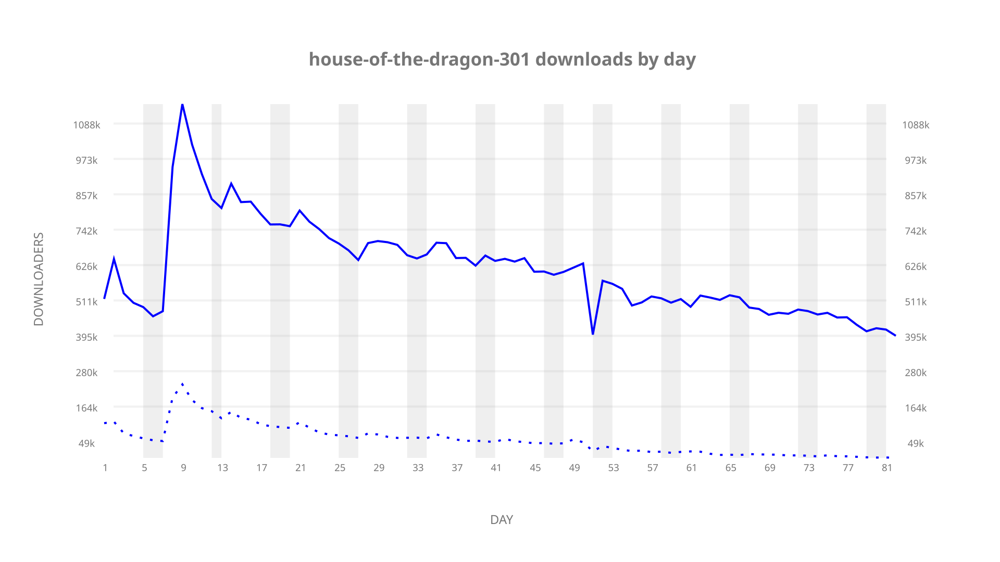
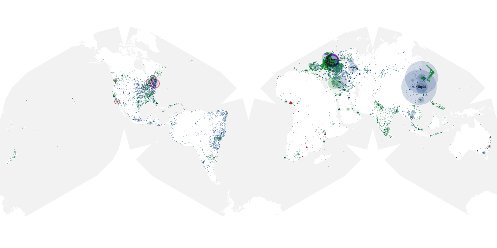
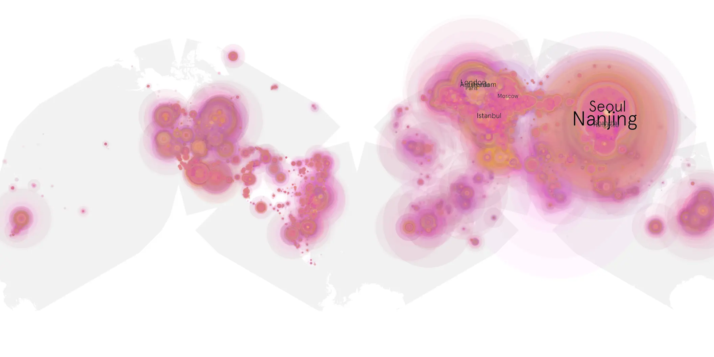
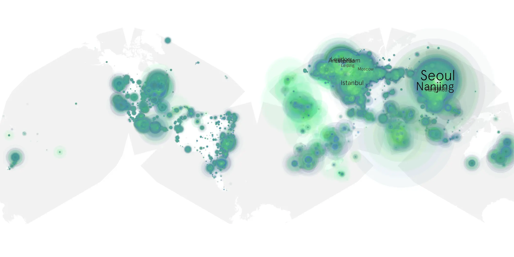

# house-of-the-dragon-301 sample cache audit

## 1. Media object

| Field | Value |
| --- | --- |
| Media object | House of the Dragon |
| Collection key | `house-of-the-dragon-301` |
| imdb_id | [tt11198330](https://www.imdb.com/title/tt11198330/) |
| wikipedia_url | [House of the Dragon](https://en.wikipedia.org/wiki/House_of_the_Dragon) |
| Sample dates | 2026-06-22-to-2026-09-14 |
| Sample days | 85 |
| BTIH count | 448 |
| Unique BTIH count | 432 |
| Downloaders total | 36,748,290 |
| Uploaders total | 4,020,850 |
| Data version | `2026-08-05` |
| IP geolocation version | `6:1777968300` |

## 2. Sample coverage report

- Generated: 2026-10-07T14:25:16Z
- Frozen sample archive directory: `/mnt/gold/src/alpha60-samples-raw.gold/house-of-the-dragon-301`
- Hour directories: 1954
- Zero-length sample files: 0
- Malformed in-scope records accepted: 0 (producer rejects nonempty malformed input)
- Hourly discontinuities: 3 (83 missing hours)
- Missing days: 3

### Sample archive discontinuities

- hourly gap: last `2026-07-03 22:05`, resumed `2026-07-05 01:05` — missing 26 hour(s)
- hourly gap: last `2026-07-19 13:05`, resumed `2026-07-19 15:05` — missing 1 hour(s)
- hourly gap: last `2026-08-12 15:05`, resumed `2026-08-15 00:05` — missing 56 hour(s)
- missing day: `2026-07-04`
- missing day: `2026-08-13`
- missing day: `2026-08-14`

### Frozen validation evidence

- Frozen content SHA-256: `e188cbaa23b12e0b9b584b8834ee705b9f6ff5e29838616bc48a31892efd9907`
- Full-input producer receipt SHA-256: `fba2feeb07641fc97a8041279932fe6e32d840bd65ac8df012e2ddaada4977f3`
- Frozen raw archives: 1954
- Empty sampler observations remain explicit gaps; no observations were imputed.
- Out-of-scope records retain the collection factory's established filtering.
- Excluded raw members: 7
- Excluded observations: 6234

## 3. Media objects file size histogram

## 4. Visualization pass — graphs

### Downloads by week cumulative (normalized start)



### Downloads by day, Saturday and Sunday in gray

## 5. Visualization pass — maps

### Cumulative geographic slices

| Africa | Americas | Asia | Europe | Oceania | Unknown |
| --- | --- | --- | --- | --- | --- |
| 3.51 | 17.69 | 35.15 | 41.21 | 1.66 | 0.76 |

### Cumulative network infrastructure

{:target="_blank" rel="noopener"}

### Cumulative data maps

**Cumulative >= 1080p**

{:target="_blank" rel="noopener"}

**Cumulative < 1080p**

{:target="_blank" rel="noopener"}

<!-- BEGIN alpha60-2026-source-recovery-r6 -->

## Recovered source samples

The source archives for the hours below were truncated in every known preserved copy.
This cache uses only complete, valid JSON sample files recovered from their readable prefixes.
Lost original membership is unknown. These hours are **not fully recovered**;
the date coverage above does not establish complete observations within them.

| Source hour | Recovered complete JSON sample files | Incomplete JSON files excluded |
| --- | ---: | ---: |
| 2026-07-10-at-09-05 | 4,145 | 0 |
| 2026-08-12-at-15-05 | 4,380 | 1 |

No missing observations were fabricated. The collection factory applies its established
scope filtering to the recovered files. Damaged original compressed archives remain preserved
outside the current raw sample directory for provenance and rollback.

[Source recovery evidence and archive hashes](../../data/txt/year-2026-source-recovery.json).

## Corrected source archive filename

The intact source archive originally named `2026-07-19-at-14-05.tar.xz` contains
**5,502 complete, valid JSON sample files** under
`2026-07-06-at-03-05`. The cache uses those observations under
their actual timestamp. The archive was copied under its matching filename with exactly
the same compressed bytes; no sample dates or JSON bytes were changed. It supplies no
observations for the wrongly labelled `2026-07-19-at-14-05` hour.
The original mislabeled compressed archive remains preserved for provenance and rollback.
This filename correction is separate from the truncated-hour losses described above.

<!-- END alpha60-2026-source-recovery-r6 -->
