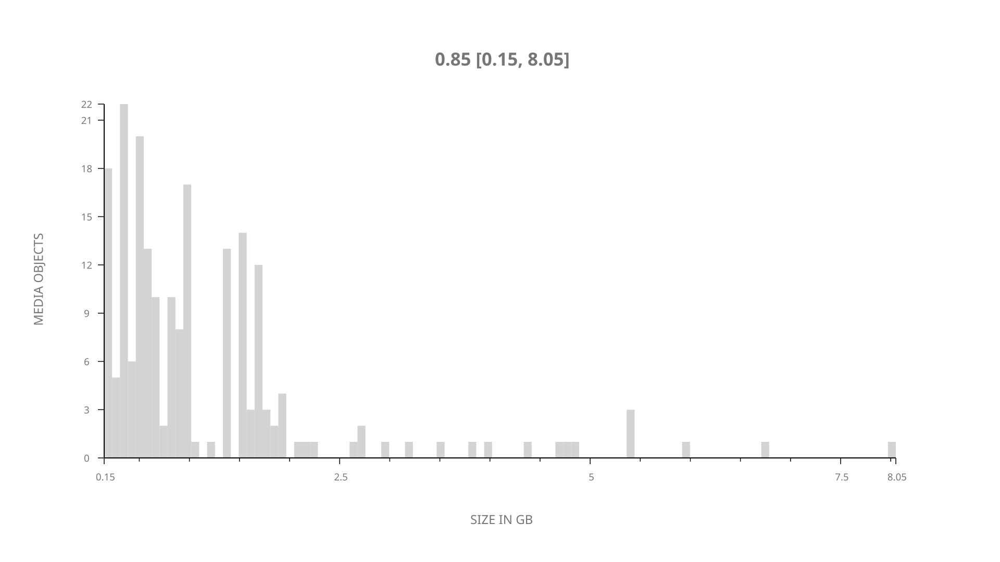
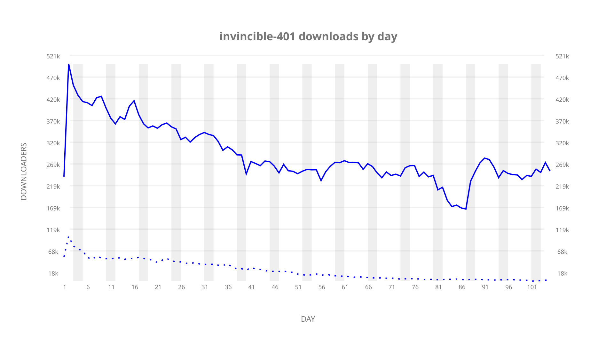
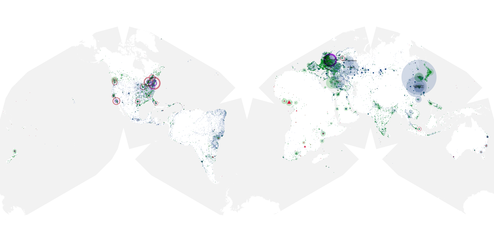
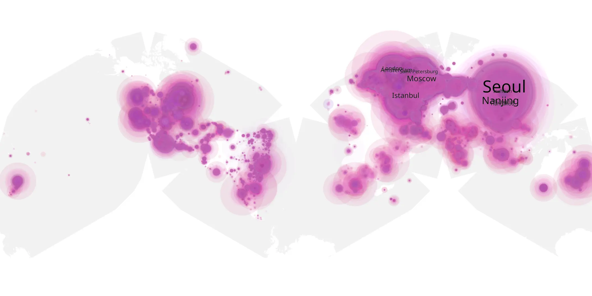
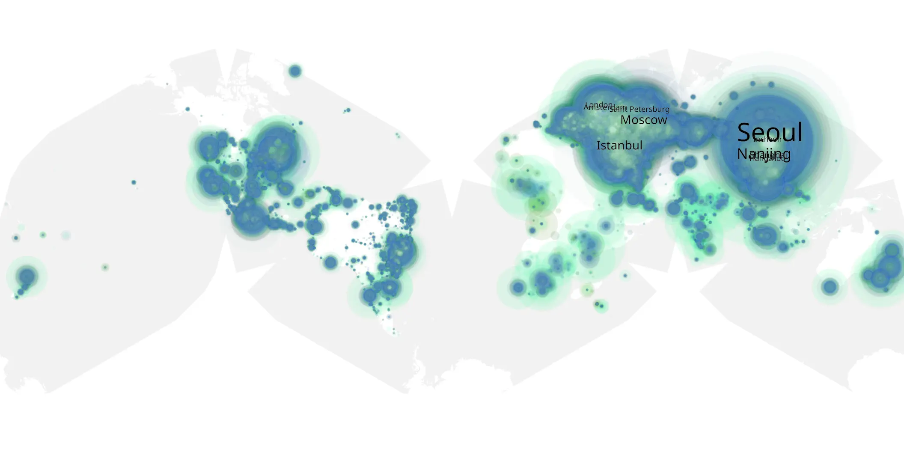

# invincible-401 sample cache audit

## 1. Media object

| Field | Value |
| --- | --- |
| Media object | Invincible |
| Collection key | `invincible-401` |
| imdb_id | [tt6741278](https://www.imdb.com/title/tt6741278/) |
| wikipedia_url | [Invincible (TV series)](https://en.wikipedia.org/wiki/Invincible_(TV_series)) |
| Sample dates | 2026-03-18-to-2026-06-30 |
| Sample days | 105 |
| BTIH count | 223 |
| Unique BTIH count | 205 |
| Downloaders total | 22,874,525 |
| Uploaders total | 2,040,164 |
| Data version | `2026-08-05` |
| IP geolocation version | `6:1777968300` |

## 2. Sample coverage report

- Generated: 2026-09-13T17:13:06Z
- Sample archive directory: `/mnt/gold/src/alpha60-samples-raw.gold/invincible-401.xz`
- Hour directories: 2495
- Zero-length sample files: 0
- Other unparsable sample files: 0
- Hourly discontinuities: 4 (9 missing hours)
- Missing days: 0

### Sample archive discontinuities

- hourly gap: last `2026-03-29 01:00`, resumed `2026-03-29 03:00` — missing 1 hour(s)
- hourly gap: last `2026-04-25 22:00`, resumed `2026-04-26 03:00` — missing 4 hour(s)
- hourly gap: last `2026-06-02 22:00`, resumed `2026-06-03 02:00` — missing 3 hour(s)
- hourly gap: last `2026-06-12 22:00`, resumed `2026-06-13 00:00` — missing 1 hour(s)

## 3. Media objects file size histogram

## 4. Visualization pass — graphs

### Downloads by week cumulative (normalized start)



### Downloads by day, Saturday and Sunday in gray

## 5. Visualization pass — maps

### Cumulative geographic slices

| Africa | Americas | Asia | Europe | Oceania | Unknown |
| --- | --- | --- | --- | --- | --- |
| 2.84 | 16.73 | 34.11 | 41.37 | 1.56 | 0.66 |

### Cumulative network infrastructure

{:target="_blank" rel="noopener"}

### Cumulative data maps

**Cumulative >= 1080p**

{:target="_blank" rel="noopener"}

**Cumulative < 1080p**

{:target="_blank" rel="noopener"}
