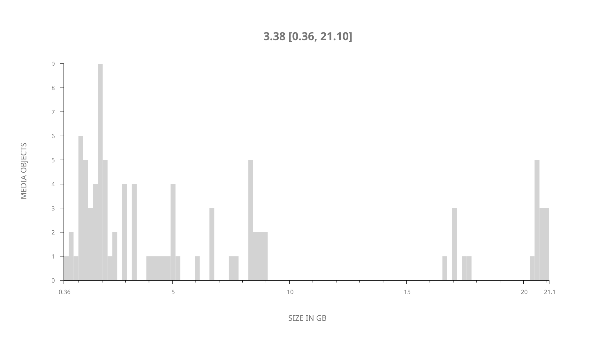
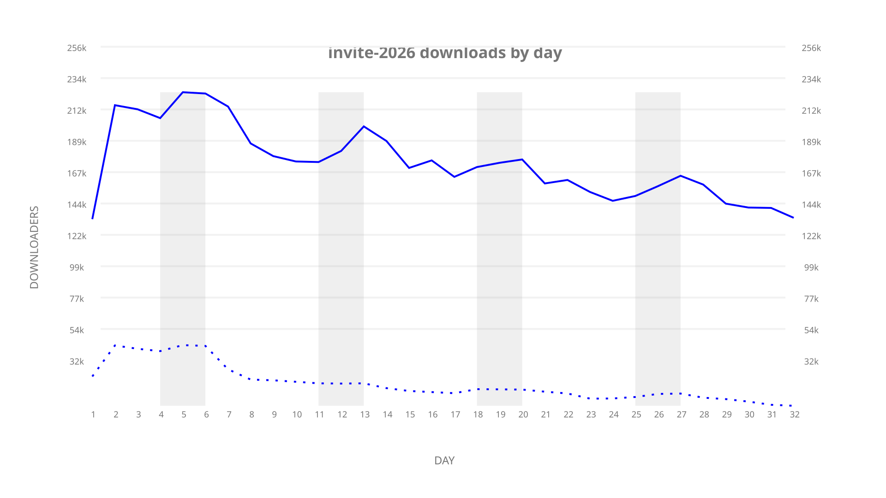
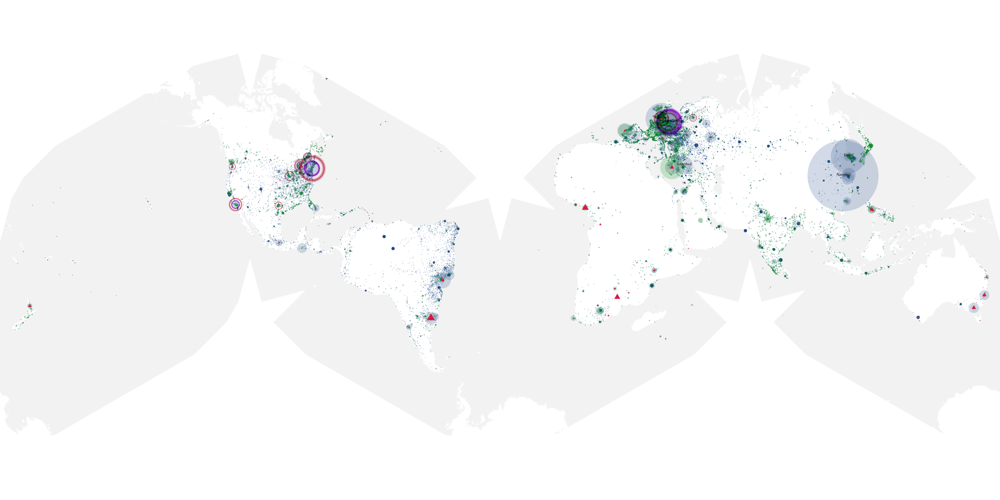
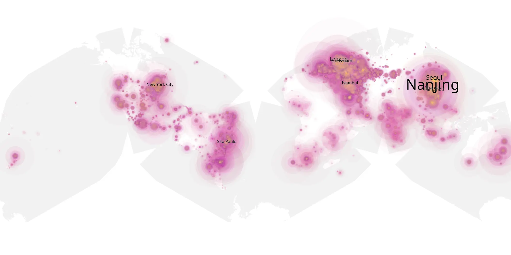
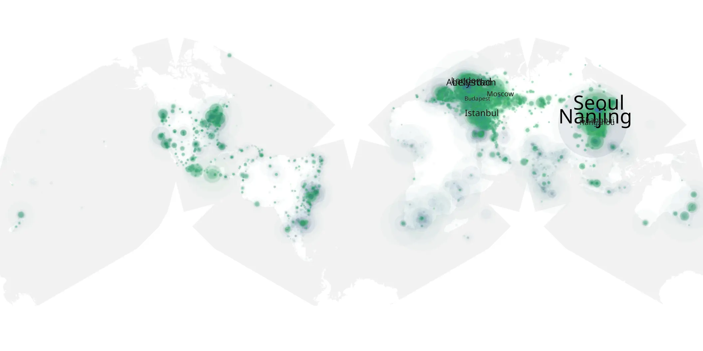

# invite-2026 sample cache audit

## 1. Media object

| Field | Value |
| --- | --- |
| Media object | The Invite |
| Collection key | `invite-2026` |
| imdb_id | [tt14173636](https://www.imdb.com/title/tt14173636/) |
| wikipedia_url | [The Invite](https://en.wikipedia.org/wiki/The_Invite) |
| Sample dates | 2026-08-11-to-2026-09-11 |
| Sample days | 32 |
| BTIH count | 95 |
| Unique BTIH count | 92 |
| Downloaders total | 4,632,833 |
| Uploaders total | 879,035 |
| Data version | `2026-08-05` |
| IP geolocation version | `6:1777968300` |

## 2. Sample coverage report

- Generated: 2026-09-13T17:13:06Z
- Sample archive directory: `/mnt/gold/src/alpha60-samples-raw.gold/invite-2026.xz`
- Hour directories: 757
- Zero-length sample files: 0
- Other unparsable sample files: 0
- Hourly discontinuities: 0 (0 missing hours)
- Missing days: 0

### Sample archive discontinuities

None detected.

## 3. Media objects file size histogram

## 4. Visualization pass — graphs

### Downloads by week cumulative (normalized start)



### Downloads by day, Saturday and Sunday in gray

## 5. Visualization pass — maps

### Cumulative geographic slices

| Africa | Americas | Asia | Europe | Oceania | Unknown |
| --- | --- | --- | --- | --- | --- |
| 3.45 | 19.76 | 25.74 | 32.66 | 1.82 | 0.54 |

### Cumulative network infrastructure

{:target="_blank" rel="noopener"}

### Cumulative data maps

**Cumulative >= 1080p**

{:target="_blank" rel="noopener"}

**Cumulative < 1080p**

{:target="_blank" rel="noopener"}
