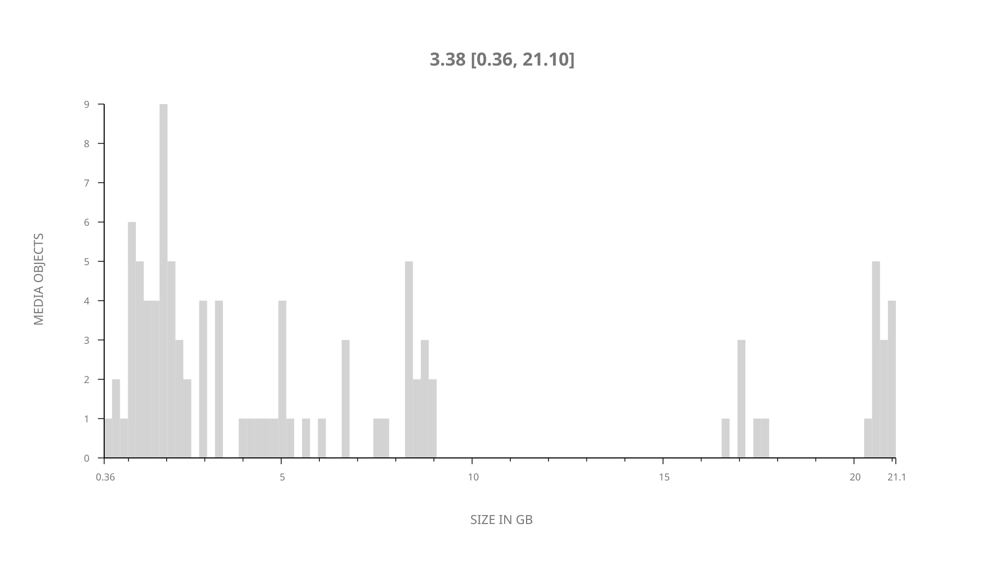
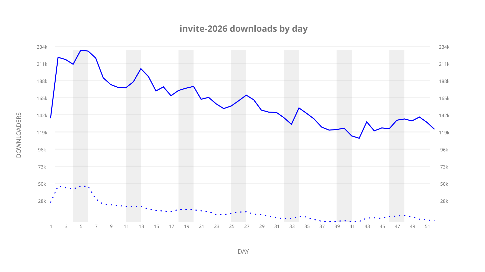
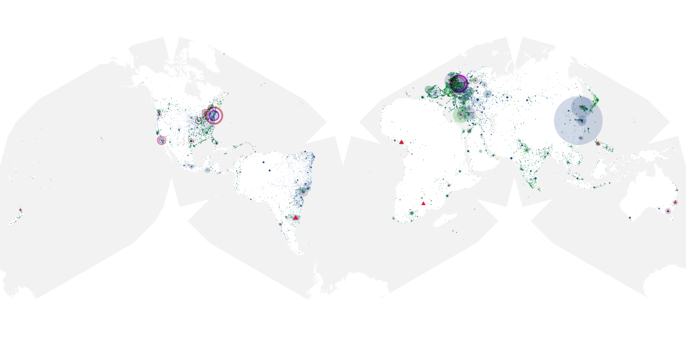
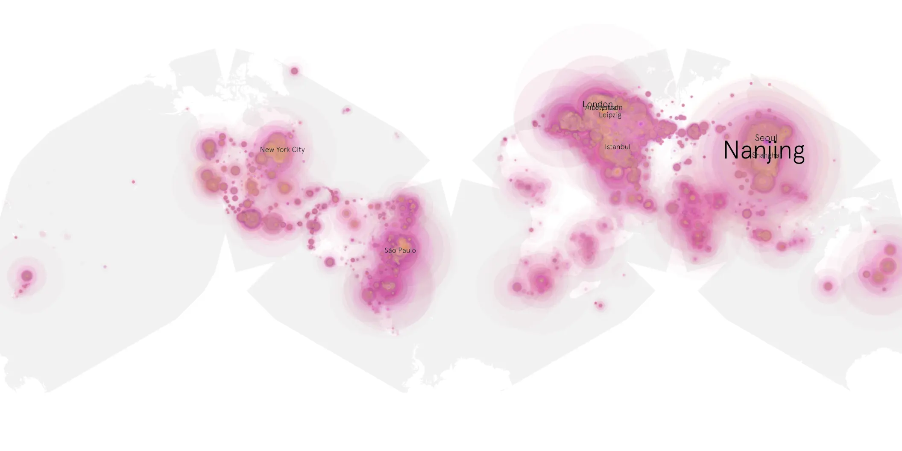
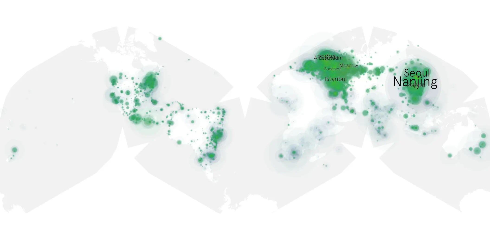

# invite-2026 sample cache audit

## 1. Media object

| Field | Value |
| --- | --- |
| Media object | The Invite |
| Collection key | `invite-2026` |
| imdb_id | [tt14173636](https://www.imdb.com/title/tt14173636/) |
| wikipedia_url | [The Invite](https://en.wikipedia.org/wiki/The_Invite) |
| Sample dates | 2026-08-11-to-2026-10-01 |
| Sample days | 52 |
| BTIH count | 102 |
| Unique BTIH count | 98 |
| Downloaders total | 6,582,065 |
| Uploaders total | 1,159,888 |
| Data version | `2026-08-05` |
| IP geolocation version | `6:1777968300` |

## 2. Coverage report

- Generated: 2026-10-03T19:10:22Z
- Frozen sample archive directory: `/mnt/gold/src/alpha60-samples-raw.gold/invite-2026.xz`
- Hour directories: 1235
- Zero-length sample files: 0
- Malformed in-scope records accepted: 0 (producer rejects nonempty malformed input)
- Hourly discontinuities: 1 (2 missing hours)
- Missing days: 0

### Sample archive discontinuities

- hourly gap: last `2026-09-11 23:05`, resumed `2026-09-12 02:05` — missing 2 hour(s)

### Frozen validation evidence

- Frozen content SHA-256: `89f746bb2b9822616de7e1884804e79e4f351ea5dc2b23bbbd180d933b9a5265`
- Full-input producer receipt SHA-256: `ccdea20c9d4f42a9c4c5f5fe3507f07732fd6860a9d1635f42a9ebb4e58c7c7d`
- Frozen raw archives: 1235
- Empty sampler observations remain explicit gaps; no observations were imputed.
- Out-of-scope records retain the collection factory's established filtering.
- Excluded raw members: 0
- Excluded observations: 0

## 3. File sizes histogram *median[lowest, highest]*

## 4. Graphs

### Downloads by week cumulative (normalized start)



### Downloads by day, Saturday and Sunday in gray

## 5. Cumulative Maps

<!-- https://raw.githubusercontent.com/alpha60-devops/alpha60-results-2026/refs/heads/main/data/ -->

### <a href="https://raw.githubusercontent.com/alpha60-devops/alpha60-results-2026/refs/heads/main/data/geojson.cumulative/invite-2026-cumulative-aggregate.geojson.gz" data-map-title="The Invite — invite-2026" onclick="leaflet_map_open_window(this.href, this.dataset.mapTitle); return false;" class="table-link" aria-label="Open The Invite (invite-2026) cumulative data map in new window" title="Opens interactive map for The Invite (invite-2026) data">Swarm Detail</a>

### Geographic Regions

| Africa | Americas | Asia | Europe | Oceania | Unknown |
| --- | --- | --- | --- | --- | --- |
| 4.51 | 23.40 | 30.54 | 38.71 | 2.24 | 0.60 |

### Network infrastructure

{:target="_blank" rel="noopener"}

### Resolution >= 1080p

{:target="_blank" rel="noopener"}

### Resolution < 1080p

{:target="_blank" rel="noopener"}
