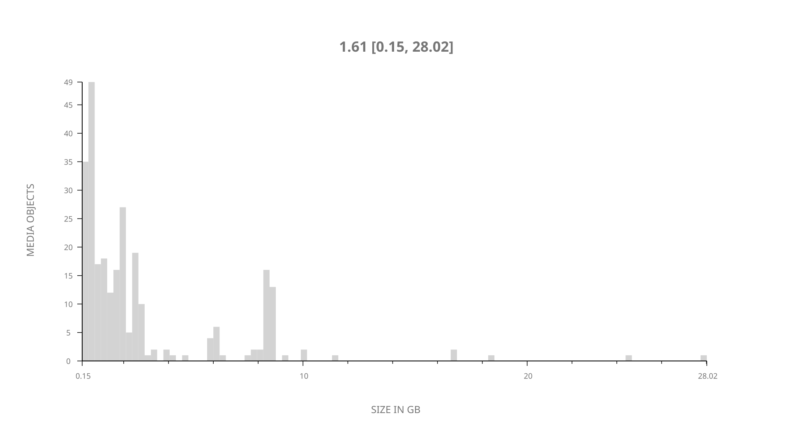
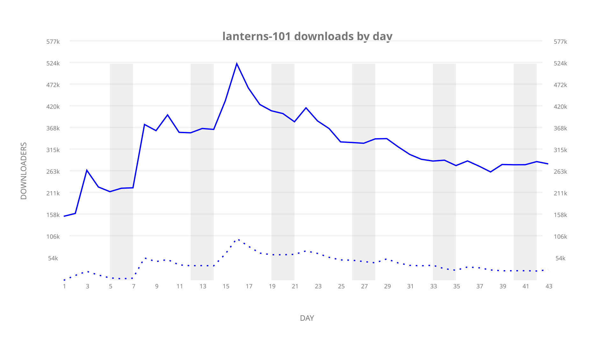
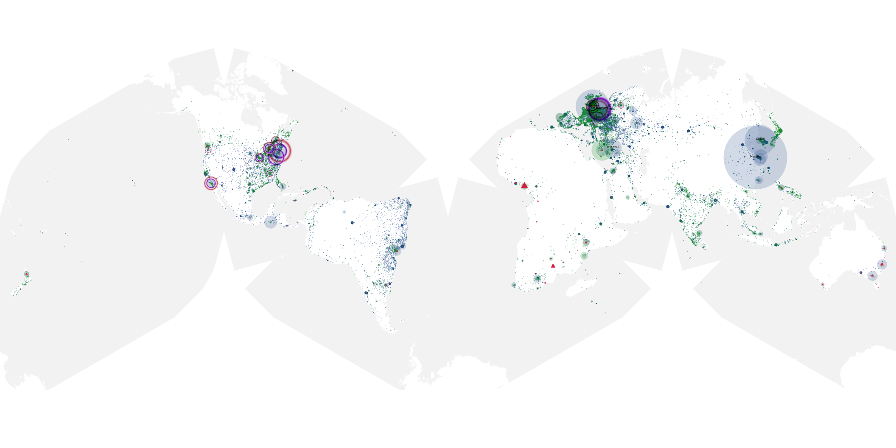
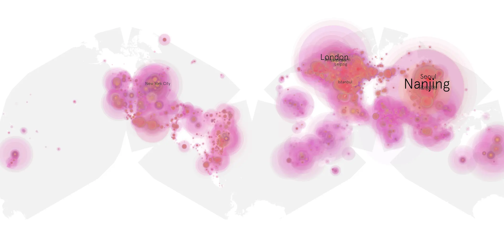
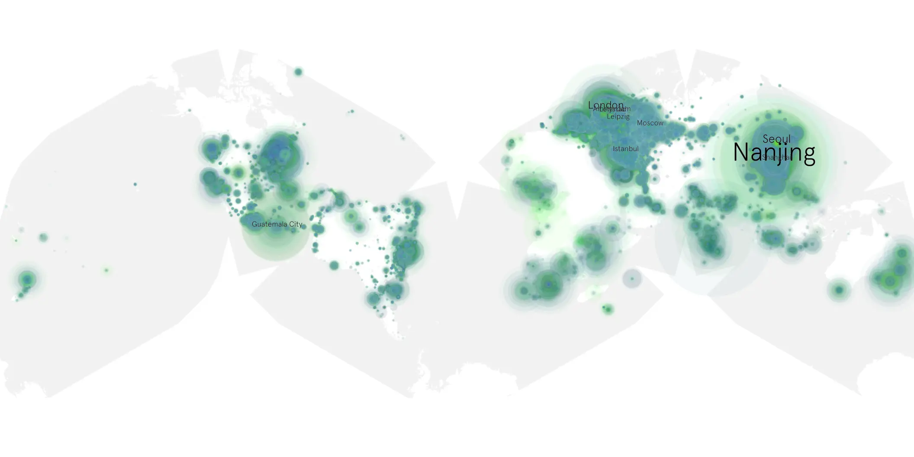

# lanterns-101 sample cache audit

## 1. Media object

| Field | Value |
| --- | --- |
| Media object | Lanterns |
| Collection key | `lanterns-101` |
| imdb_id | [tt26545992](https://www.imdb.com/title/tt26545992/) |
| wikipedia_url | [Lanterns (TV series)](https://en.wikipedia.org/wiki/Lanterns_(TV_series)) |
| Sample dates | 2026-08-17-to-2026-09-28 |
| Sample days | 43 |
| BTIH count | 282 |
| Unique BTIH count | 269 |
| Downloaders total | 9,898,427 |
| Uploaders total | 1,864,242 |
| Data version | `2026-08-05` |
| IP geolocation version | `6:1777968300` |

## 2. Coverage report

- Generated: 2026-10-03T19:10:22Z
- Frozen sample archive directory: `/mnt/gold/src/alpha60-samples-raw.gold/lanterns-101.xz`
- Hour directories: 1027
- Zero-length sample files: 0
- Malformed in-scope records accepted: 0 (producer rejects nonempty malformed input)
- Hourly discontinuities: 0 (0 missing hours)
- Missing days: 0

### Sample archive discontinuities

None detected.

### Frozen validation evidence

- Frozen content SHA-256: `0bb0bba181c9d7e3fc26746cc0a749b523e0d2b74c063cbf355b579c36e61dec`
- Full-input producer receipt SHA-256: `6a80a5d2dfad4c915004a1d9c82cd6b88bababe2cb547372abdc004b2b4a4e3b`
- Frozen raw archives: 1027
- Empty sampler observations remain explicit gaps; no observations were imputed.
- Out-of-scope records retain the collection factory's established filtering.
- Excluded raw members: 0
- Excluded observations: 0

## 3. File sizes histogram *median[lowest, highest]*

## 4. Graphs

### Downloads by week cumulative (normalized start)



### Downloads by day, Saturday and Sunday in gray

## 5. Cumulative Maps

<!-- https://raw.githubusercontent.com/alpha60-devops/alpha60-results-2026/refs/heads/main/data/ -->

### <a href="https://raw.githubusercontent.com/alpha60-devops/alpha60-results-2026/refs/heads/main/data/geojson.cumulative/lanterns-101-cumulative-aggregate.geojson.gz" data-map-title="Lanterns — lanterns-101" onclick="leaflet_map_open_window(this.href, this.dataset.mapTitle); return false;" class="table-link" aria-label="Open Lanterns (lanterns-101) cumulative data map in new window" title="Opens interactive map for Lanterns (lanterns-101) data">Swarm Detail</a>

### Geographic Regions

| Africa | Americas | Asia | Europe | Oceania | Unknown |
| --- | --- | --- | --- | --- | --- |
| 5.57 | 23.25 | 29.69 | 38.08 | 2.81 | 0.59 |

### Network infrastructure

{:target="_blank" rel="noopener"}

### Resolution >= 1080p

{:target="_blank" rel="noopener"}

### Resolution < 1080p

{:target="_blank" rel="noopener"}
