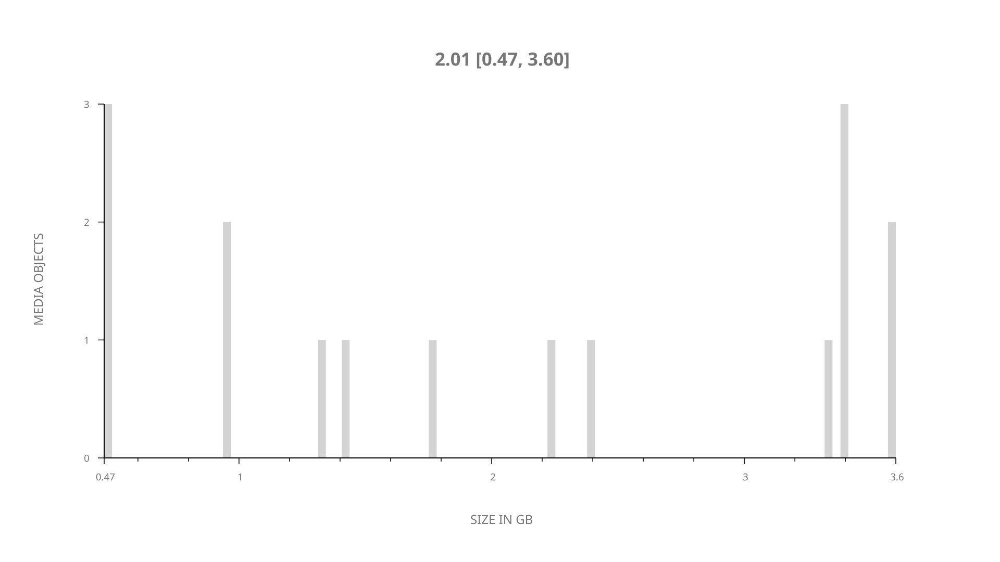
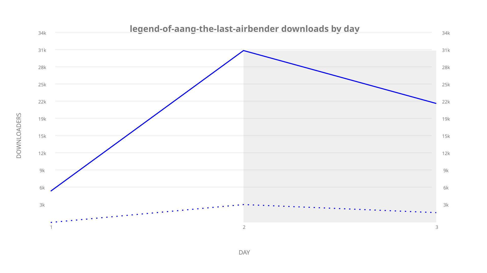
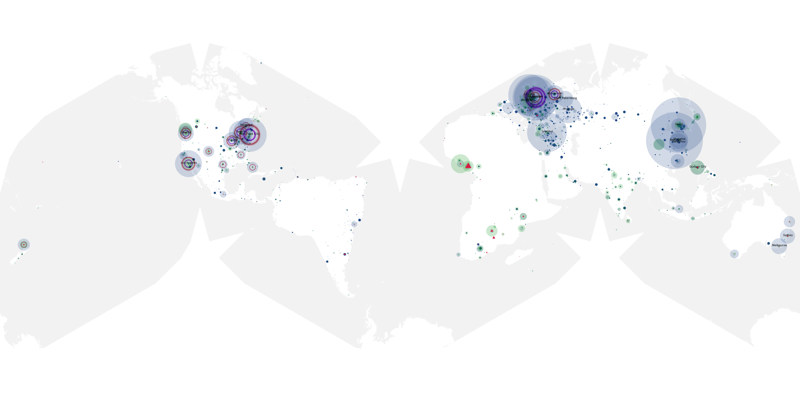
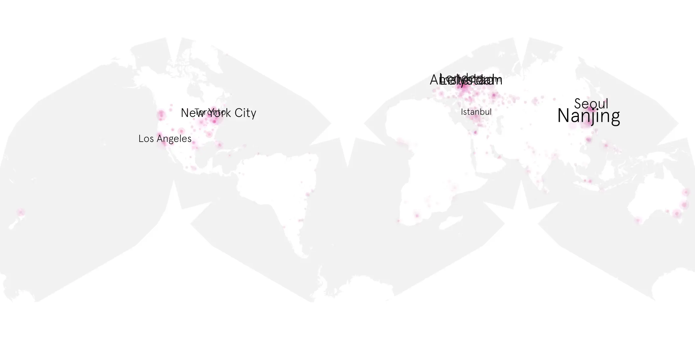
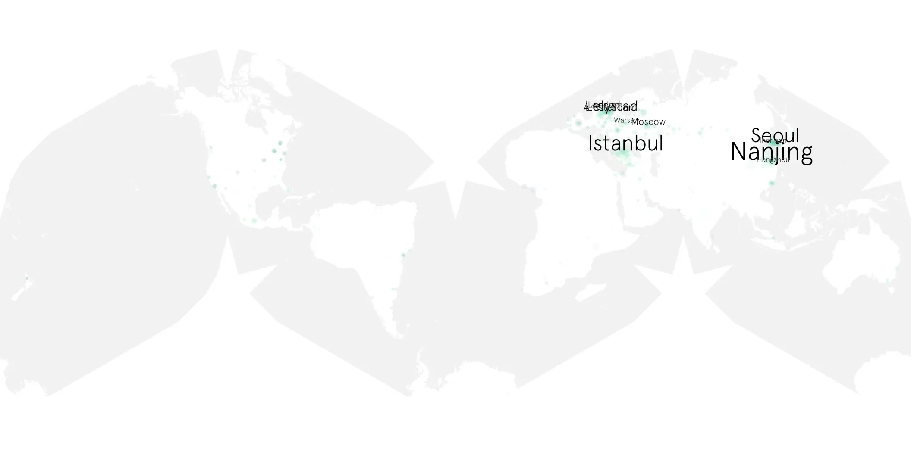

# legend-of-aang-the-last-airbender sample cache audit

## 1. Media object

| Field | Value |
| --- | --- |
| Media object | The Legend of Aang: The Last Airbender |
| Collection key | `legend-of-aang-the-last-airbender` |
| imdb_id | [tt18259538](https://www.imdb.com/title/tt18259538/) |
| wikipedia_url | [Avatar Aang: The Last Airbender](https://en.wikipedia.org/wiki/Avatar_Aang:_The_Last_Airbender) |
| Sample dates | 2026-04-16-to-2026-04-18 |
| Sample days | 3 |
| BTIH count | 16 |
| Unique BTIH count | 16 |
| Downloaders total | 53,642 |
| Uploaders total | 8,976 |
| Data version | `2026-08-05` |
| IP geolocation version | `6:1777968300` |

## 2. Sample coverage report

- Generated: 2026-09-13T17:13:06Z
- Sample archive directory: `/mnt/gold/src/alpha60-samples-raw.gold/legend-of-aang-the-last-airbender.xz`
- Hour directories: 64
- Zero-length sample files: 0
- Other unparsable sample files: 0
- Hourly discontinuities: 0 (0 missing hours)
- Missing days: 0

### Sample archive discontinuities

None detected.

## 3. Media objects file size histogram

## 4. Visualization pass — graphs

### Downloads by week cumulative (normalized start)



### Downloads by day, Saturday and Sunday in gray

## 5. Visualization pass — maps

### Cumulative geographic slices

| Africa | Americas | Asia | Europe | Oceania | Unknown |
| --- | --- | --- | --- | --- | --- |
| 1.55 | 19.50 | 21.02 | 28.09 | 2.60 | 0.35 |

### Cumulative network infrastructure

{:target="_blank" rel="noopener"}

### Cumulative data maps

**Cumulative >= 1080p**

{:target="_blank" rel="noopener"}

**Cumulative < 1080p**

{:target="_blank" rel="noopener"}
