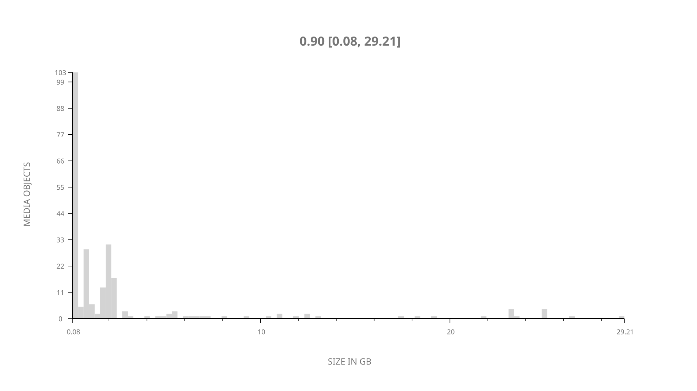
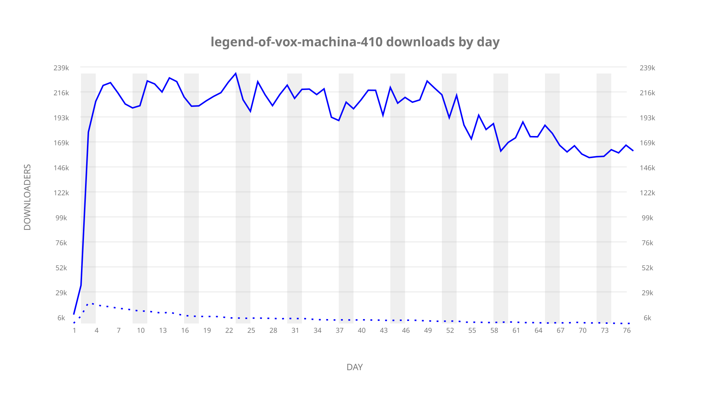
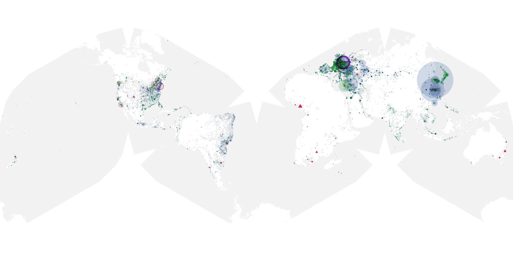
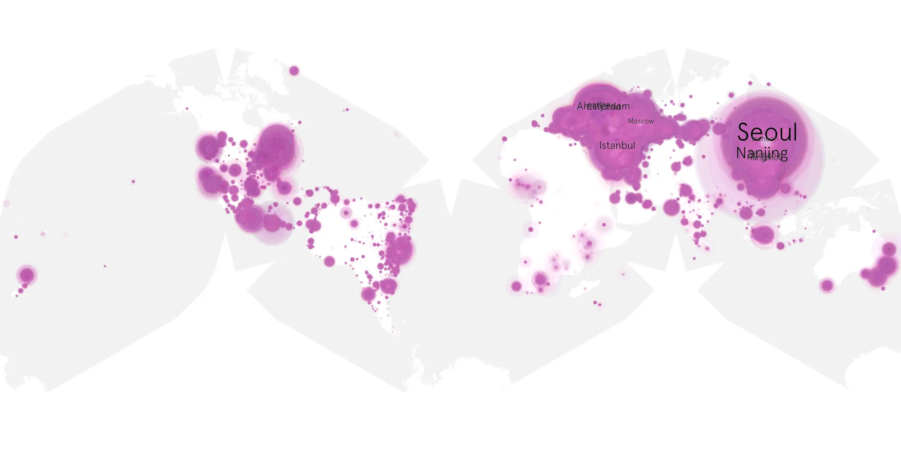
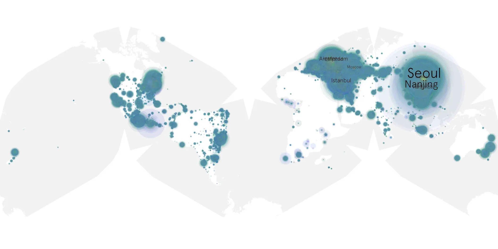

# legend-of-vox-machina-410 sample cache audit

## 1. Media object

| Field | Value |
| --- | --- |
| Media object | The Legend of Vox Machina |
| Collection key | `legend-of-vox-machina-410` |
| imdb_id | [tt11247158](https://www.imdb.com/title/tt11247158/) |
| wikipedia_url | [The Legend of Vox Machina](https://en.wikipedia.org/wiki/The_Legend_of_Vox_Machina) |
| Sample dates | 2026-06-25-to-2026-09-09 |
| Sample days | 77 |
| BTIH count | 249 |
| Unique BTIH count | 247 |
| Downloaders total | 11,707,207 |
| Uploaders total | 266,114 |
| Data version | `2026-08-05` |
| IP geolocation version | `6:1777968300` |

## 2. Sample coverage report

- Generated: 2026-09-13T17:13:06Z
- Sample archive directory: `/mnt/gold/src/alpha60-samples-raw.gold/legend-of-vox-machina-410.xz`
- Hour directories: 1846
- Zero-length sample files: 0
- Other unparsable sample files: 0
- Hourly discontinuities: 0 (0 missing hours)
- Missing days: 0

### Sample archive discontinuities

None detected.

## 3. Media objects file size histogram

## 4. Visualization pass — graphs

### Downloads by week cumulative (normalized start)



### Downloads by day, Saturday and Sunday in gray

## 5. Visualization pass — maps

### Cumulative geographic slices

| Africa | Americas | Asia | Europe | Oceania | Unknown |
| --- | --- | --- | --- | --- | --- |
| 1.35 | 17.15 | 35.12 | 42.55 | 1.14 | 0.85 |

### Cumulative network infrastructure

{:target="_blank" rel="noopener"}

### Cumulative data maps

**Cumulative >= 1080p**

{:target="_blank" rel="noopener"}

**Cumulative < 1080p**

{:target="_blank" rel="noopener"}
