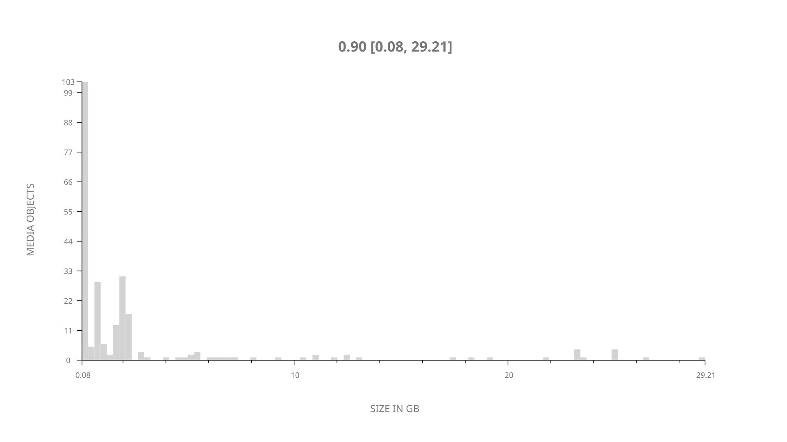
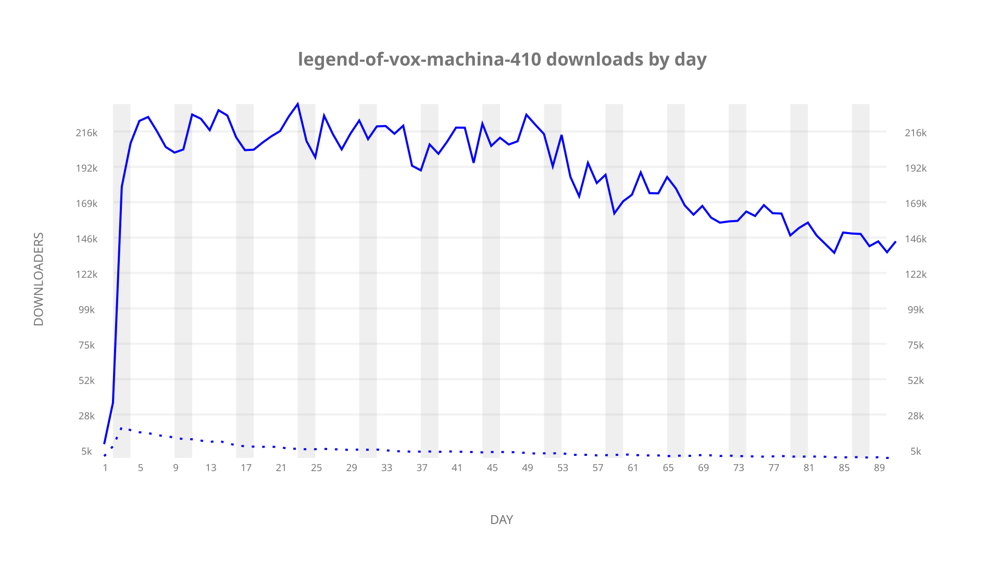
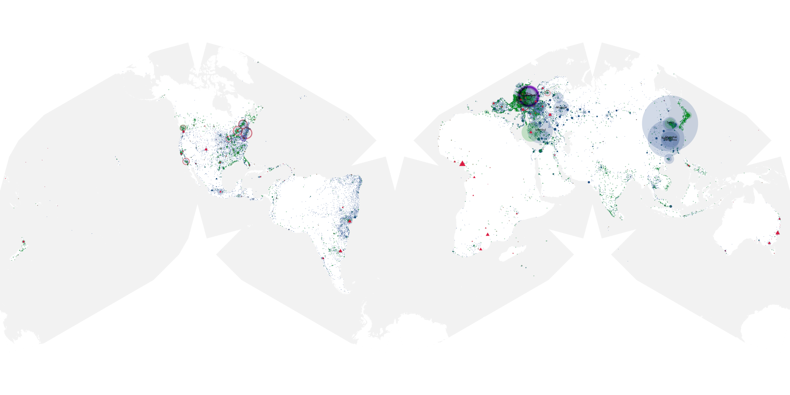
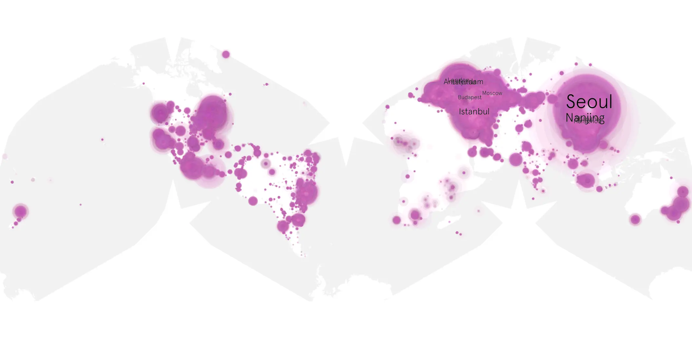
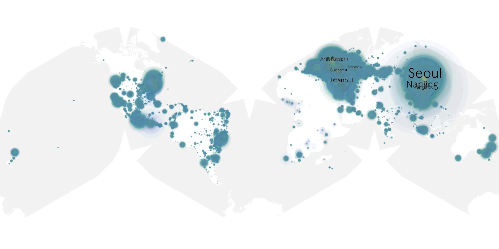

# legend-of-vox-machina-410 sample cache audit

## 1. Media object

| Field | Value |
| --- | --- |
| Media object | The Legend of Vox Machina |
| Collection key | `legend-of-vox-machina-410` |
| imdb_id | [tt11247158](https://www.imdb.com/title/tt11247158/) |
| wikipedia_url | [The Legend of Vox Machina](https://en.wikipedia.org/wiki/The_Legend_of_Vox_Machina) |
| Sample dates | 2026-06-25-to-2026-09-23 |
| Sample days | 91 |
| BTIH count | 249 |
| Unique BTIH count | 247 |
| Downloaders total | 13,186,911 |
| Uploaders total | 284,130 |
| Data version | `2026-08-05` |
| IP geolocation version | `6:1777968300` |

## 2. Sample coverage report

- Generated: 2026-10-07T11:57:08Z
- Frozen sample archive directory: `/mnt/gold/src/alpha60-samples-raw.gold/legend-of-vox-machina-410`
- Hour directories: 2182
- Zero-length sample files: 0
- Malformed in-scope records accepted: 0 (producer rejects nonempty malformed input)
- Hourly discontinuities: 0 (0 missing hours)
- Missing days: 0

### Sample archive discontinuities

None detected.

### Frozen validation evidence

- Frozen content SHA-256: `9cf26cc82589b252f9144889673a8cb0f38f362f731ab061e72f6c5e7cba0880`
- Full-input producer receipt SHA-256: `ebe2acaf169381d19d6e17329419a4e362e04987f2cf2da1a25219246f545592`
- Frozen raw archives: 2182
- Empty sampler observations remain explicit gaps; no observations were imputed.
- Out-of-scope records retain the collection factory's established filtering.
- Excluded raw members: 0
- Excluded observations: 0

## 3. Media objects file size histogram

## 4. Visualization pass — graphs

### Downloads by week cumulative (normalized start)



### Downloads by day, Saturday and Sunday in gray

## 5. Visualization pass — maps

### Cumulative geographic slices

| Africa | Americas | Asia | Europe | Oceania | Unknown |
| --- | --- | --- | --- | --- | --- |
| 1.43 | 17.78 | 35.14 | 43.67 | 1.13 | 0.85 |

### Cumulative network infrastructure

{:target="_blank" rel="noopener"}

### Cumulative data maps

**Cumulative >= 1080p**

{:target="_blank" rel="noopener"}

**Cumulative < 1080p**

{:target="_blank" rel="noopener"}

<!-- BEGIN alpha60-2026-source-recovery-r6 -->

## Recovered source samples

The source archives for the hours below were truncated in every known preserved copy.
This cache uses only complete, valid JSON sample files recovered from their readable prefixes.
Lost original membership is unknown. These hours are **not fully recovered**;
the date coverage above does not establish complete observations within them.

| Source hour | Recovered complete JSON sample files | Incomplete JSON files excluded |
| --- | ---: | ---: |
| 2026-08-17-at-22-04 | 1,046 | 0 |

No missing observations were fabricated. The collection factory applies its established
scope filtering to the recovered files. Damaged original compressed archives remain preserved
outside the current raw sample directory for provenance and rollback.

[Source recovery evidence and archive hashes](../../data/txt/year-2026-source-recovery.json).

<!-- END alpha60-2026-source-recovery-r6 -->
