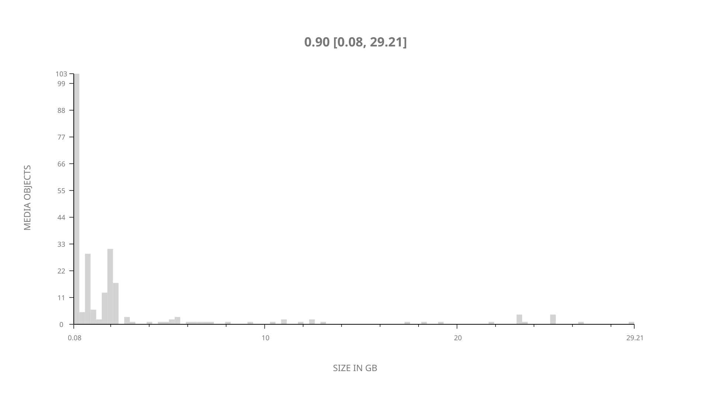
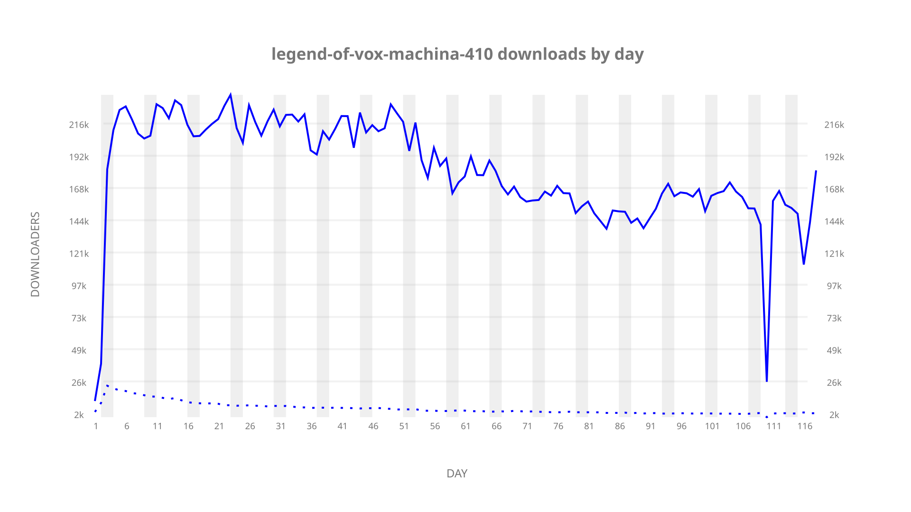
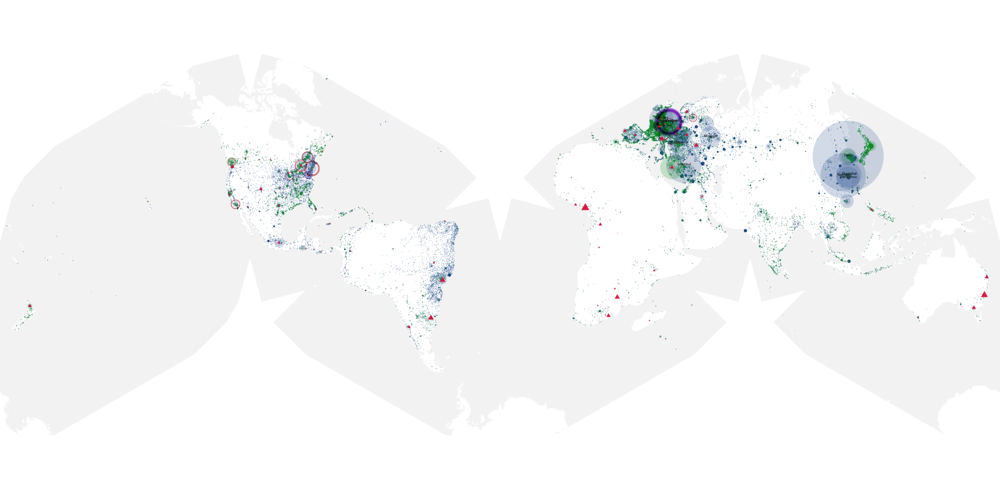
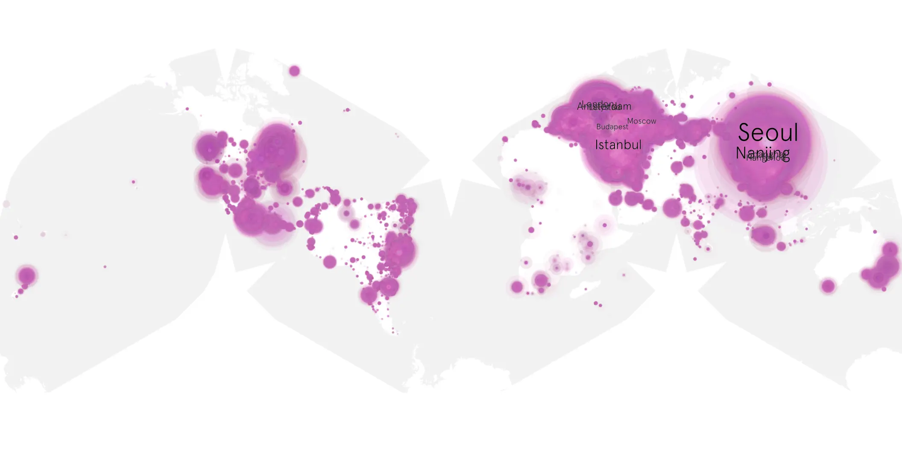
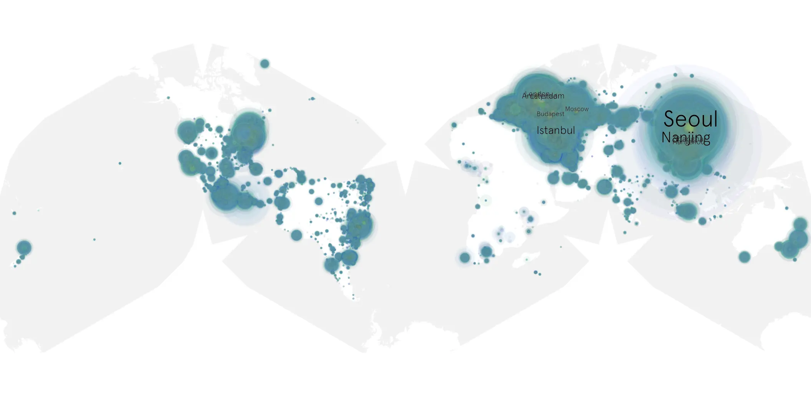

# legend-of-vox-machina-410 sample cache audit

## 1. Media object

| Field | Value |
| --- | --- |
| Media object | The Legend of Vox Machina |
| Collection key | `legend-of-vox-machina-410` |
| imdb_id | [tt11247158](https://www.imdb.com/title/tt11247158/) |
| wikipedia_url | [The Legend of Vox Machina](https://en.wikipedia.org/wiki/The_Legend_of_Vox_Machina) |
| Sample dates | 2026-06-25-to-2026-10-21 |
| Sample days | 119 |
| BTIH count | 249 |
| Unique BTIH count | 247 |
| Downloaders total | 16,159,172 |
| Uploaders total | 316,346 |
| Data version | `2026-08-05` |
| IP geolocation version | `6:1777968300` |

## 2. Coverage report

- Generated: 2026-11-19T05:48:22Z
- Sample archive directory: `/home/bkoz/src/alpha60-campaigns/year-2026/20261116-v8/objects/legend-of-vox-machina-410/g1/results/coverage-inputs`
- Hour directories: 2808
- Zero-length sample files: 0
- Other unparsable sample files: 0
- Hourly discontinuities: 1 (46 missing hours)
- Missing days: 1

### Sample archive discontinuities

- hourly gap: last `2026-10-11 22:04`, resumed `2026-10-13 21:04` — missing 46 hour(s)
- missing day: `2026-10-12`

## 3. File sizes histogram *median[lowest, highest]*

## 4. Graphs

### Downloads by week cumulative (normalized start)



### Downloads by day, Saturday and Sunday in gray

## 5. Cumulative Maps

<!-- https://raw.githubusercontent.com/alpha60-devops/alpha60-results-2026/refs/heads/main/data/ -->

### <a href="https://raw.githubusercontent.com/alpha60-devops/alpha60-results-2026/refs/heads/main/data/geojson.cumulative/legend-of-vox-machina-410-cumulative-aggregate.geojson.gz" data-map-title="The Legend of Vox Machina — legend-of-vox-machina-410" onclick="leaflet_map_open_window(this.href, this.dataset.mapTitle); return false;" class="table-link" aria-label="Open The Legend of Vox Machina (legend-of-vox-machina-410) cumulative data map in new window" title="Opens interactive map for The Legend of Vox Machina (legend-of-vox-machina-410) data">Swarm Detail</a>

### Geographic Regions

| Africa | Americas | Asia | Europe | Oceania | Unknown |
| --- | --- | --- | --- | --- | --- |
| 1.50 | 18.21 | 34.58 | 43.71 | 1.13 | 0.87 |

### Network infrastructure

{:target="_blank" rel="noopener"}

### Resolution >= 1080p

{:target="_blank" rel="noopener"}

### Resolution < 1080p

{:target="_blank" rel="noopener"}

<!-- BEGIN alpha60-v8-source-dispositions -->

## Recovered and skipped source samples

1 damaged source archives yielded 1,973 complete, valid JSON sample files; 0 archives yielded none and were skipped.
Recovered files were retained only after complete JSON validation and archive readback. Damaged original archives remain preserved.
**These source hours are not fully recovered. Lost original membership is unknown.**
The sample-date range does not establish complete observations in the affected hours. No missing observations were fabricated.

| Source archive | Disposition | Valid JSON files recovered |
| --- | --- | ---: |
| `2026-10-10-at-22-04.tar.xz` | partial-recovery | 1,973 |

[Source dispositions and archive hashes](../../data/txt/year-2026-source-dispositions/legend-of-vox-machina-410.json).

<!-- END alpha60-v8-source-dispositions -->
