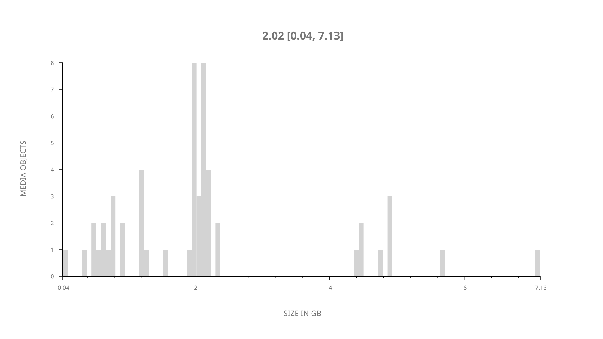
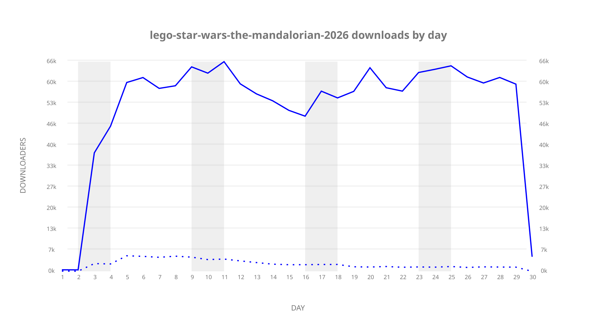
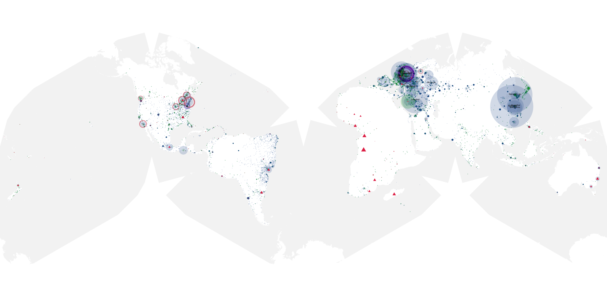
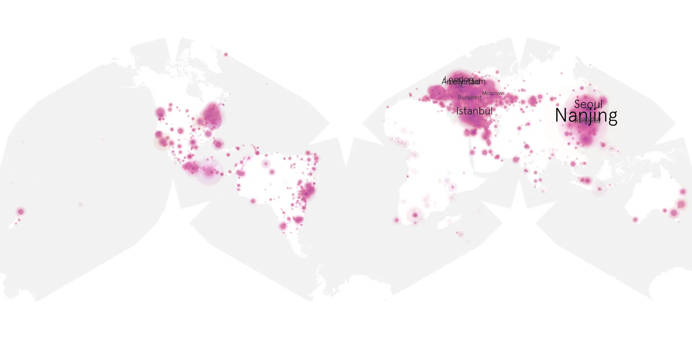
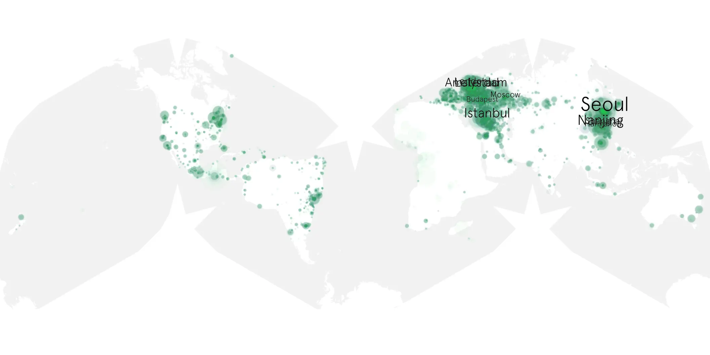

# lego-star-wars-the-mandalorian-2026 sample cache audit

## 1. Media object

| Field | Value |
| --- | --- |
| Media object | LEGO Star Wars: The Mandalorian |
| Collection key | `lego-star-wars-the-mandalorian-2026` |
| imdb_id | [tt43679852](https://www.imdb.com/title/tt43679852/) |
| wikipedia_url | UNAVAILABLE — no English Wikipedia page exists |
| Sample dates | 2026-09-03-to-2026-10-02 |
| Sample days | 30 |
| BTIH count | 60 |
| Unique BTIH count | 54 |
| Downloaders total | 1,287,434 |
| Uploaders total | 42,827 |
| Data version | `2026-08-05` |
| IP geolocation version | `6:1777968300` |

## 2. Coverage report

- Generated: 2026-10-03T19:10:22Z
- Frozen sample archive directory: `/mnt/gold/src/alpha60-samples-raw.gold/lego-star-wars-the-mandalorian-2026.xz`
- Hour directories: 694
- Zero-length sample files: 0
- Malformed in-scope records accepted: 0 (producer rejects nonempty malformed input)
- Hourly discontinuities: 0 (0 missing hours)
- Missing days: 0

### Sample archive discontinuities

None detected.

### Frozen validation evidence

- Frozen content SHA-256: `f2a4dad79db5a79741c8b478fff22517207dac972c74b88d52ae0303e46d8a21`
- Full-input producer receipt SHA-256: `e57baa0d8718ed2627c8242eabda74c03e7948afad192d9acb6fe3669972908a`
- Frozen raw archives: 694
- Empty sampler observations remain explicit gaps; no observations were imputed.
- Out-of-scope records retain the collection factory's established filtering.
- Excluded raw members: 0
- Excluded observations: 0

## 3. File sizes histogram *median[lowest, highest]*

## 4. Graphs

### Downloads by week cumulative (normalized start)



### Downloads by day, Saturday and Sunday in gray

## 5. Cumulative Maps

<!-- https://raw.githubusercontent.com/alpha60-devops/alpha60-results-2026/refs/heads/main/data/ -->

### <a href="https://raw.githubusercontent.com/alpha60-devops/alpha60-results-2026/refs/heads/main/data/geojson.cumulative/lego-star-wars-the-mandalorian-2026-cumulative-aggregate.geojson.gz" data-map-title="LEGO Star Wars: The Mandalorian — lego-star-wars-the-mandalorian-2026" onclick="leaflet_map_open_window(this.href, this.dataset.mapTitle); return false;" class="table-link" aria-label="Open LEGO Star Wars: The Mandalorian (lego-star-wars-the-mandalorian-2026) cumulative data map in new window" title="Opens interactive map for LEGO Star Wars: The Mandalorian (lego-star-wars-the-mandalorian-2026) data">Swarm Detail</a>

### Geographic Regions

| Africa | Americas | Asia | Europe | Oceania | Unknown |
| --- | --- | --- | --- | --- | --- |
| 2.28 | 19.99 | 30.79 | 44.92 | 1.28 | 0.74 |

### Network infrastructure

{:target="_blank" rel="noopener"}

### Resolution >= 1080p

{:target="_blank" rel="noopener"}

### Resolution < 1080p

{:target="_blank" rel="noopener"}
