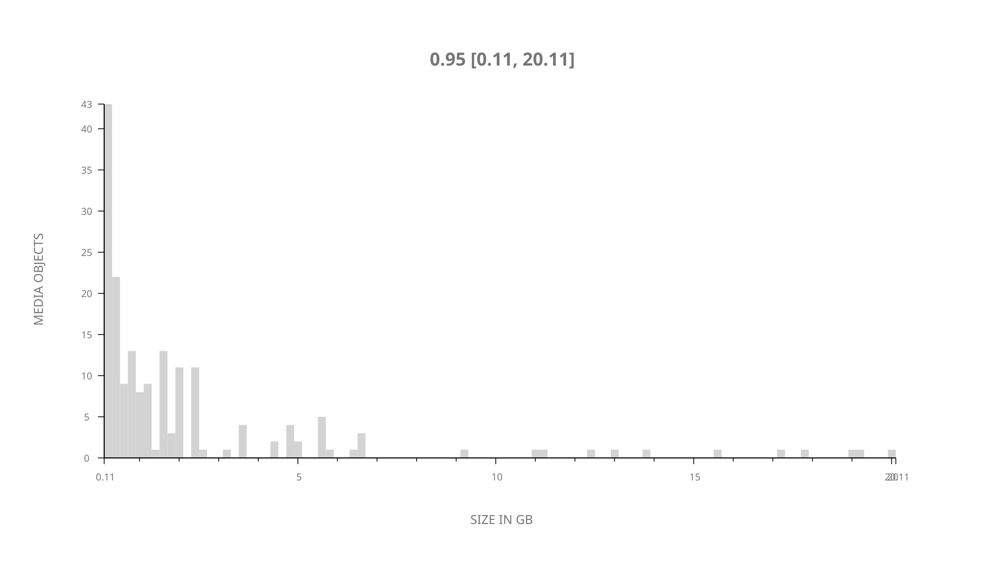
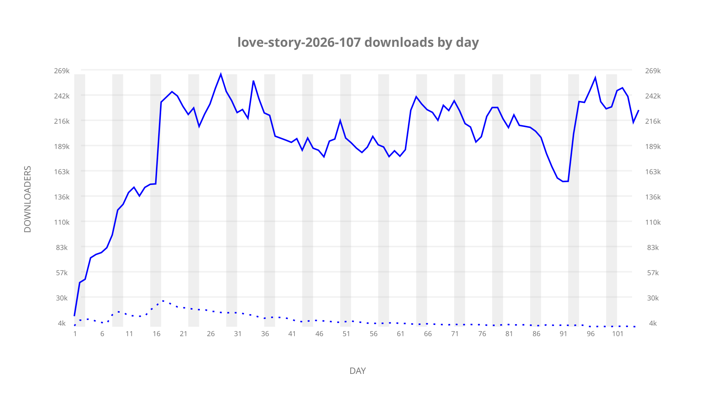
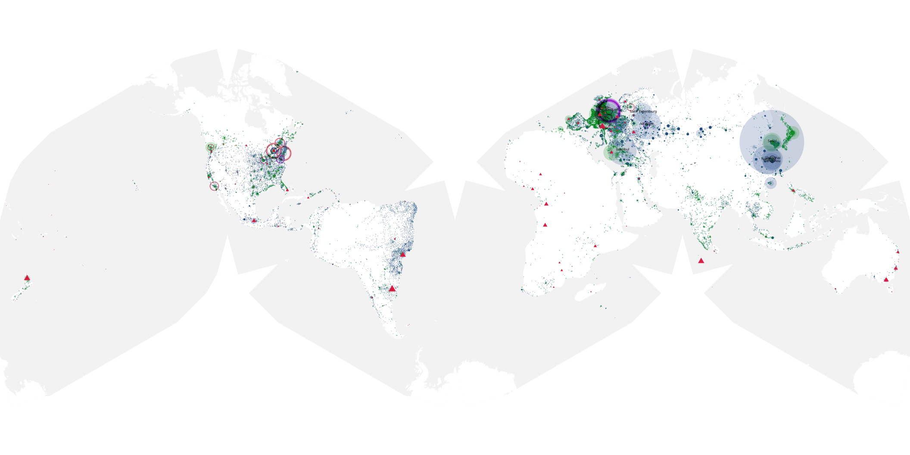
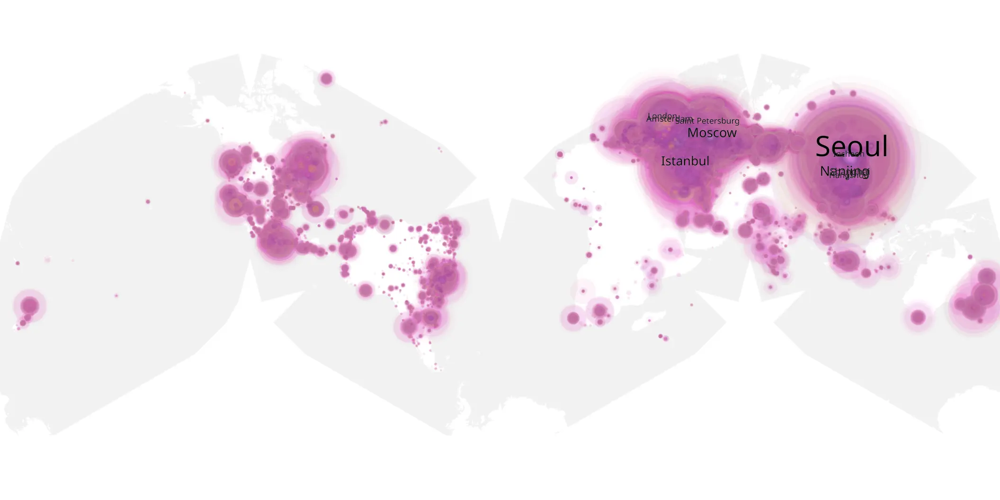
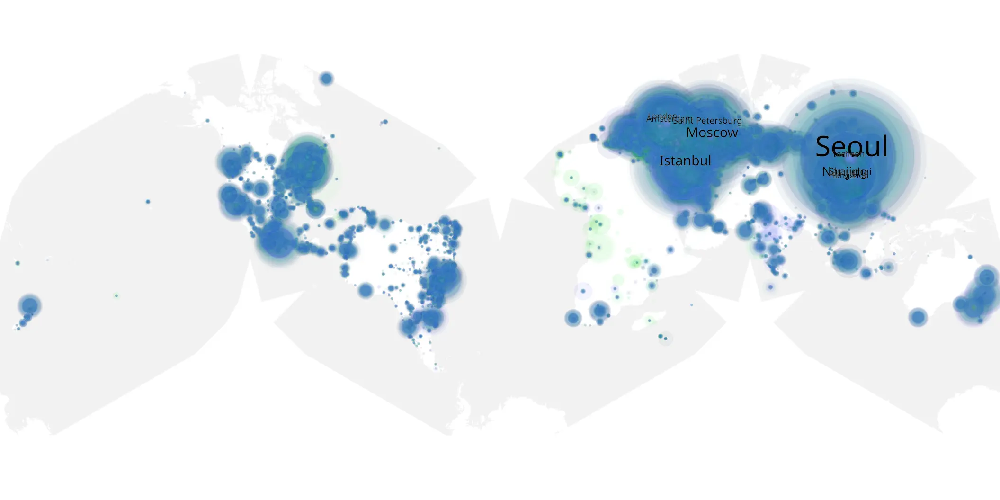

# love-story-2026-107 sample cache audit

## 1. Media object

| Field | Value |
| --- | --- |
| Media object | Love Story 2026 |
| Collection key | `love-story-2026-107` |
| imdb_id | [tt15232564](https://www.imdb.com/title/tt15232564/) |
| wikipedia_url | [Love Story (2026 TV series)](https://en.wikipedia.org/wiki/Love_Story_(2026_TV_series)) |
| Sample dates | 2026-03-13-to-2026-06-25 |
| Sample days | 105 |
| BTIH count | 206 |
| Unique BTIH count | 179 |
| Downloaders total | 17,104,582 |
| Uploaders total | 681,362 |
| Data version | `2026-08-05` |
| IP geolocation version | `6:1777968300` |

## 2. Coverage report

- Generated: 2026-09-13T17:13:07Z
- Sample archive directory: `/mnt/gold/src/alpha60-samples-raw.gold/love-story-2026-107.xz`
- Hour directories: 2505
- Zero-length sample files: 0
- Other unparsable sample files: 0
- Hourly discontinuities: 2 (10 missing hours)
- Missing days: 0

### Sample archive discontinuities

- hourly gap: last `2026-03-27 22:02`, resumed `2026-03-28 08:02` — missing 9 hour(s)
- hourly gap: last `2026-03-29 01:02`, resumed `2026-03-29 03:02` — missing 1 hour(s)

## 3. File sizes histogram *median[lowest, highest]*

## 4. Graphs

### Downloads by week cumulative (normalized start)



### Downloads by day, Saturday and Sunday in gray

## 5. Cumulative Maps

<!-- https://raw.githubusercontent.com/alpha60-devops/alpha60-results-2026/refs/heads/main/data/ -->

### <a href="https://raw.githubusercontent.com/alpha60-devops/alpha60-results-2026/refs/heads/main/data/geojson.cumulative/love-story-2026-107-cumulative-aggregate.geojson.gz" data-map-title="Love Story 2026 — love-story-2026-107" onclick="leaflet_map_open_window(this.href, this.dataset.mapTitle); return false;" class="table-link" aria-label="Open Love Story 2026 (love-story-2026-107) cumulative data map in new window" title="Opens interactive map for Love Story 2026 (love-story-2026-107) data">Swarm Detail</a>

### Geographic Regions

| Africa | Americas | Asia | Europe | Oceania | Unknown |
| --- | --- | --- | --- | --- | --- |
| 1.20 | 14.69 | 35.45 | 44.07 | 1.18 | 0.72 |

### Network infrastructure

{:target="_blank" rel="noopener"}

### Resolution >= 1080p

{:target="_blank" rel="noopener"}

### Resolution < 1080p

{:target="_blank" rel="noopener"}
