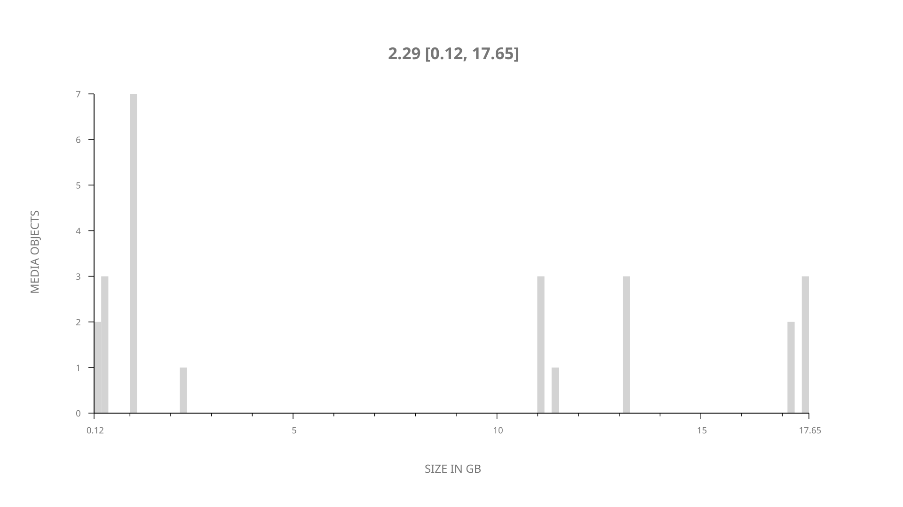
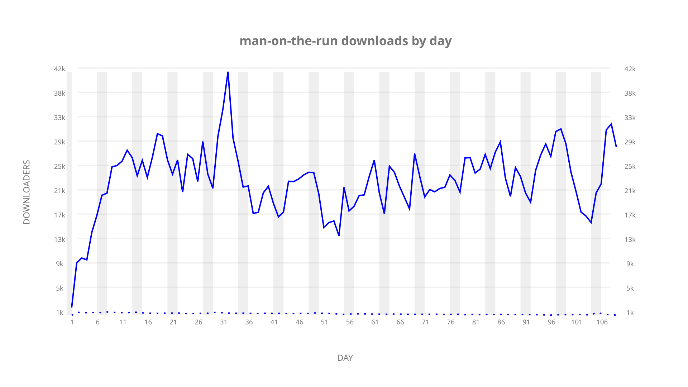
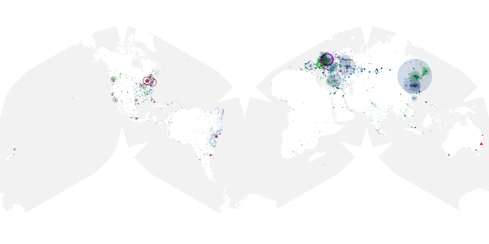
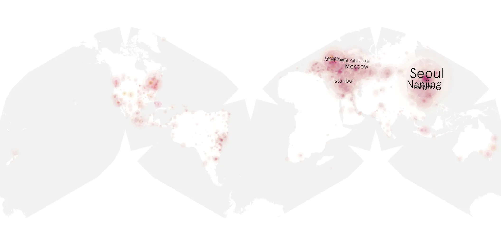
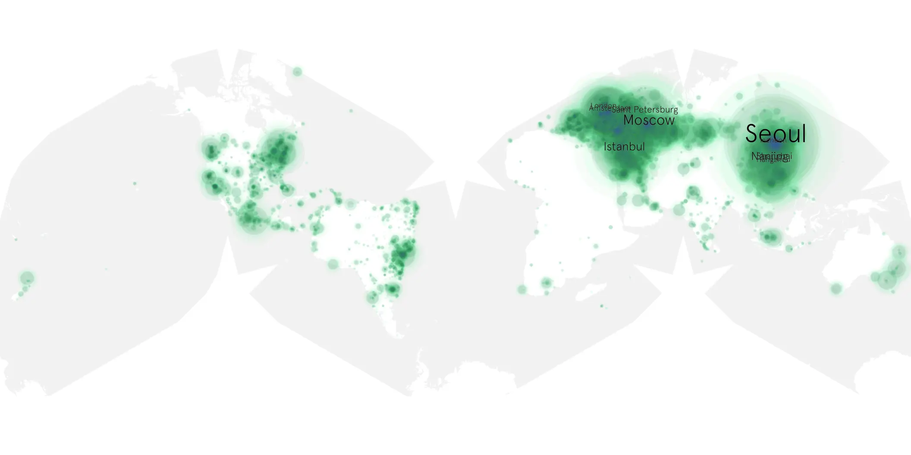

# man-on-the-run sample cache audit

## 1. Media object

| Field | Value |
| --- | --- |
| Media object | Man on the Run |
| Collection key | `man-on-the-run` |
| imdb_id | [tt26931594](https://www.imdb.com/title/tt26931594/) |
| wikipedia_url | [Man on the Run (2025 film)](https://en.wikipedia.org/wiki/Man_on_the_Run_(2025_film)) |
| Sample dates | 2026-03-01-to-2026-06-17 |
| Sample days | 109 |
| BTIH count | 36 |
| Unique BTIH count | 25 |
| Downloaders total | 2,073,670 |
| Uploaders total | 32,690 |
| Data version | `2026-08-05` |
| IP geolocation version | `6:1777968300` |

## 2. Sample coverage report

- Generated: 2026-09-13T17:13:07Z
- Sample archive directory: `/mnt/gold/src/alpha60-samples-raw.gold/man-on-the-run.xz`
- Hour directories: 2611
- Zero-length sample files: 0
- Other unparsable sample files: 0
- Hourly discontinuities: 2 (3 missing hours)
- Missing days: 0

### Sample archive discontinuities

- hourly gap: last `2026-03-29 01:01`, resumed `2026-03-29 03:01` — missing 1 hour(s)
- hourly gap: last `2026-05-27 22:01`, resumed `2026-05-28 01:01` — missing 2 hour(s)

## 3. Media objects file size histogram

## 4. Visualization pass — graphs

### Downloads by week cumulative (normalized start)



### Downloads by day, Saturday and Sunday in gray

## 5. Visualization pass — maps

### Cumulative geographic slices

| Africa | Americas | Asia | Europe | Oceania | Unknown |
| --- | --- | --- | --- | --- | --- |
| 0.81 | 12.04 | 30.08 | 38.42 | 0.92 | 0.60 |

### Cumulative network infrastructure

{:target="_blank" rel="noopener"}

### Cumulative data maps

**Cumulative >= 1080p**

{:target="_blank" rel="noopener"}

**Cumulative < 1080p**

{:target="_blank" rel="noopener"}
