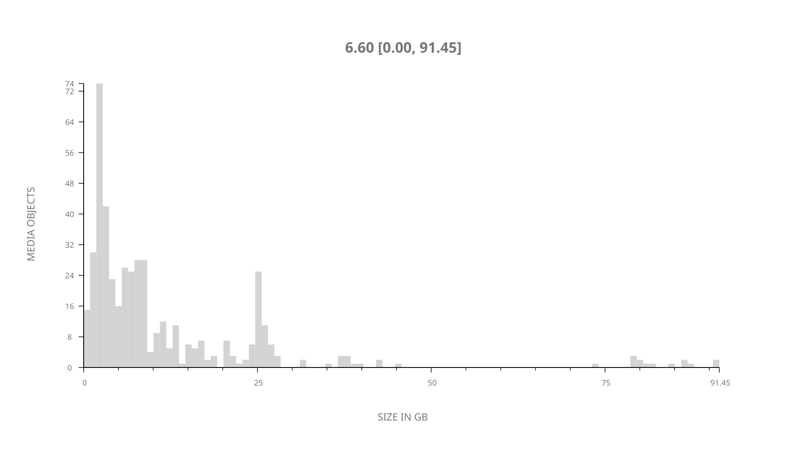
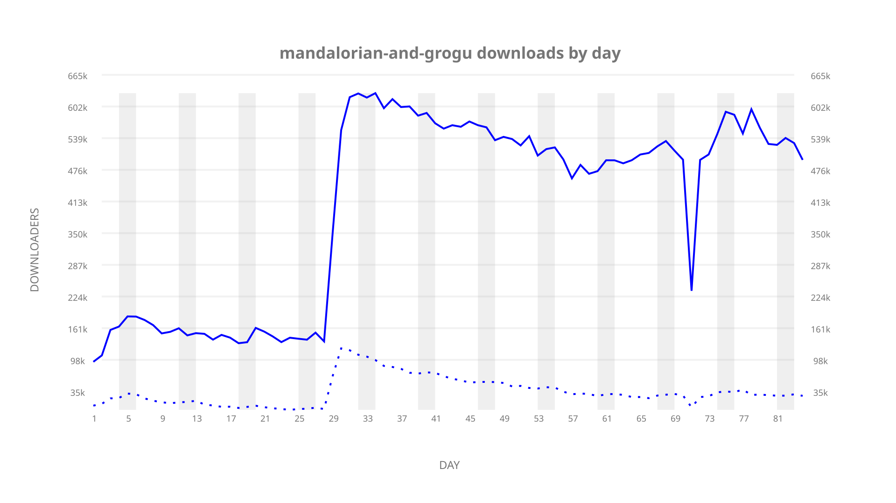
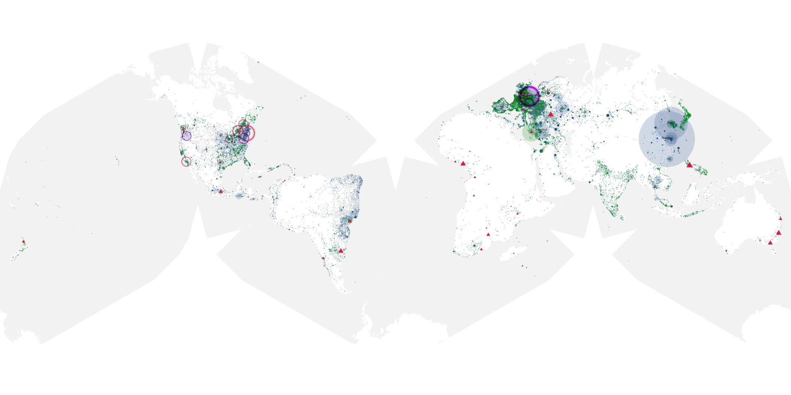
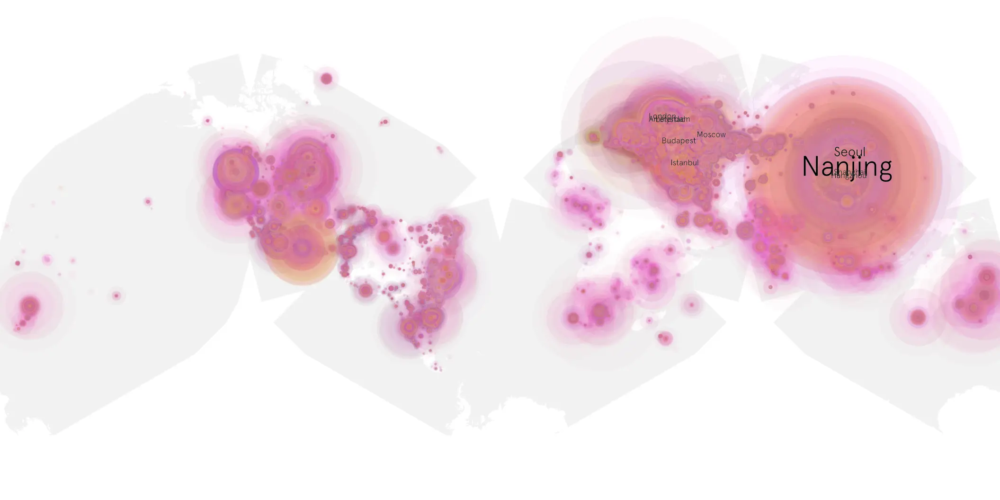
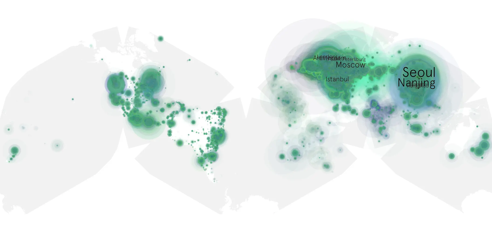

# mandalorian-and-grogu sample cache audit

## 1. Media object

| Field | Value |
| --- | --- |
| Media object | The Mandalorian and Grogu |
| Collection key | `mandalorian-and-grogu` |
| imdb_id | [tt30825738](https://www.imdb.com/title/tt30825738/) |
| wikipedia_url | [The Mandalorian and Grogu](https://en.wikipedia.org/wiki/The_Mandalorian_and_Grogu) |
| Sample dates | 2026-06-23-to-2026-09-14 |
| Sample days | 84 |
| BTIH count | 498 |
| Unique BTIH count | 464 |
| Downloaders total | 26,763,466 |
| Uploaders total | 3,278,698 |
| Data version | `2026-08-05` |
| IP geolocation version | `6:1777968300` |

## 2. Coverage report

- Generated: 2026-10-03T19:10:22Z
- Frozen sample archive directory: `/mnt/gold/src/alpha60-samples-raw.gold/mandalorian-and-grogu.xz`
- Hour directories: 1996
- Zero-length sample files: 0
- Malformed in-scope records accepted: 0 (producer rejects nonempty malformed input)
- Hourly discontinuities: 1 (15 missing hours)
- Missing days: 0

### Sample archive discontinuities

- hourly gap: last `2026-09-01 02:01`, resumed `2026-09-01 18:28` — missing 15 hour(s)

### Frozen validation evidence

- Frozen content SHA-256: `56ab4cafd27de178d96b56bb114a9f8b6b9feb8487dfbfadae1c526447117eac`
- Full-input producer receipt SHA-256: `4ba1588ed874776a9c4d53bb72afa98cb9addde32f6bf4bc9c4a992d3f6d5274`
- Frozen raw archives: 1996
- Empty sampler observations remain explicit gaps; no observations were imputed.
- Out-of-scope records retain the collection factory's established filtering.
- Excluded raw members: 0
- Excluded observations: 0

## 3. File sizes histogram *median[lowest, highest]*

## 4. Graphs

### Downloads by week cumulative (normalized start)



### Downloads by day, Saturday and Sunday in gray

## 5. Cumulative Maps

<!-- https://raw.githubusercontent.com/alpha60-devops/alpha60-results-2026/refs/heads/main/data/ -->

### <a href="https://raw.githubusercontent.com/alpha60-devops/alpha60-results-2026/refs/heads/main/data/geojson.cumulative/mandalorian-and-grogu-cumulative-aggregate.geojson.gz" data-map-title="The Mandalorian and Grogu — mandalorian-and-grogu" onclick="leaflet_map_open_window(this.href, this.dataset.mapTitle); return false;" class="table-link" aria-label="Open The Mandalorian and Grogu (mandalorian-and-grogu) cumulative data map in new window" title="Opens interactive map for The Mandalorian and Grogu (mandalorian-and-grogu) data">Swarm Detail</a>

### Geographic Regions

| Africa | Americas | Asia | Europe | Oceania | Unknown |
| --- | --- | --- | --- | --- | --- |
| 2.09 | 18.99 | 33.27 | 43.32 | 1.52 | 0.81 |

### Network infrastructure

{:target="_blank" rel="noopener"}

### Resolution >= 1080p

{:target="_blank" rel="noopener"}

### Resolution < 1080p

{:target="_blank" rel="noopener"}
