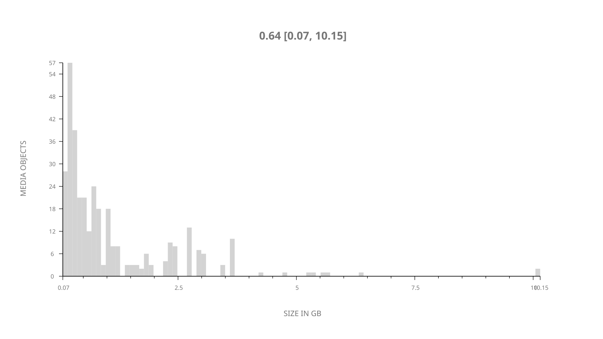
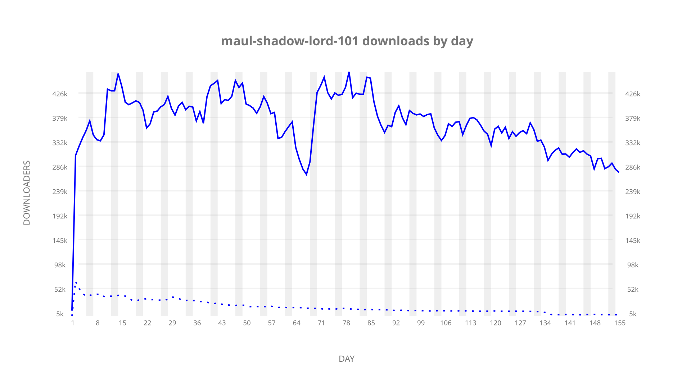
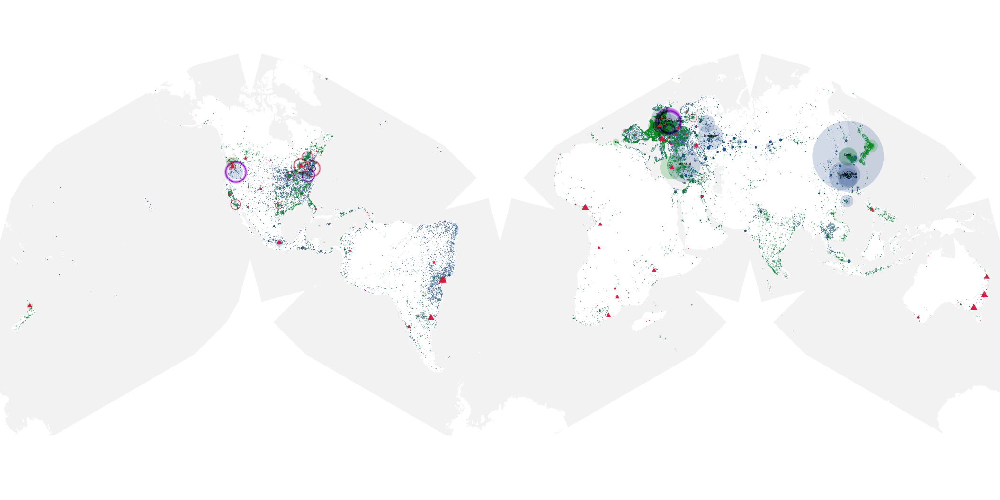
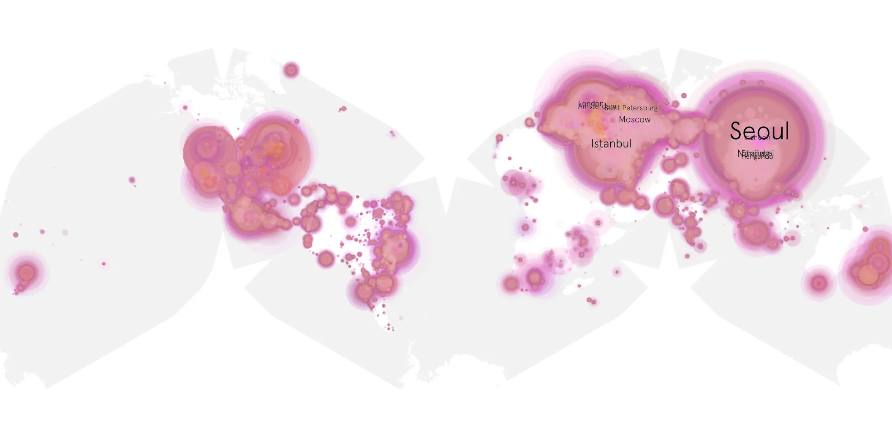
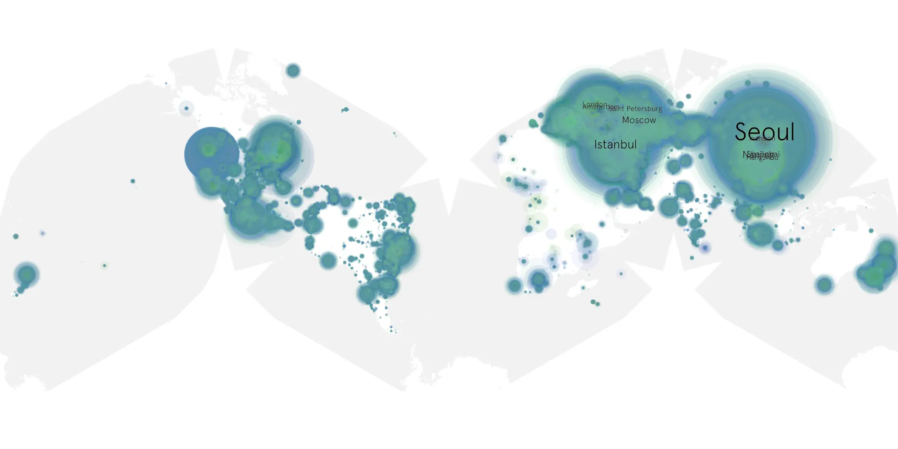

# maul-shadow-lord-101 sample cache audit

## 1. Media object

| Field | Value |
| --- | --- |
| Media object | Star Wars: Maul - Shadow Lord |
| Collection key | `maul-shadow-lord-101` |
| imdb_id | [tt36594331](https://www.imdb.com/title/tt36594331/) |
| wikipedia_url | [Star Wars: Maul – Shadow Lord](https://en.wikipedia.org/wiki/Star_Wars:_Maul_%E2%80%93_Shadow_Lord) |
| Sample dates | 2026-04-06-to-2026-09-07 |
| Sample days | 155 |
| BTIH count | 367 |
| Unique BTIH count | 346 |
| Downloaders total | 43,710,091 |
| Uploaders total | 1,660,883 |
| Data version | `2026-08-05` |
| IP geolocation version | `6:1777968300` |

## 2. Sample coverage report

- Generated: 2026-09-13T17:13:07Z
- Sample archive directory: `/mnt/gold/src/alpha60-samples-raw.gold/maul-shadow-lord-101.xz`
- Hour directories: 3697
- Zero-length sample files: 0
- Other unparsable sample files: 0
- Hourly discontinuities: 0 (0 missing hours)
- Missing days: 0

### Sample archive discontinuities

None detected.

## 3. Media objects file size histogram

## 4. Visualization pass — graphs

### Downloads by week cumulative (normalized start)



### Downloads by day, Saturday and Sunday in gray

## 5. Visualization pass — maps

### Cumulative geographic slices

| Africa | Americas | Asia | Europe | Oceania | Unknown |
| --- | --- | --- | --- | --- | --- |
| 1.29 | 17.54 | 34.64 | 43.46 | 1.22 | 0.80 |

### Cumulative network infrastructure

{:target="_blank" rel="noopener"}

### Cumulative data maps

**Cumulative >= 1080p**

{:target="_blank" rel="noopener"}

**Cumulative < 1080p**

{:target="_blank" rel="noopener"}
