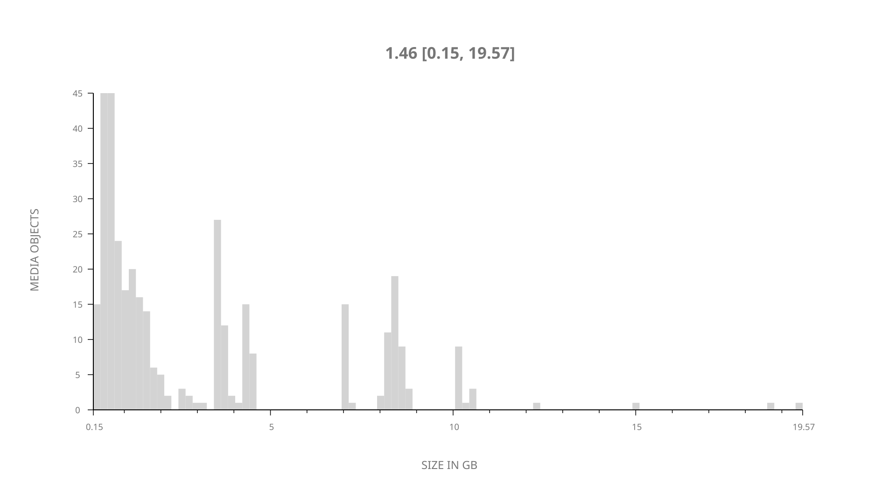
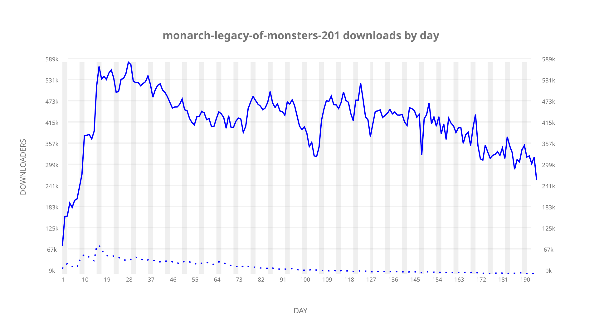
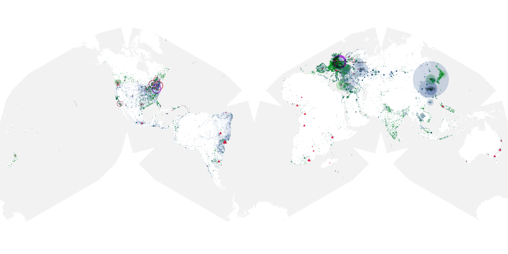
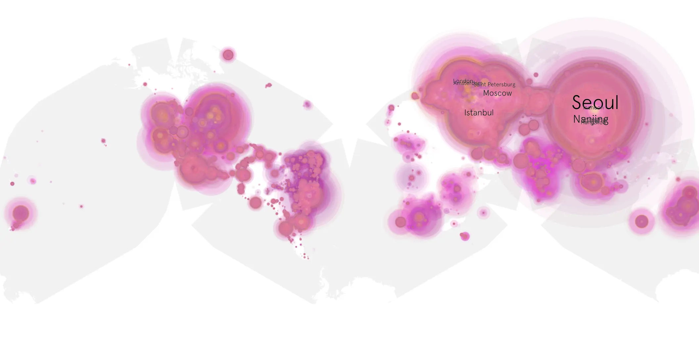
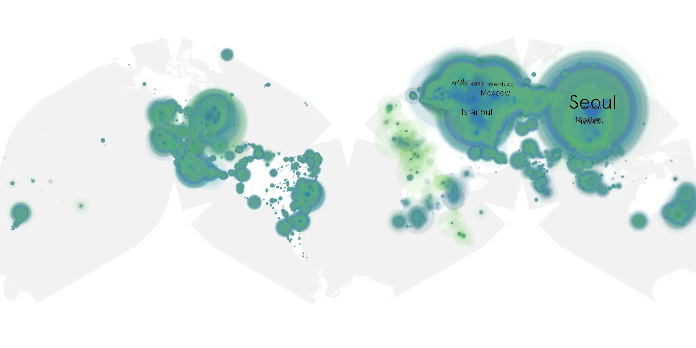

# monarch-legacy-of-monsters-201 sample cache audit

## 1. Media object

| Field | Value |
| --- | --- |
| Media object | Monarch: Legacy of Monsters |
| Collection key | `monarch-legacy-of-monsters-201` |
| imdb_id | [tt17220216](https://www.imdb.com/title/tt17220216/) |
| wikipedia_url | [Monarch: Legacy of Monsters](https://en.wikipedia.org/wiki/Monarch:_Legacy_of_Monsters) |
| Sample dates | 2026-02-27-to-2026-09-10 |
| Sample days | 196 |
| BTIH count | 380 |
| Unique BTIH count | 358 |
| Downloaders total | 62,908,962 |
| Uploaders total | 2,759,897 |
| Data version | `2026-08-05` |
| IP geolocation version | `6:1777968300` |

## 2. Sample coverage report

- Generated: 2026-09-13T17:13:07Z
- Sample archive directory: `/mnt/gold/src/alpha60-samples-raw.gold/monarch-legacy-of-monsters-201.xz`
- Hour directories: 4668
- Zero-length sample files: 0
- Other unparsable sample files: 0
- Hourly discontinuities: 3 (28 missing hours)
- Missing days: 1

### Sample archive discontinuities

- hourly gap: last `2026-03-29 01:02`, resumed `2026-03-29 03:02` — missing 1 hour(s)
- hourly gap: last `2026-05-27 22:02`, resumed `2026-05-28 00:14` — missing 1 hour(s)
- hourly gap: last `2026-07-03 22:02`, resumed `2026-07-05 01:02` — missing 26 hour(s)
- missing day: `2026-07-04`

## 3. Media objects file size histogram

## 4. Visualization pass — graphs

### Downloads by week cumulative (normalized start)



### Downloads by day, Saturday and Sunday in gray

## 5. Visualization pass — maps

### Cumulative geographic slices

| Africa | Americas | Asia | Europe | Oceania | Unknown |
| --- | --- | --- | --- | --- | --- |
| 1.57 | 16.59 | 35.10 | 43.72 | 1.19 | 0.80 |

### Cumulative network infrastructure

{:target="_blank" rel="noopener"}

### Cumulative data maps

**Cumulative >= 1080p**

{:target="_blank" rel="noopener"}

**Cumulative < 1080p**

{:target="_blank" rel="noopener"}
