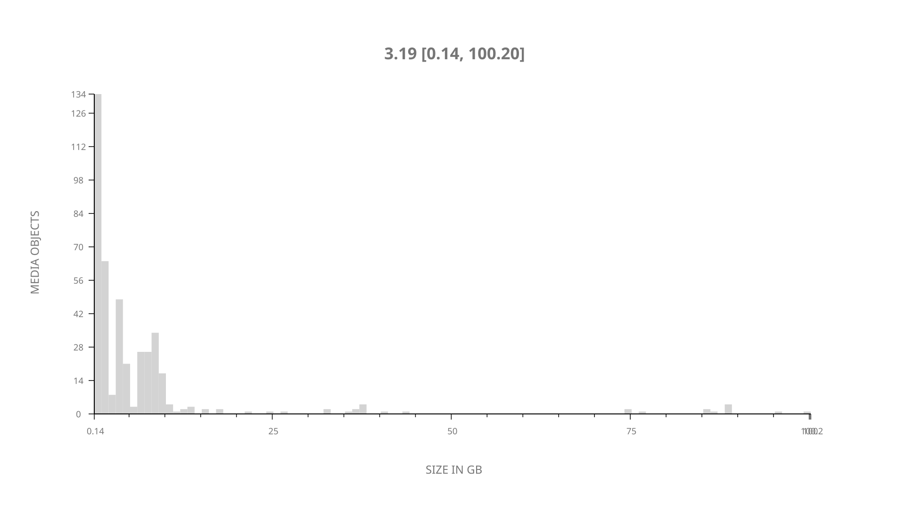
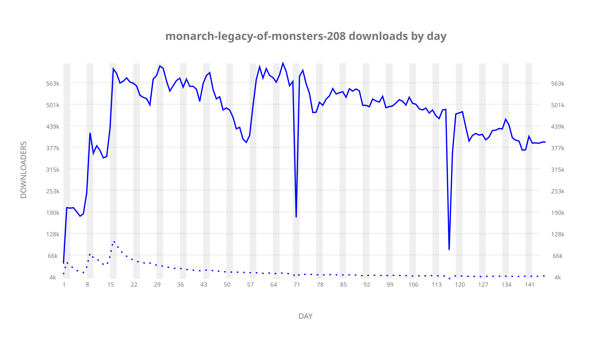
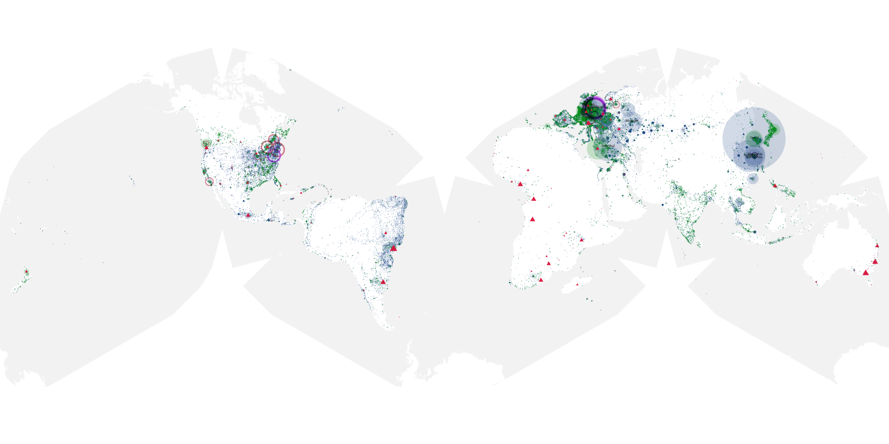
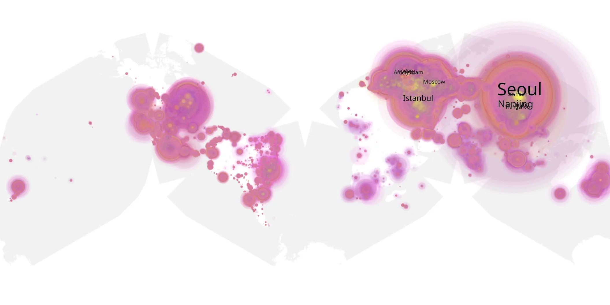
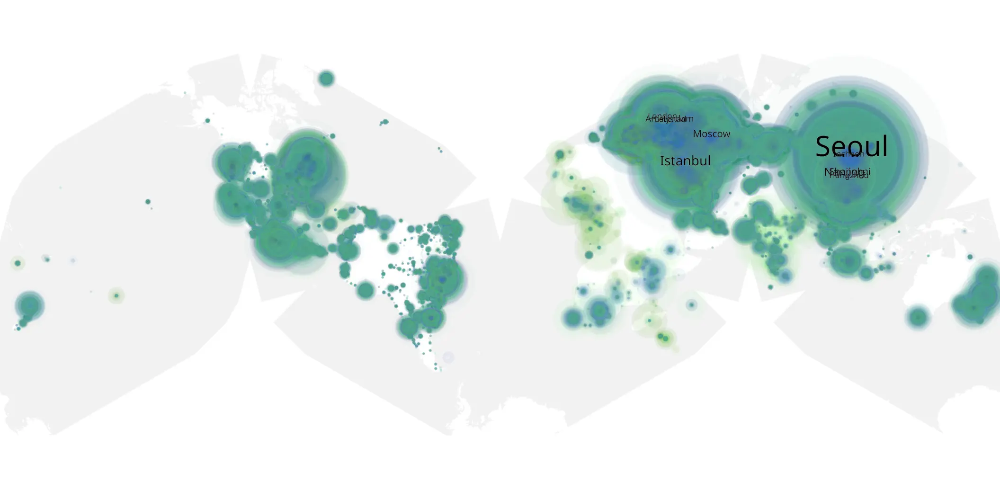

# monarch-legacy-of-monsters-208 sample cache audit

## 1. Media object

| Field | Value |
| --- | --- |
| Media object | Monarch: Legacy of Monsters |
| Collection key | `monarch-legacy-of-monsters-208` |
| imdb_id | [tt17220216](https://www.imdb.com/title/tt17220216/) |
| wikipedia_url | [Monarch: Legacy of Monsters](https://en.wikipedia.org/wiki/Monarch:_Legacy_of_Monsters) |
| Sample dates | 2026-04-17-to-2026-09-10 |
| Sample days | 147 |
| BTIH count | 445 |
| Unique BTIH count | 421 |
| Downloaders total | 53,653,736 |
| Uploaders total | 1,927,569 |
| Data version | `2026-08-05` |
| IP geolocation version | `6:1777968300` |

## 2. Coverage report

- Generated: 2026-09-13T17:13:07Z
- Sample archive directory: `/mnt/gold/src/alpha60-samples-raw.gold/monarch-legacy-of-monsters-208.xz`
- Hour directories: 3447
- Zero-length sample files: 0
- Other unparsable sample files: 0
- Hourly discontinuities: 2 (67 missing hours)
- Missing days: 1

### Sample archive discontinuities

- hourly gap: last `2026-06-25 23:06`, resumed `2026-06-27 17:06` — missing 41 hour(s)
- hourly gap: last `2026-08-12 03:06`, resumed `2026-08-13 06:06` — missing 26 hour(s)
- missing day: `2026-06-26`

## 3. File sizes histogram *median[lowest, highest]*

## 4. Graphs

### Downloads by week cumulative (normalized start)



### Downloads by day, Saturday and Sunday in gray

## 5. Cumulative Maps

<!-- https://raw.githubusercontent.com/alpha60-devops/alpha60-results-2026/refs/heads/main/data/ -->

### <a href="https://raw.githubusercontent.com/alpha60-devops/alpha60-results-2026/refs/heads/main/data/geojson.cumulative/monarch-legacy-of-monsters-208-cumulative-aggregate.geojson.gz" data-map-title="Monarch: Legacy of Monsters — monarch-legacy-of-monsters-208" onclick="leaflet_map_open_window(this.href, this.dataset.mapTitle); return false;" class="table-link" aria-label="Open Monarch: Legacy of Monsters (monarch-legacy-of-monsters-208) cumulative data map in new window" title="Opens interactive map for Monarch: Legacy of Monsters (monarch-legacy-of-monsters-208) data">Swarm Detail</a>

### Geographic Regions

| Africa | Americas | Asia | Europe | Oceania | Unknown |
| --- | --- | --- | --- | --- | --- |
| 1.47 | 16.83 | 35.80 | 42.79 | 1.15 | 0.83 |

### Network infrastructure

{:target="_blank" rel="noopener"}

### Resolution >= 1080p

{:target="_blank" rel="noopener"}

### Resolution < 1080p

{:target="_blank" rel="noopener"}
