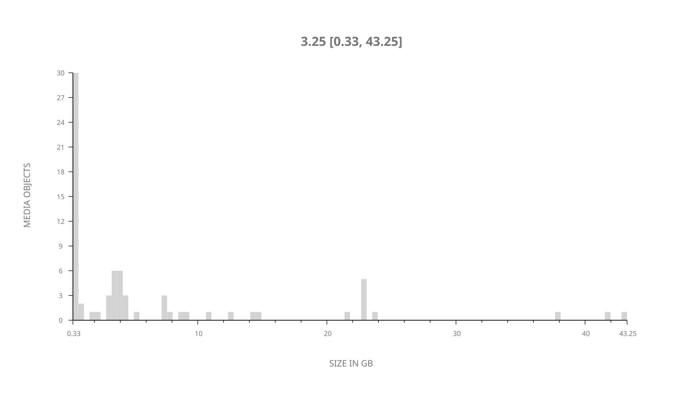
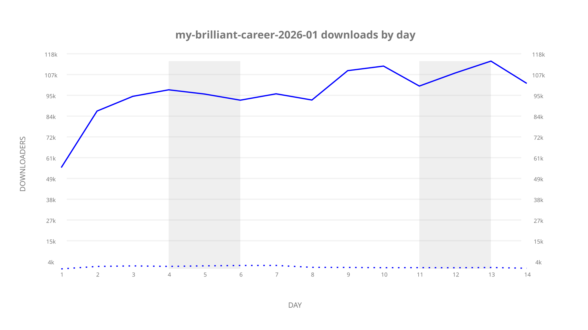
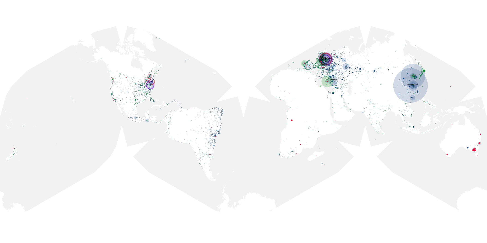
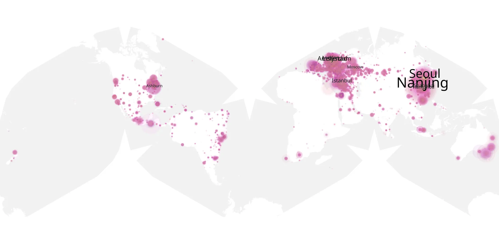
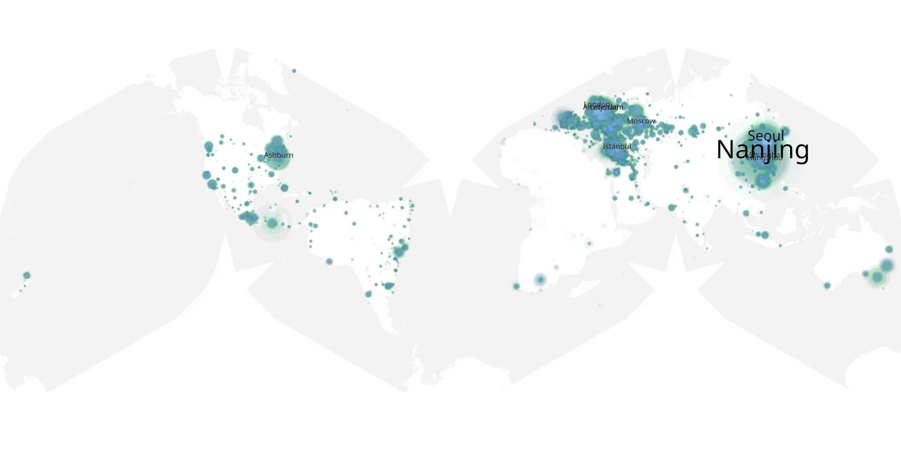

# my-brilliant-career-2026-01 sample cache audit

## 1. Media object

| Field | Value |
| --- | --- |
| Media object | My Brilliant Career |
| Collection key | `my-brilliant-career-2026-01` |
| imdb_id | [tt37352716](https://www.imdb.com/title/tt37352716/) |
| wikipedia_url | [My Brilliant Career (TV series)](https://en.wikipedia.org/wiki/My_Brilliant_Career_(TV_series)) |
| Sample dates | 2026-08-18-to-2026-08-31 |
| Sample days | 14 |
| BTIH count | 73 |
| Unique BTIH count | 73 |
| Downloaders total | 1,217,272 |
| Uploaders total | 48,671 |
| Data version | `2026-08-05` |
| IP geolocation version | `6:1777968300` |

## 2. Coverage report

- Generated: 2026-09-13T17:13:07Z
- Sample archive directory: `/mnt/gold/src/alpha60-samples-raw.gold/my-brilliant-career-2026-01.xz`
- Hour directories: 336
- Zero-length sample files: 0
- Other unparsable sample files: 0
- Hourly discontinuities: 0 (0 missing hours)
- Missing days: 0

### Sample archive discontinuities

None detected.

## 3. File sizes histogram *median[lowest, highest]*

## 4. Graphs

### Downloads by week cumulative (normalized start)



### Downloads by day, Saturday and Sunday in gray

## 5. Cumulative Maps

<!-- https://raw.githubusercontent.com/alpha60-devops/alpha60-results-2026/refs/heads/main/data/ -->

### <a href="https://raw.githubusercontent.com/alpha60-devops/alpha60-results-2026/refs/heads/main/data/geojson.cumulative/my-brilliant-career-2026-01-cumulative-aggregate.geojson.gz" data-map-title="My Brilliant Career — my-brilliant-career-2026-01" onclick="leaflet_map_open_window(this.href, this.dataset.mapTitle); return false;" class="table-link" aria-label="Open My Brilliant Career (my-brilliant-career-2026-01) cumulative data map in new window" title="Opens interactive map for My Brilliant Career (my-brilliant-career-2026-01) data">Swarm Detail</a>

### Geographic Regions

| Africa | Americas | Asia | Europe | Oceania | Unknown |
| --- | --- | --- | --- | --- | --- |
| 1.46 | 17.38 | 34.12 | 41.48 | 2.21 | 0.75 |

### Network infrastructure

{:target="_blank" rel="noopener"}

### Resolution >= 1080p

{:target="_blank" rel="noopener"}

### Resolution < 1080p

{:target="_blank" rel="noopener"}
