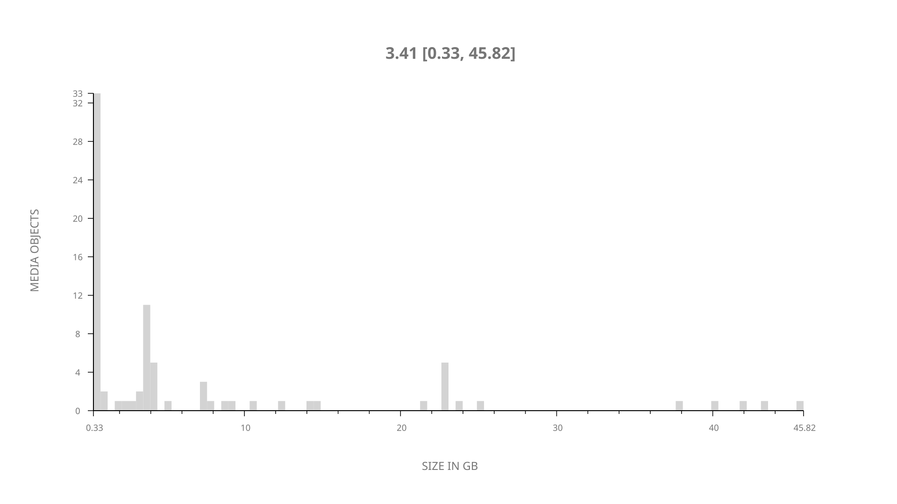
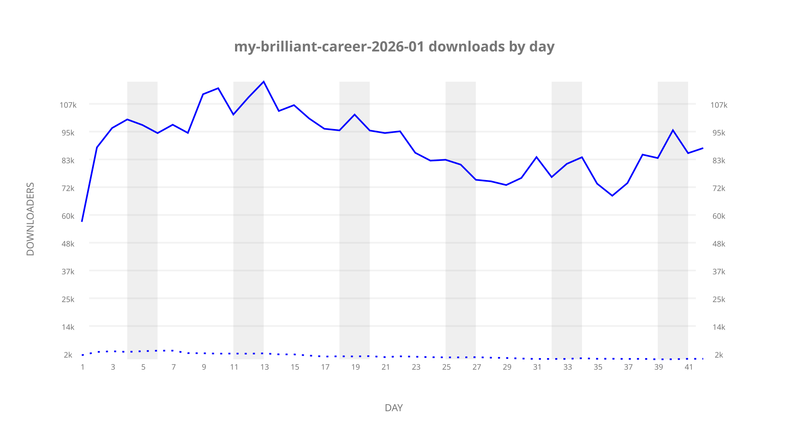
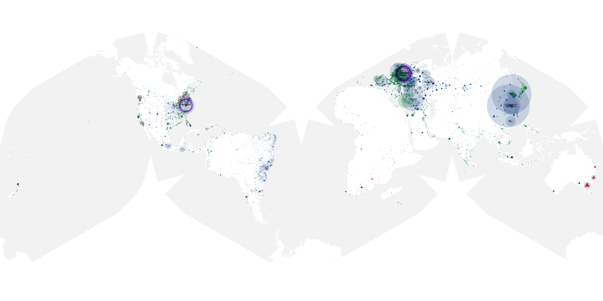
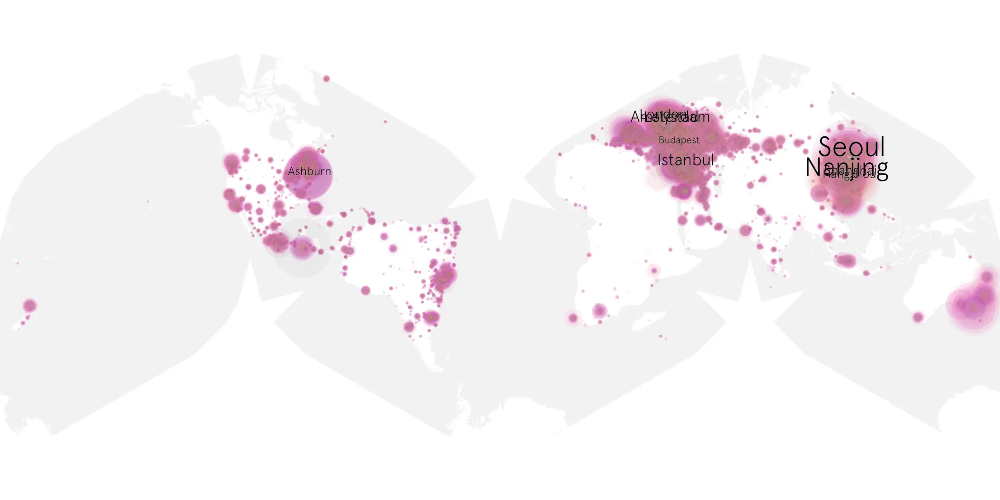
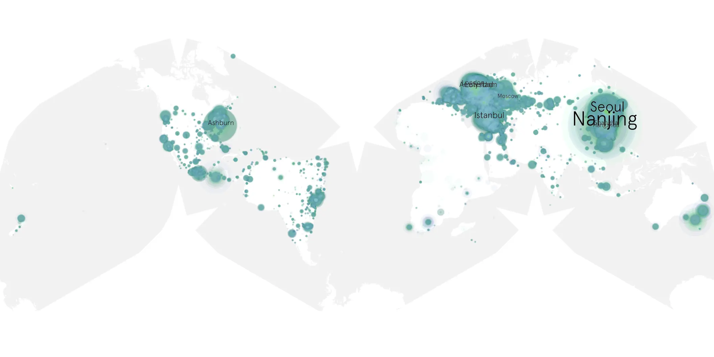

# my-brilliant-career-2026-01 sample cache audit

## 1. Media object

| Field | Value |
| --- | --- |
| Media object | My Brilliant Career |
| Collection key | `my-brilliant-career-2026-01` |
| imdb_id | [tt37352716](https://www.imdb.com/title/tt37352716/) |
| wikipedia_url | [My Brilliant Career (TV series)](https://en.wikipedia.org/wiki/My_Brilliant_Career_(TV_series)) |
| Sample dates | 2026-08-18-to-2026-09-28 |
| Sample days | 42 |
| BTIH count | 80 |
| Unique BTIH count | 80 |
| Downloaders total | 3,156,069 |
| Uploaders total | 92,839 |
| Data version | `2026-08-05` |
| IP geolocation version | `6:1777968300` |

## 2. Sample coverage report

- Generated: 2026-10-07T11:57:09Z
- Frozen sample archive directory: `/mnt/gold/src/alpha60-samples-raw.gold/my-brilliant-career-2026-01.xz`
- Hour directories: 1007
- Zero-length sample files: 0
- Malformed in-scope records accepted: 0 (producer rejects nonempty malformed input)
- Hourly discontinuities: 1 (1 missing hours)
- Missing days: 0

### Sample archive discontinuities

- hourly gap: last `2026-09-09 22:02`, resumed `2026-09-10 00:02` — missing 1 hour(s)

### Frozen validation evidence

- Frozen content SHA-256: `dbc9218fc6ed6dcdb76dc5b8ce4a3ad2476a0c915199c9701a3d9e22ab0fa48a`
- Full-input producer receipt SHA-256: `d2c6d223acc33b3c6f908afc51df9ef523a745624e828b9ba12b26b97bded793`
- Frozen raw archives: 1007
- Empty sampler observations remain explicit gaps; no observations were imputed.
- Out-of-scope records retain the collection factory's established filtering.
- Excluded raw members: 0
- Excluded observations: 0

## 3. Media objects file size histogram

## 4. Visualization pass — graphs

### Downloads by week cumulative (normalized start)



### Downloads by day, Saturday and Sunday in gray

## 5. Visualization pass — maps

### Cumulative geographic slices

| Africa | Americas | Asia | Europe | Oceania | Unknown |
| --- | --- | --- | --- | --- | --- |
| 1.54 | 19.15 | 32.71 | 43.88 | 1.96 | 0.77 |

### Cumulative network infrastructure

{:target="_blank" rel="noopener"}

### Cumulative data maps

**Cumulative >= 1080p**

{:target="_blank" rel="noopener"}

**Cumulative < 1080p**

{:target="_blank" rel="noopener"}
