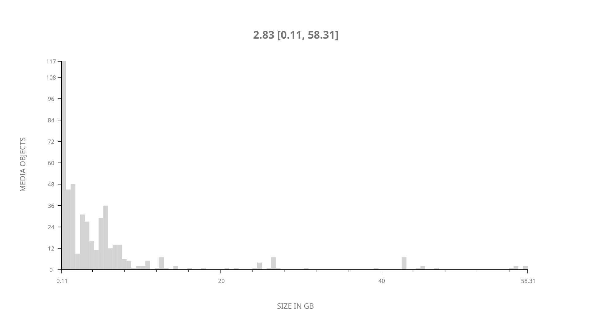
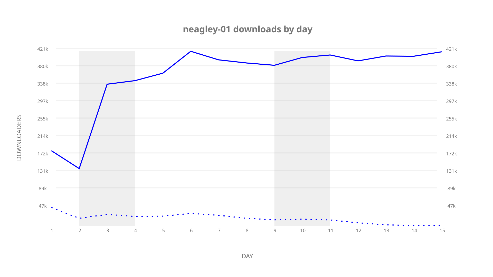
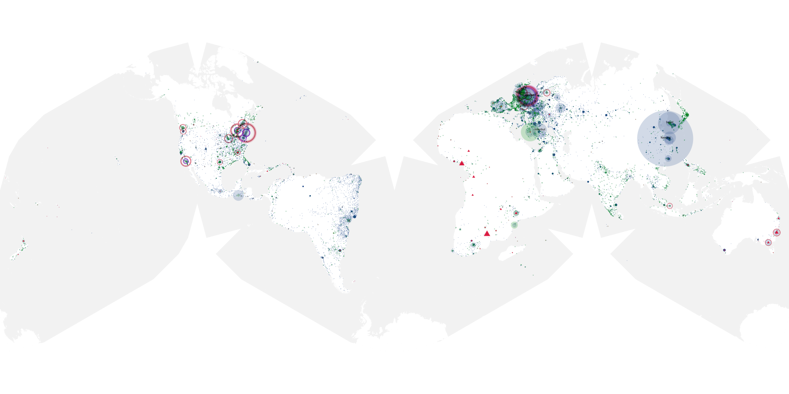
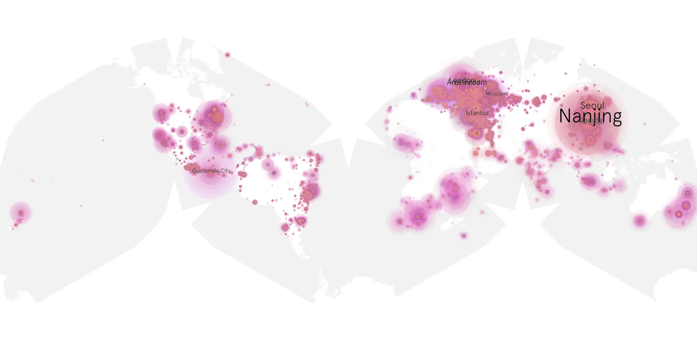
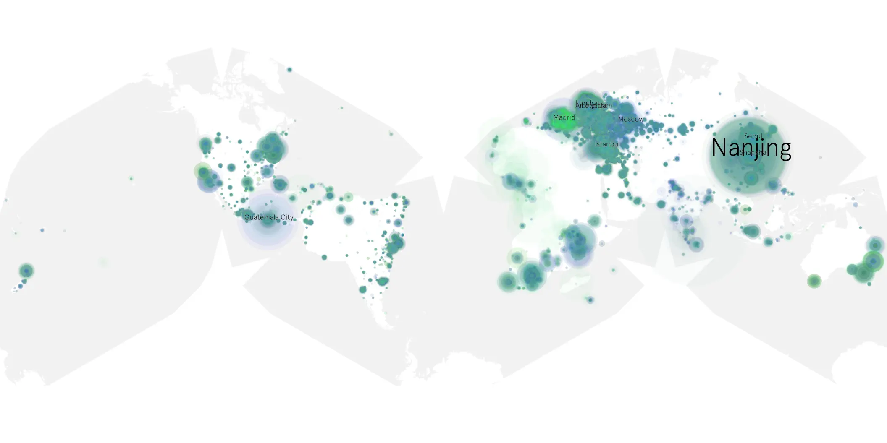

# neagley-01 sample cache audit

## 1. Media object

| Field | Value |
| --- | --- |
| Media object | Neagley |
| Collection key | `neagley-01` |
| imdb_id | [tt33539520](https://www.imdb.com/title/tt33539520/) |
| wikipedia_url | [Neagley](https://en.wikipedia.org/wiki/Neagley) |
| Sample dates | 2026-09-17-to-2026-10-01 |
| Sample days | 15 |
| BTIH count | 481 |
| Unique BTIH count | 477 |
| Downloaders total | 4,675,218 |
| Uploaders total | 612,019 |
| Data version | `2026-08-05` |
| IP geolocation version | `6:1777968300` |

## 2. Coverage report

- Generated: 2026-10-03T19:10:22Z
- Frozen sample archive directory: `/mnt/gold/src/alpha60-samples-raw.gold/neagley-01.xz`
- Hour directories: 360
- Zero-length sample files: 0
- Malformed in-scope records accepted: 0 (producer rejects nonempty malformed input)
- Hourly discontinuities: 0 (0 missing hours)
- Missing days: 0

### Sample archive discontinuities

None detected.

### Frozen validation evidence

- Frozen content SHA-256: `3978f78c7f66af6ab0d65fff504301b95fe77f4b88c908aaea9c8e5f523a5210`
- Full-input producer receipt SHA-256: `b5217ab6fbd24f7bfa6423990e5b6407c80299a4ab685e83de7526d112926e23`
- Frozen raw archives: 360
- Empty sampler observations remain explicit gaps; no observations were imputed.
- Out-of-scope records retain the collection factory's established filtering.
- Excluded raw members: 0
- Excluded observations: 0

## 3. File sizes histogram *median[lowest, highest]*

## 4. Graphs

### Downloads by week cumulative (normalized start)



### Downloads by day, Saturday and Sunday in gray

## 5. Cumulative Maps

<!-- https://raw.githubusercontent.com/alpha60-devops/alpha60-results-2026/refs/heads/main/data/ -->

### <a href="https://raw.githubusercontent.com/alpha60-devops/alpha60-results-2026/refs/heads/main/data/geojson.cumulative/neagley-01-cumulative-aggregate.geojson.gz" data-map-title="Neagley — neagley-01" onclick="leaflet_map_open_window(this.href, this.dataset.mapTitle); return false;" class="table-link" aria-label="Open Neagley (neagley-01) cumulative data map in new window" title="Opens interactive map for Neagley (neagley-01) data">Swarm Detail</a>

### Geographic Regions

| Africa | Americas | Asia | Europe | Oceania | Unknown |
| --- | --- | --- | --- | --- | --- |
| 5.73 | 19.96 | 29.96 | 41.28 | 2.36 | 0.70 |

### Network infrastructure

{:target="_blank" rel="noopener"}

### Resolution >= 1080p

{:target="_blank" rel="noopener"}

### Resolution < 1080p

{:target="_blank" rel="noopener"}
