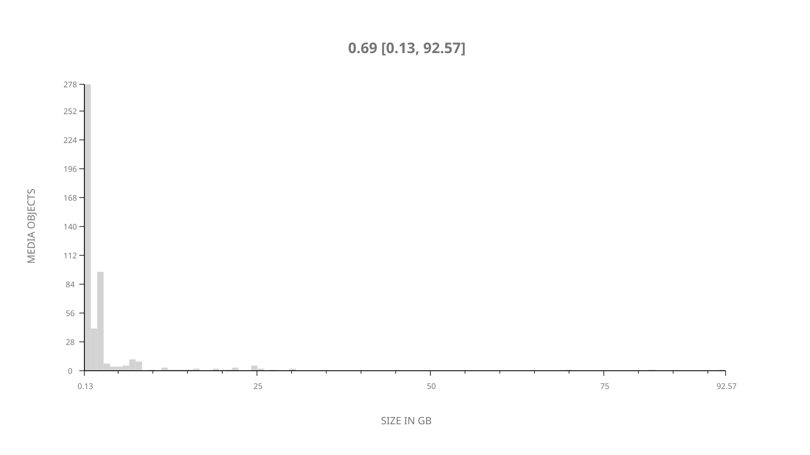
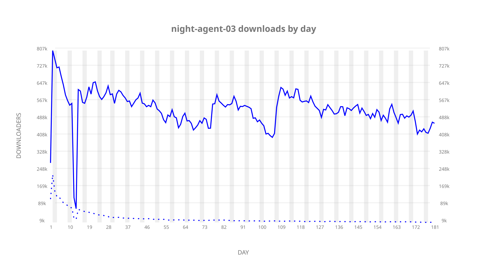
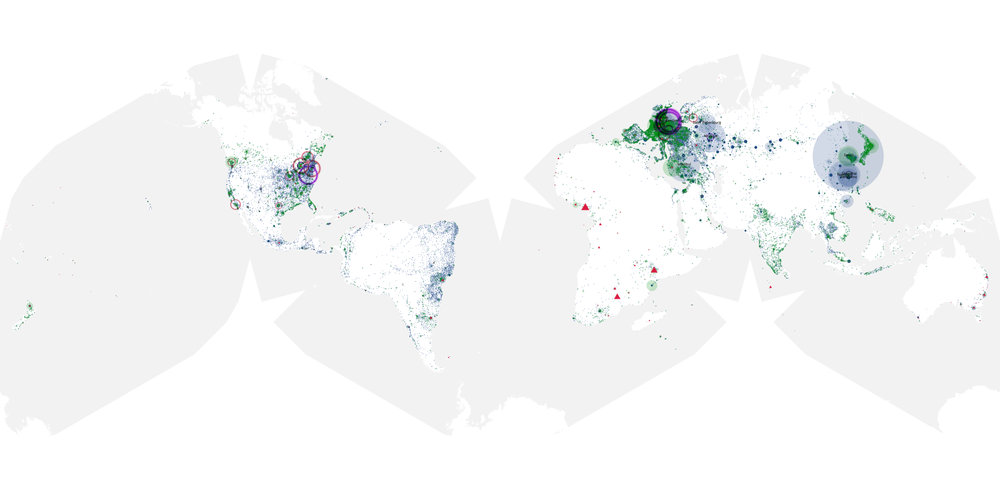
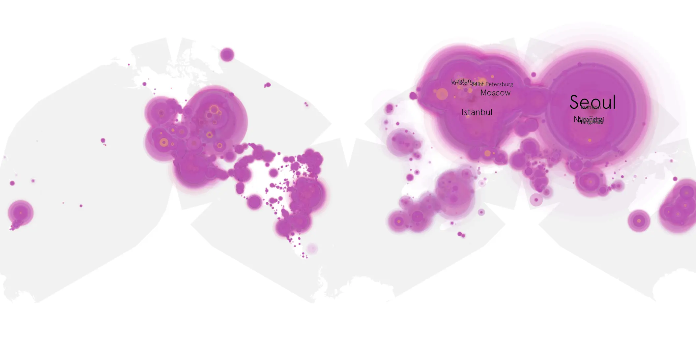
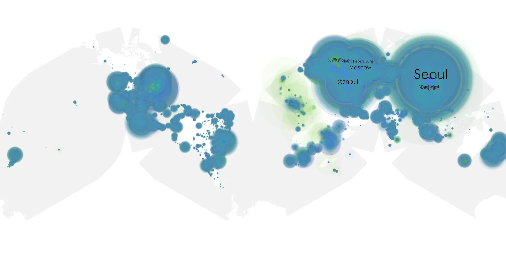

# night-agent-03 sample cache audit

## 1. Media object

| Field | Value |
| --- | --- |
| Media object | Night Agent |
| Collection key | `night-agent-03` |
| imdb_id | [tt13918776](https://www.imdb.com/title/tt13918776/) |
| wikipedia_url | [The Night Agent](https://en.wikipedia.org/wiki/The_Night_Agent) |
| Sample dates | 2026-02-19-to-2026-08-26 |
| Sample days | 189 |
| BTIH count | 555 |
| Unique BTIH count | 484 |
| Downloaders total | 75,506,778 |
| Uploaders total | 3,145,767 |
| Data version | `2026-08-05` |
| IP geolocation version | `6:1777968300` |

## 2. Sample coverage report

- Generated: 2026-09-13T17:13:08Z
- Sample archive directory: `/mnt/gold/src/alpha60-samples-raw.gold/night-agent-03.xz`
- Hour directories: 4473
- Zero-length sample files: 0
- Other unparsable sample files: 0
- Hourly discontinuities: 2 (45 missing hours)
- Missing days: 0

### Sample archive discontinuities

- hourly gap: last `2026-03-02 02:06`, resumed `2026-03-03 23:46` — missing 44 hour(s)
- hourly gap: last `2026-03-29 01:06`, resumed `2026-03-29 03:06` — missing 1 hour(s)

## 3. Media objects file size histogram

## 4. Visualization pass — graphs

### Downloads by week cumulative (normalized start)



### Downloads by day, Saturday and Sunday in gray

## 5. Visualization pass — maps

### Cumulative geographic slices

| Africa | Americas | Asia | Europe | Oceania | Unknown |
| --- | --- | --- | --- | --- | --- |
| 1.94 | 15.99 | 34.90 | 44.09 | 1.22 | 0.79 |

### Cumulative network infrastructure

{:target="_blank" rel="noopener"}

### Cumulative data maps

**Cumulative >= 1080p**

{:target="_blank" rel="noopener"}

**Cumulative < 1080p**

{:target="_blank" rel="noopener"}
