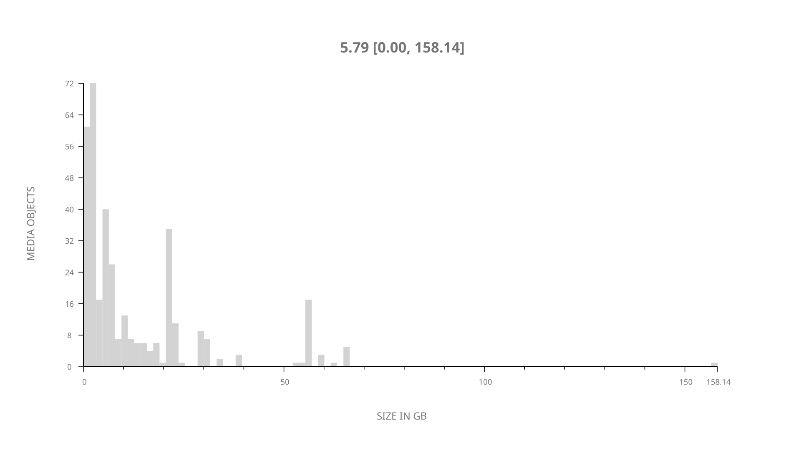
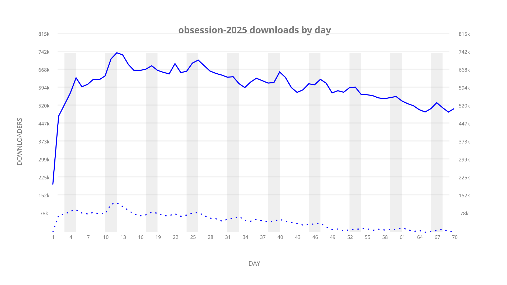
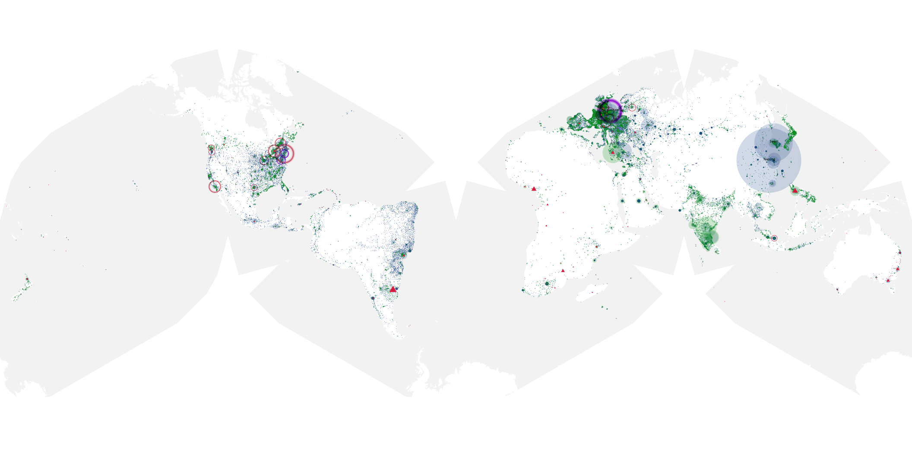
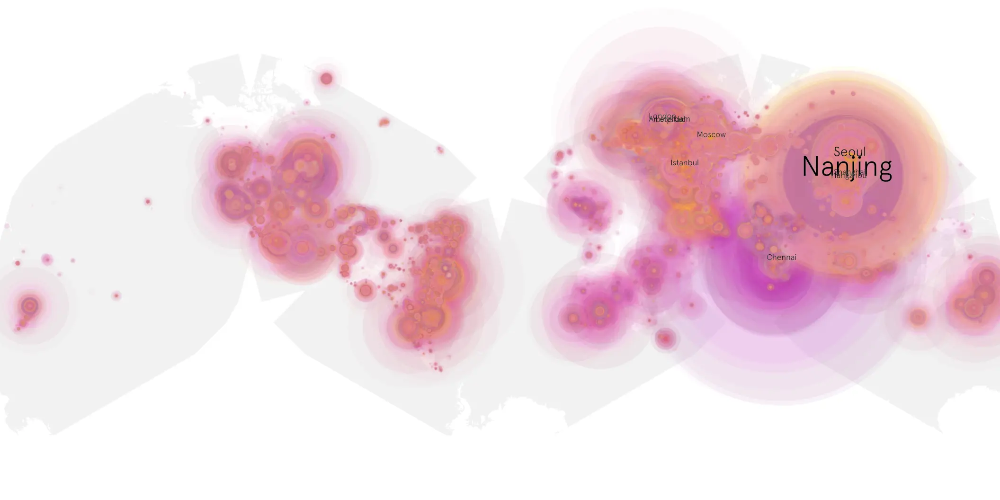
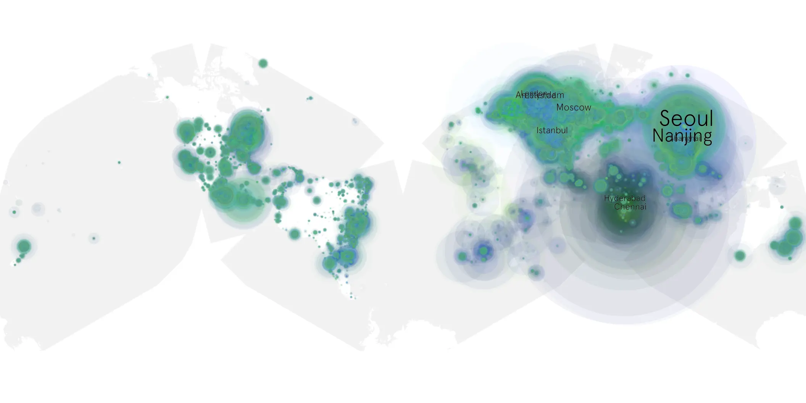

# obsession-2025 sample cache audit

## 1. Media object

| Field | Value |
| --- | --- |
| Media object | Obsession |
| Collection key | `obsession-2025` |
| imdb_id | [tt37287335](https://www.imdb.com/title/tt37287335/) |
| wikipedia_url | [Obsession (2025 film)](https://en.wikipedia.org/wiki/Obsession_(2025_film)) |
| Sample dates | 2026-07-01-to-2026-09-08 |
| Sample days | 70 |
| BTIH count | 389 |
| Unique BTIH count | 363 |
| Downloaders total | 33,190,752 |
| Uploaders total | 4,905,540 |
| Data version | `2026-08-05` |
| IP geolocation version | `6:1777968300` |

## 2. Coverage report

- Generated: 2026-09-13T17:13:08Z
- Sample archive directory: `/mnt/gold/src/alpha60-samples-raw.gold/obsession-2025.xz`
- Hour directories: 1672
- Zero-length sample files: 0
- Other unparsable sample files: 0
- Hourly discontinuities: 0 (0 missing hours)
- Missing days: 0

### Sample archive discontinuities

None detected.

## 3. File sizes histogram *median[lowest, highest]*

## 4. Graphs

### Downloads by week cumulative (normalized start)



### Downloads by day, Saturday and Sunday in gray

## 5. Cumulative Maps

<!-- https://raw.githubusercontent.com/alpha60-devops/alpha60-results-2026/refs/heads/main/data/ -->

### <a href="https://raw.githubusercontent.com/alpha60-devops/alpha60-results-2026/refs/heads/main/data/geojson.cumulative/obsession-2025-cumulative-aggregate.geojson.gz" data-map-title="Obsession — obsession-2025" onclick="leaflet_map_open_window(this.href, this.dataset.mapTitle); return false;" class="table-link" aria-label="Open Obsession (obsession-2025) cumulative data map in new window" title="Opens interactive map for Obsession (obsession-2025) data">Swarm Detail</a>

### Geographic Regions

| Africa | Americas | Asia | Europe | Oceania | Unknown |
| --- | --- | --- | --- | --- | --- |
| 2.79 | 17.12 | 36.84 | 37.23 | 1.36 | 0.70 |

### Network infrastructure

{:target="_blank" rel="noopener"}

### Resolution >= 1080p

{:target="_blank" rel="noopener"}

### Resolution < 1080p

{:target="_blank" rel="noopener"}
