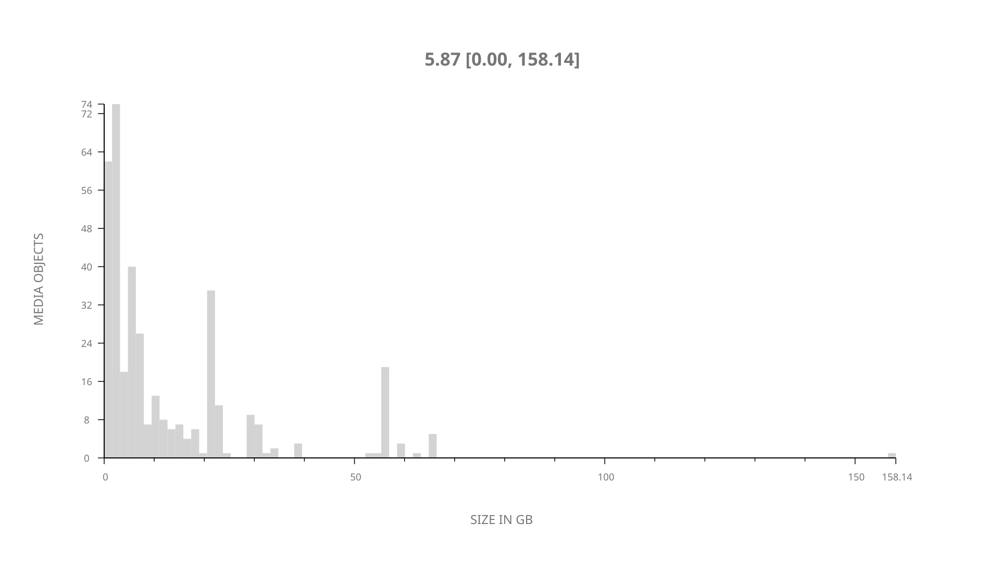
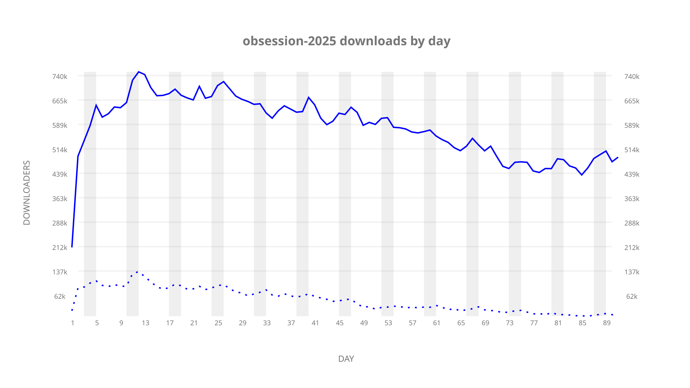
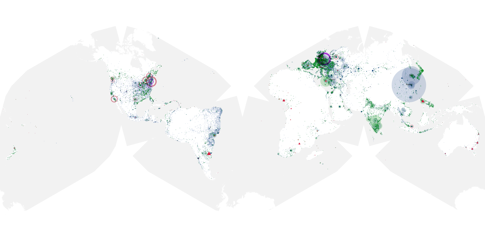
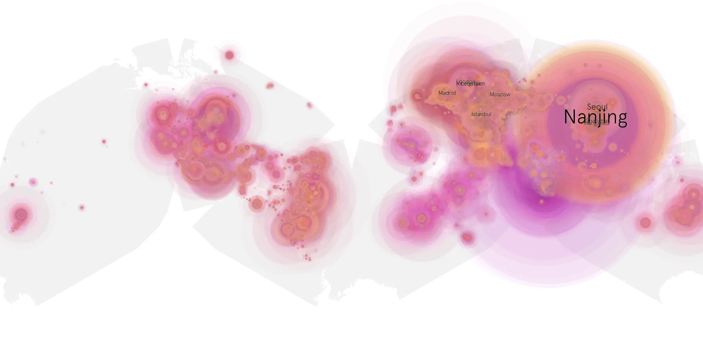
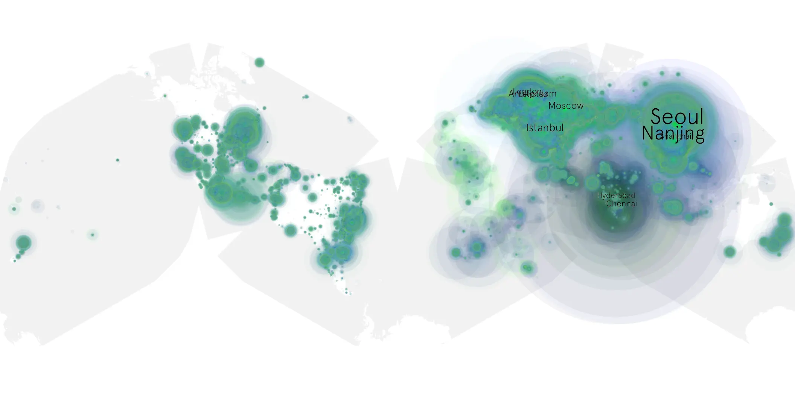

# obsession-2025 sample cache audit

## 1. Media object

| Field | Value |
| --- | --- |
| Media object | Obsession |
| Collection key | `obsession-2025` |
| imdb_id | [tt37287335](https://www.imdb.com/title/tt37287335/) |
| wikipedia_url | [Obsession (2025 film)](https://en.wikipedia.org/wiki/Obsession_(2025_film)) |
| Sample dates | 2026-07-01-to-2026-09-29 |
| Sample days | 91 |
| BTIH count | 401 |
| Unique BTIH count | 372 |
| Downloaders total | 40,392,900 |
| Uploaders total | 5,593,863 |
| Data version | `2026-08-05` |
| IP geolocation version | `6:1777968300` |

## 2. Sample coverage report

- Generated: 2026-10-07T14:25:17Z
- Frozen sample archive directory: `/mnt/gold/src/alpha60-samples-raw.gold/obsession-2025.xz`
- Hour directories: 2176
- Zero-length sample files: 0
- Malformed in-scope records accepted: 0 (producer rejects nonempty malformed input)
- Hourly discontinuities: 0 (0 missing hours)
- Missing days: 0

### Sample archive discontinuities

None detected.

### Frozen validation evidence

- Frozen content SHA-256: `904d05e87d4fca66d765f310bc937ad627c47b6df5ece9abcb9901a88cf2d2ee`
- Full-input producer receipt SHA-256: `34920602663da25880593927d95f6e90a506b080e69a2af47174056d0b7199dd`
- Frozen raw archives: 2176
- Empty sampler observations remain explicit gaps; no observations were imputed.
- Out-of-scope records retain the collection factory's established filtering.
- Excluded raw members: 4
- Excluded observations: 6556

## 3. Media objects file size histogram

## 4. Visualization pass — graphs

### Downloads by week cumulative (normalized start)



### Downloads by day, Saturday and Sunday in gray

## 5. Visualization pass — maps

### Cumulative geographic slices

| Africa | Americas | Asia | Europe | Oceania | Unknown |
| --- | --- | --- | --- | --- | --- |
| 3.01 | 18.41 | 37.59 | 38.85 | 1.42 | 0.72 |

### Cumulative network infrastructure

{:target="_blank" rel="noopener"}

### Cumulative data maps

**Cumulative >= 1080p**

{:target="_blank" rel="noopener"}

**Cumulative < 1080p**

{:target="_blank" rel="noopener"}
